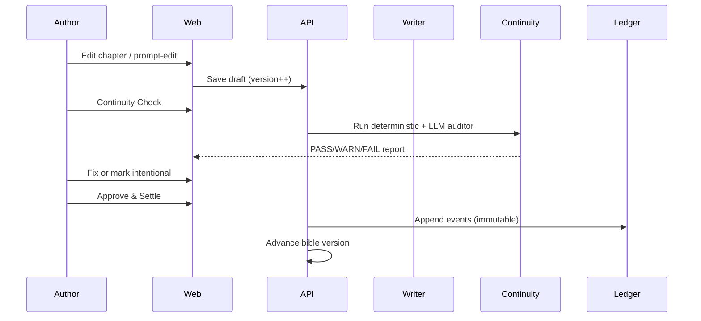

# StoryForge Architecture

StoryForge is an AI-assisted long-form fiction platform. Canon (Story Bible + ledgers) is the source of truth; prose is versioned and must pass continuity gates before state is settled.

## Stack

| Layer | Technology | Role |
|-------|------------|------|
| Web | Next.js (App Router, TypeScript) | Author UI: chapter editor, continuity gate, bible browser |
| API | FastAPI (Python 3.11+) | REST + agent orchestration, ledger writes, context pack assembly |
| Database | PostgreSQL + pgvector | Relational canon, append-only events, embeddings for retrieval |
| Cache / queue | Redis | Job queues, session cache, rate limits |
| LLM gateway | LiteLLM | Unified model routing for agent pipeline |
| Git mirror | Markdown/YAML | Human-readable canon export (optional sync) |
| Graph (later) | Neo4j | Relationship-heavy queries if needed |

## Monorepo Layout

```
apps/web/          Next.js author-facing UI
apps/api/          FastAPI backend + agent workers
packages/shared/   Shared types/schemas (future)
skills/            Portable agent skills (domain + stack)
.cursor/rules/     Cursor path-scoped rules
scripts/harness/   Agent preflight + CI checks
docs/              Architecture, domain, roadmap
```

## Core Principles

1. **Multi-project isolation** — Every query scoped by `project_id`. No cross-project canon leakage.
2. **Versioned Story Bible** — Immutable bible versions; drafts reference a version, settled chapters advance canon.
3. **Append-only ledgers** — Character, object, knowledge, promise/foreshadow events are never overwritten; corrections append compensating events.
4. **Context packs** — Agents receive curated slices (scene beats, relevant bible entries, recent ledger tail), never full novel dumps.
5. **Human-in-the-loop** — Two approvals: prose revision accepted, then state diff approved before `settle`.
6. **Progressive depth** — Characters start as seeds/stubs; depth grows via extract-approve-lazy pattern.

## Agent Pipeline

```
Architect → World → Character-keeper → Writer → Editor
                              ↓
              Deterministic Continuity (rules engine)
                              ↓
              LLM Continuity Auditor (semantic checks)
                              ↓
              Fact Extractor → State Diff Preview
                              ↓
              Human: Approve prose → Approve state → Settle
```

| Agent | Responsibility |
|-------|----------------|
| Architect | Outline, act structure, chapter/scene beat plan |
| World | World rules, locations, power systems, timeline skeleton |
| Character-keeper | Psyche cards, cast tiers, canonical IDs, relationship graph |
| Writer | Draft prose from beats + context pack |
| Editor | Style, pacing, prompt-edit revisions (versioned) |
| Deterministic Continuity | Rule-based checks: death, timeline order, power ladder |
| LLM Continuity Auditor | Semantic contradictions, foreshadow fairness, OOC hints |
| Fact Extractor | Propose ledger events + bible candidates from settled prose |

## Request Flow (Chapter Edit → Settle)



## Layer Boundaries

- **Web** — Presentation, optimistic UI, calls API. No direct DB or LLM calls.
- **API** — Business logic, agent orchestration, ledger writes, ACL enforcement.
- **Ledgers** — Postgres tables + event streams; settlement is transactional.
- **Agents** — Stateless workers; all state from context packs + bible snapshot.

## Wireframe Context (not implemented in bootstrap)

Product wireframes show:

- **Chapter Editor** — Scene beats sidebar, versioned prose, Prompt Edit panel (apply/regenerate/compare).
- **Continuity Gate** — Issue table (severity/category), state diff preview, reject/revise/approve-settle actions.

See `docs/domain-model.md` for entities these screens map to.

## Related Docs

- [Domain model](./domain-model.md)
- [Schema draft](./schema-draft.md)
- [Roadmap](./roadmap.md)
- [Agent setup](./agent-setup.md)
