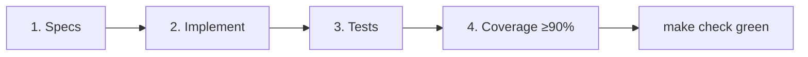

# StoryForge Quality Gates

> Engineering policy for AI agents and human contributors. **Order is mandatory.**

---

## Workflow: Spec → Implement → Test → Coverage

| Step | Artifact | Gate |
|------|----------|------|
| **1. Specs** | `docs/specs/phase-N/*`, OpenAPI, schema | Review before code |
| **2. Implement** | `apps/api`, `apps/web` | Matches spec; no silent canon violations |
| **3. Tests** | Unit + integration (Testcontainers for API) | All pass |
| **4. Coverage** | pytest-cov / vitest coverage | Line ≥ **90%** hard fail in CI |

**Do not skip specs.** Phase contracts: [Phase 1](../specs/phase-1/README.md), [Phase 2](../specs/phase-2/README.md).

---

## Commands

| Command | When | Fails if |
|---------|------|----------|
| `make check` | Every PR | Lint, typecheck, unit tests fail |
| `make test-api` | API changes | pytest failures |
| `make test-api-cov` | API implementation PR | Coverage < 90% or test failures |
| `make test-web-cov` | Web implementation PR | Coverage < 90% or test failures |
| `make validate-specs` | Spec or OpenAPI edits | Invalid YAML |

---

## Coverage policy

### Backend (`apps/api`)

- **Tool:** `pytest-cov`
- **Scope:** `app/` package
- **Hard gate:** line coverage ≥ **90%** (`--cov-fail-under=90`)
- **Stretch:** branch coverage ≥ 80% (report only until Phase 2)

Config: `apps/api/pyproject.toml` → `[tool.coverage.*]`

### Frontend (`apps/web`)

- **Tool:** Vitest + `@vitest/coverage-v8` (implementation PR)
- **Scope:** Phase 1 UI modules — see [web-screens.md](../specs/phase-1/web-screens.md); Phase 2 — [web-screens.md](../specs/phase-2/web-screens.md)
- **Hard gate:** line coverage ≥ **90%** for scoped paths

---

## Integration tests

- **Postgres:** Testcontainers (`postgres:16-alpine`) — real migrations, real SQL
- **Redis:** Not required Phase 1
- **Required test:** cross-tenant isolation (`404` for foreign `project_id`)

See [Phase 1 test strategy](../specs/phase-1/test-strategy.md) and [Phase 2 test strategy](../specs/phase-2/test-strategy.md).

---

## CI

| Job | Specs PR | Implementation PR |
|-----|----------|-------------------|
| `make check` | ✅ required | ✅ required |
| `make validate-specs` | ✅ required | ✅ if specs touched |
| `make test-api-cov` | **local only** | **local only** (Docker + Testcontainers) |
| `make test-web-cov` | skip | ✅ when web tests exist |

**Cost policy:** Do not run Testcontainers or full `pytest-cov` on GitHub Actions. Agents and developers run `make test-api-cov` locally before opening API PRs.

---

## Agent checklist (before PR)

1. Read relevant phase spec package
2. Implement against OpenAPI + schema
3. Run `make test-api` / web tests locally
4. Run coverage targets — meet 90% line gate
5. Run `make check`
6. Update specs first if contract changed

---

## Links

- [AGENTS.md](../../AGENTS.md)
- [agent-setup.md](../agent-setup.md)
- [Phase 1 test strategy](../specs/phase-1/test-strategy.md)
- [Phase 2 test strategy](../specs/phase-2/test-strategy.md)
