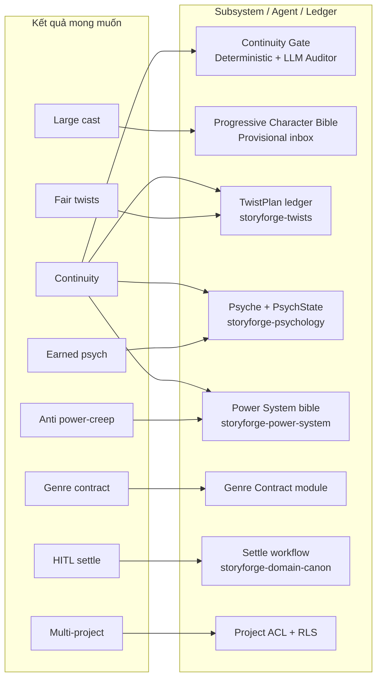

# StoryForge — Tầm nhìn & Kết quả mong muốn

> **Đối tượng:** Kim và team sản phẩm. Code identifiers và file paths giữ tiếng Anh.

## Tóm tắt

StoryForge không chỉ giúp *viết nhanh* mà giúp **viết được một truyện tốt** — truyện dài, nhiều nhân vật, nhiều tầng plot, vẫn giữ được tính liên tục, twist công bằng, và tâm lý nhân vật có cơ sở.

**“Viết được một truyện tốt”** được định nghĩa vận hành như sau:

| Tiêu chí | Nghĩa vận hành | Đo lường thành công |
|----------|----------------|---------------------|
| **Continuity / canon integrity** | Mọi sự thật đã settle không bị mâu thuẫn trừ khi có sự kiện bù trừ hoặc override có lý do | 0 FAIL chưa xử lý khi settle; ledger append-only, bible version immutable |
| **Large cast (Kiếm Lai scale)** | Hàng nghìn nhân vật T0/T1; chỉ deep-card nhân vật trong scene | Context pack ≤ token budget; không load full cast vào LLM |
| **Fair plot twists** | Payoff phải có plant đã đăng ký hoặc author mark intentional | TwistPlan fairness gate PASS hoặc override có ghi chú |
| **Earned psychology** | Thay đổi tính cách / đạo đức cần trigger event trong prose | PsychState ledger + OOC WARN/FAIL |
| **Power system anti-creep** | Rank/technique không tăng vô cớ | Deterministic rules trên cultivation ledger |
| **Genre contracts** | Thể loại (kiếm hiệp, trinh thám, văn chương) có rule set riêng | `genre_profile` bật/tắt module kiểm tra |
| **Theme, stakes, scene engine** | Mỗi scene có mục tiêu, xung đột, thay đổi trạng thái | Scene beat checklist + stakes ledger (Phase 8+) |
| **POV / voice, conflict maps** | Giọng kể và xung đột nhất quán theo POV | Style guide + conflict arc graph |
| **Relationship arcs** | Quan hệ tiến triển có sự kiện neo | Relationship ledger events |
| **Setting-as-pressure** | Bối cảnh tạo áp lực chủ động, không chỉ trang trí | Location pressure tags trên scene beats |
| **Clue / info economy** | Ai biết gì, reader biết gì — có kiểm soát | Knowledge ledger + revelation events |
| **Human-in-the-loop settle** | Không auto-commit canon sau LLM | Hai cổng: prose OK + state diff approved |
| **Multi-project isolation** | Dự án A không leak canon sang dự án B | Mọi query có `project_id`; ACL per project |

---

## Outcome → Subsystem / Agent / Ledger

### Chi tiết mapping

| Outcome | Subsystem / Skill | Ledger / Entity chính | Agent vai trò |
|---------|-------------------|----------------------|---------------|
| Continuity / canon | `storyforge-continuity`, Continuity Gate UI | `ledger_events`, `bible_versions`, `continuity_reports` | Deterministic engine, LLM Auditor, Fact Extractor |
| Large cast | `storyforge-characters` | `characters` (tier T0–T3), `character_provisional` | Character-keeper, Fact Extractor |
| Fair twists | `storyforge-twists` | `twist_plans`, `twist_plants`, `twist_payoffs` | Architect, LLM Auditor (foreshadow) |
| Earned psychology | `storyforge-psychology` | `psyche_card`, `psych_states` | Character-keeper, LLM Auditor (OOC) |
| Power anti-creep | `storyforge-power-system` | cultivation events trong `ledger_events` | World agent, Deterministic engine |
| Genre contracts | Genre Contract module (Phase 6) | `projects.genre_profile`, rule packs JSON | Architect, Continuity (category filter) |
| Theme & stakes | Theme module, Scene engine (Phase 8+) | `stakes_ledger`, scene beat metadata | Architect, Writer |
| POV / voice | Style guide + POV registry | `chapters.pov_character_id`, style rules | Editor, LLM Auditor |
| Conflict / relationship arcs | Relationship panels | relationship events trong ledger | Character-keeper |
| Setting pressure | Bible locations + beat tags | location entities, beat `pressure_tags` | World, Writer context pack |
| Info / clue economy | Knowledge ledger | `ledger_events` entity_type=knowledge | Fact Extractor, TwistPlan |
| HITL settle | `storyforge-domain-canon` | settle transaction | — (author only) |
| Multi-project | `storyforge-architecture` | `projects`, RLS policies | — |

---

## Persona chính

| Persona | Mục tiêu | Pain point StoryForge giải quyết |
|---------|----------|----------------------------------|
| **Kim — tác giả tiểu thuyết dài** | Viết kiếm hiệp 500+ chương, cast lớn | Quên nhân vật phụ, mâu thuẫn cultivation, twist không công bằng |
| **Editor / beta reader** | Review continuity trước publish | Không có single source of truth |
| **AI agent (dev)** | Implement feature đúng domain | Cần docs + skills nhất quán |

---

## Nguyên tắc sản phẩm (không thương lượng)

1. **Canon là source of truth** — Prose là draft; bible + ledger sau settle mới là chân lý.
2. **Append-only history** — Sửa lỗi bằng event mới, không overwrite.
3. **Progressive depth** — Không bắt author điền full bible trước chương 1.
4. **Context pack, không full dump** — Agent chỉ nhận slice liên quan scene/beat.
5. **Hai cổng phê duyệt** — Prose chấp nhận → state diff approved → settle.
6. **Genre-aware** — Module bật theo `genre_profile`; mystery strict hơn slice-of-life.

---

## Anti-goals (StoryForge *không* làm)

- Auto-publish prose LLM mà không continuity check
- Thay thế hoàn toàn sáng tác của author (AI là cộng sự, không ghostwriter vô kiểm soát)
- Wiki công khai / fan wiki (author-only canon)
- Billing / marketplace trong MVP

---

## Liên kết

- [02-architecture.md](./02-architecture.md) — kiến trúc kỹ thuật
- [03-domain-and-subsystems.md](./03-domain-and-subsystems.md) — deep dive subsystem
- [06-build-plan.md](./06-build-plan.md) — lộ trình triển khai
- Skill: `skills/storyforge-domain-canon/SKILL.md`
