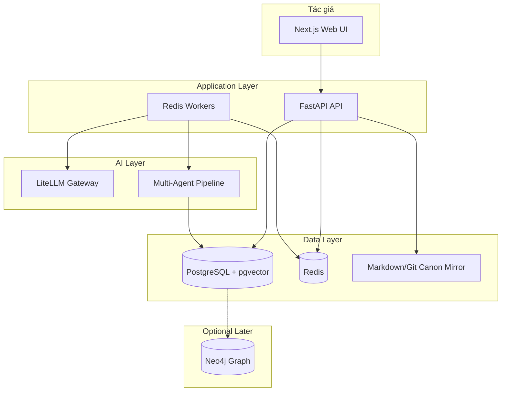
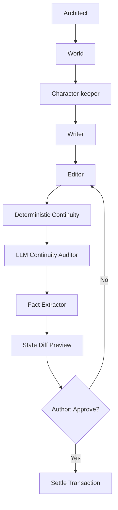
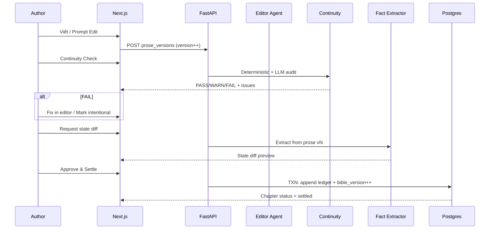

# StoryForge — Kiến trúc hệ thống

> **Canonical architecture doc.** Bản tóm tắt kỹ thuật ngắn: [docs/architecture.md](../architecture.md) (stub trỏ về đây).

StoryForge là nền tảng viết tiểu thuyết dài có AI, với **Story Bible + ledgers** làm source of truth. Prose được version hóa và phải qua **Continuity Gate** trước khi **settle** trạng thái câu chuyện.

---

## Sơ đồ tổng quan



---

## Stack

| Layer | Technology | Vai trò |
|-------|------------|---------|
| **Web** | Next.js (App Router, TypeScript) | Dashboard, Project Hub, Chapter Editor, Continuity Gate, Bible browser |
| **API** | FastAPI (Python 3.11+) | REST, ACL, agent orchestration, ledger writes, context pack assembly |
| **Database** | PostgreSQL + pgvector | Canon quan hệ, event append-only, embedding retrieval |
| **Cache / Queue** | Redis | Job queue (continuity, extract), session, rate limit |
| **LLM Gateway** | LiteLLM | Routing model thống nhất cho agent pipeline |
| **Git mirror** | Markdown/YAML | Export canon human-readable (derived, không phải SoT) |
| **Graph (later)** | Neo4j | Query quan hệ phức tạp nếu pgvector + JSON không đủ |

### Monorepo layout

```
apps/web/          Next.js author UI
apps/api/          FastAPI + workers
packages/shared/   Shared types/schemas (future)
skills/            storyforge-* agent skills
vendor/aas-skills/ Vendored AAS stack craft
docs/              Engineering + product docs
docs/product/      Product docs (VI primary)
docs/wireframes/   Wireframe images + specs
.cursor/rules/     Cursor path-scoped rules
scripts/harness/   check.sh, agent-preflight.sh
```

---

## Nguyên tắc kiến trúc

1. **Multi-project isolation** — Mọi query scoped `project_id`; RLS Postgres (Phase 1+).
2. **Versioned Story Bible** — `bible_versions` immutable; settle tạo version N+1.
3. **Append-only ledgers** — Character, object, knowledge, promise/twist, psych, power — không UPDATE settled rows.
4. **Context packs** — Agent nhận slice (beat, bible snippets, ledger tail), không full manuscript.
5. **Human-in-the-loop** — Prose revision accepted → state diff approved → settle.
6. **Progressive depth** — Character T0 seed → T3 principal theo nhu cầu scene.

---

## Multi-agent pipeline



| Agent | Trách nhiệm | Skill liên quan |
|-------|-------------|-----------------|
| **Architect** | Outline, act structure, chapter/scene beat plan | — |
| **World** | World rules, locations, power system, timeline skeleton | `storyforge-power-system` |
| **Character-keeper** | Psyche cards, cast tiers, canonical IDs, relationships | `storyforge-characters`, `storyforge-psychology` |
| **Writer** | Draft prose từ beats + context pack | — |
| **Editor** | Style, pacing, Prompt Edit revisions (versioned) | — |
| **Deterministic Continuity** | Rule engine: death, timeline, power ladder, twist plants | `storyforge-continuity` |
| **LLM Continuity Auditor** | Semantic: foreshadow, OOC hints, world-rule nuance | `storyforge-continuity` |
| **Fact Extractor** | Propose ledger events + bible candidates từ prose | `storyforge-domain-canon` |

**Lưu ý:** Writer không nhận `secret_truth` từ TwistPlan — chỉ active plants (`storyforge-twists`).

---

## Ledgers (append-only)

| Ledger | Entity type | Ví dụ event |
|--------|-------------|-------------|
| **Canon / Bible** | `bible_versions` | Snapshot JSON world/characters/timeline |
| **Character state** | `character` | status_change, location_change, cultivation_change |
| **Object** | `object` | ownership, condition, reveal |
| **Knowledge** | `knowledge` | who_learned, reader_reveal |
| **Promise / Twist** | `promise` | plant, misdirection, payoff |
| **PsychState** | `psych` | emotional snapshot per chapter |
| **Power state** | (trong character/world events) | rank change, technique learned |

Schema sketch: [docs/schema-draft.md](../schema-draft.md).

---

## Data flow: Draft → Prompt Edit → Continuity → Approve



### Settle transaction (atomic)

1. Append approved `ledger_events` với `settled_at`
2. Insert `bible_versions` row (version N+1)
3. Update `projects.bible_version_current`
4. Set `chapters.status = settled`
5. (Optional) Queue Git mirror export job

Skill: `skills/storyforge-domain-canon/SKILL.md`.

---

## Context pack assembly

API build pack trước mỗi agent call:

```yaml
project_id: uuid
bible_version: 12          # snapshot at draft time
chapter: 7
beat: "7.4"
canon_snippets:            # pgvector retrieval + manual links
  - id: rules.cultivation.realm
    excerpt: "..."
ledger_tail:               # last K events for scene entities
  - entity_id: ...
    event_type: location_change
twist_relevant:            # active plants ONLY — no secret_truth for Writer
  - plant_id: ...
psych_states:              # POV + scene characters
  - character_id: ...
word_budget: 8000
genre_profile: xianxia
```

**Invariant:** Không bao gồm full manuscript hoặc full bible JSON.

---

## Security & ACL

| Concern | Approach |
|---------|----------|
| **Tenant isolation** | `project_id` on all tables; Postgres RLS |
| **Roles** | `owner`, `editor`, `viewer` per project (Phase 1+) |
| **Secrets** | LLM keys server-side only; LiteLLM env |
| **Author-only data** | `secret_truth`, unrevealed twists — không export public bible |
| **Audit** | `continuity_overrides`, settle timestamps |

Web **không** gọi DB/LLM trực tiếp — mọi thứ qua API.

---

## Layer boundaries

| Layer | Path | Được phép | Không được |
|-------|------|-----------|------------|
| Web | `apps/web/` | UI, API client, optimistic updates | DB, LLM, ledger writes |
| API | `apps/api/` | Business logic, agents, settle txn | React |
| Workers | `apps/api/` (async) | Continuity, extract jobs | Sync long LLM in request path |
| Ledgers | Postgres via API | Append-only writes | In-place canon overwrite |

---

## Nguồn cảm hứng (tham khảo ngắn)

| Project | Ý tưởng StoryForge mượn |
|---------|---------------------------|
| **Aeon Echoes** | Long-horizon narrative memory, state tracking |
| **OpenNovel** | Author-centric novel workflow |
| **EMBER** | Entity/state modeling for fiction |
| **Novel-OS** | Project/chapter structure |
| **Loreweave** | World bible / canon management |
| **graphify-novel** | Relationship graph visualization |
| **story-skills** | Agent skill patterns for storytelling |
| **dsh-story** | Draft → review → publish loop |

StoryForge **kết hợp** bible versioned + append-only ledgers + continuity gate + progressive cast — không copy một repo đơn lẻ.

---

## Wireframes → Architecture mapping

| Screen | API domains chính |
|--------|-------------------|
| Dashboard | `GET /projects` |
| Project Hub | `GET /chapters`, stats aggregates |
| Chapter Editor | `prose_versions`, `scene_beats`, Prompt Edit → Editor agent |
| Story Bible | `bible_versions`, canon CRUD (pre-settle draft) |
| Continuity Gate | `continuity_reports`, state diff, settle |

Chi tiết UI: [05-wireframes.md](./05-wireframes.md).

---

## Liên kết

- [01-vision-and-outcomes.md](./01-vision-and-outcomes.md)
- [03-domain-and-subsystems.md](./03-domain-and-subsystems.md)
- [docs/domain-model.md](../domain-model.md) — entity reference ngắn
- [docs/schema-draft.md](../schema-draft.md)
- Skills: `skills/storyforge-architecture/`, `storyforge-api-python/`, `storyforge-web-next/`
