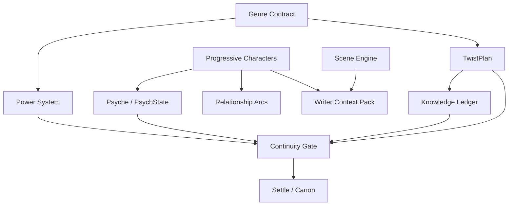

# StoryForge — Domain & Subsystems

> Deep dive các subsystem đảm bảo chất lượng truyện (“bổ sung”). Entity names và paths giữ tiếng Anh.

Mỗi subsystem: **purpose**, **key entities**, **invariants**, **agent roles**, **failure modes**.

---

## 1. Progressive Characters + Provisional Inbox

**Skill:** `storyforge-characters`

### Purpose

Quản lý cast quy mô Kiếm Lai (hàng nghìn tên) mà không overwhelm author lúc khởi tạo. Depth tăng dần theo mức độ xuất hiện trong prose.

### Key entities

| Entity | Table / field | Mô tả |
|--------|---------------|-------|
| `Character` | `characters` | Canonical ID (UUID), `tier` 0–3, `display_name` |
| `Provisional mention` | `character_provisional` | Extract từ prose, chờ merge/promote/reject |
| Tier metadata | `characters.tier` | T0 Seed → T3 Principal |

### Invariants

- Không gán ledger events cho provisional ID
- Canonical UUID stable qua rename (metadata event, không đổi ID)
- Không auto-promote lên T3 — author hoặc rule recurrence có giới hạn

### Agent roles

- **Character-keeper:** tạo T0 từ outline, suggest promote
- **Fact Extractor:** propose provisional rows từ prose mới

### Failure modes

| Failure | Triệu chứng | Mitigation |
|---------|-------------|------------|
| Duplicate characters | Hai UUID cùng một người | Merge workflow + alias table |
| Orphan provisionals | Inbox đầy, author bỏ qua | UI filter “stale > N chapters”, bulk reject |
| Over-deep cast in context | Token overflow | Cap stubs; pgvector retrieve by scene names only |

---

## 2. TwistPlan (Plants / Misdirection / Payoff)

**Skill:** `storyforge-twists`

### Purpose

Twist **công bằng**: reader có cơ hội đoán trước payoff; author track plants và misdirection.

### Key entities

| Entity | Field | Mô tả |
|--------|-------|-------|
| `secret_truth` | `twist_plans` | Sự thật gốc — author-only |
| `plant` | `twist_plants` | Hint fair: chapter, beat, strength |
| `misdirection` | linked to secret | False trail |
| `payoff` | `twist_payoffs` | Target chapter + `required_plant_ids[]` |

### Invariants

- Payoff without registered plants → continuity **FAIL** (unless intentional override)
- Writer context: plants only — never `secret_truth`
- Reveal không contradict settled ledger without compensating event

### Agent roles

- **Architect:** register secrets + payoff targets early
- **LLM Auditor:** foreshadow fairness, category `foreshadow`

### Failure modes

| Failure | Mitigation |
|---------|------------|
| Retcon reveal | Require compensating ledger + author note |
| Mystery too strict for xianxia | `genre_profile` relaxes plant requirements |
| Lost plant IDs | Twist dashboard + chapter_ref in issue table |

---

## 3. Psyche Card + PsychState

**Skill:** `storyforge-psychology`

### Purpose

Tâm lý nhân vật **earned** — thay đổi có trigger, không OOC tùy tiện.

### Key entities

| Entity | Storage | Nội dung |
|--------|---------|----------|
| **Psyche card** | `characters.psyche_card` jsonb | Traits, wounds, desires, fears, speech patterns, moral boundaries |
| **PsychState** | `psych_states` append-only | Snapshot per `(character_id, chapter_ref)`: emotion, beliefs, stressors |

### Invariants

- Psyche card update: author edit hoặc approved extract — không mỗi draft
- Personality shift cần triggering events → ledger refs
- OOC: action vs `moral_boundaries` without override → WARN/FAIL

### Agent roles

- **Character-keeper:** maintain psyche on tier promote
- **Writer:** latest PsychState + psyche for POV
- **LLM Auditor:** voice drift, psychology category

### Failure modes

| Failure | Mitigation |
|---------|------------|
| Card stale vs prose | Extract suggest diff; author approve in state diff |
| False OOC positives | Intentional override + arc flag `allow_moral_break` |

---

## 4. Power System Bible

**Skill:** `storyforge-power-system`

### Purpose

Kiếm hiệp / progression fantasy: rank ladder, technique eligibility, **anti power-creep**.

### Key entities

| Entity | Location | Nội dung |
|--------|----------|----------|
| Power system def | `bible_versions.snapshot_json.world.power_system` | ranks[], techniques[], priority_gap |
| Cultivation events | `ledger_events` | cultivation_change, technique_learned, resource_consumed |

### Invariants

- Rank không tăng > N stages/chapter without flagged breakthrough
- Technique use cần ledger proof (sect, lineage)
- Defeat higher rank cần explicit technique/item refs or FAIL
- Non-progression genres: omit block; skip checks

### Agent roles

- **World:** seed power system in bible v0
- **Deterministic Continuity:** world_rule + power checks

### Failure modes

| Failure | Mitigation |
|---------|------------|
| Author forgets breakthrough scene | Continuity FAIL + fix in editor |
| Soft magic genre | `genre_profile` disables module |

---

## 5. Genre Contract

### Purpose

Mỗi thể loại có “hợp đồng” kỳ vọng reader: pacing, twist strictness, power rules, tone.

### Key entities

- `projects.genre_profile`: `xianxia`, `mystery`, `literary`, `romance`, …
- `genre_rule_packs` (JSON, Phase 6): enabled modules, thresholds

### Invariants

- Rule pack không override global append-only / settle invariants
- Override per-project trong `projects.settings`

### Agent roles

- **Architect:** apply genre defaults to outline
- **Continuity:** filter categories by genre

### Failure modes

| Failure | Mitigation |
|---------|------------|
| Wrong profile chosen | Wizard allows change pre-settle v1 |
| Hybrid genre | Multi-tag + union of rules with conflict resolution UI |

---

## 6. Theme Module

### Purpose

Thread chủ đề xuyên suốt — symbols, questions, resolution target.

### Key entities

- `theme_statement`, `motifs[]`, `theme_beats` (link scene → theme moment)
- Motif ledger events (optional Phase 8+)

### Invariants

- Theme không auto-rewrite prose — chỉ annotate + context pack hints

### Failure modes

- Theme drift → WARN in Editor review checklist (Phase 8+)

---

## 7. Stakes Escalation + Scene Engine

### Purpose

Mỗi scene có **goal, conflict, outcome, value shift** — tránh filler.

### Key entities

- `scene_beats`: `goal`, `conflict`, `outcome`, `stakes_level`, `pressure_tags`
- `stakes_ledger` (Phase 8+): escalation checkpoints per act

### Invariants

- Beat marked complete only if outcome documented (author or extract)

### Agent roles

- **Architect:** act-level stakes curve
- **Writer:** beat goal in context pack header

### Failure modes

| Failure | Mitigation |
|---------|------------|
| Flat middle | Project Hub “open stakes” indicator |
| Beat without conflict | Lint WARN pre-continuity |

---

## 8. POV / Voice + Style Guide

### Purpose

Nhất quán giọng kể và character voice theo POV chapter.

### Key entities

- `chapters.pov_character_id`
- `style_guide` in project settings: tense, distance, taboo words, dialogue rules

### Invariants

- POV shift requires chapter-level declaration
- LLM Editor respects style_guide in Prompt Edit

### Failure modes

- Head-hopping → continuity WARN (LLM auditor)

---

## 9. Conflict Maps + Relationship Arcs

### Purpose

Track xung đột và quan hệ theo thời gian — ai ghét ai, trust arc, betrayal plants.

### Key entities

- Relationship edges: `(a, b, relation_type, intensity, chapter_ref)`
- Conflict map: faction / character conflict groups

### Invariants

- Relationship change = ledger event on settle
- Graph UI derived from ledger — not separate SoT

### Failure modes

| Failure | Mitigation |
|---------|------------|
| Contradictory relationship | Continuity character category FAIL |
| Graph too dense | Filter by act + active cast |

---

## 10. Setting-as-Pressure

### Purpose

Location không chỉ backdrop — weather, politics, resource scarcity **ép** nhân vật quyết định.

### Key entities

- Bible `locations[]` with `pressure_factors`
- Scene beat `pressure_tags[]` linking location factors

### Invariants

- Pressure tags optional but recommended for T2+ beats

### Agent roles

- **World:** location bible entries
- **Writer:** include active pressures in context pack

---

## 11. Info / Clue Economy (Knowledge Ledger)

### Purpose

Ai biết gì, khi nào reader biết — critical for mystery và political intrigue.

### Key entities

- `ledger_events` entity_type=`knowledge`
- Fields: `knower_id`, `fact_id`, `revealed_to_reader_at_chapter`

### Invariants

- Character cannot act on secret they don't know (deterministic check)
- Reader reveal is explicit event

### Failure modes

| Failure | Mitigation |
|---------|------------|
| Clue without keeper | Knowledge extract in Fact Extractor |
| Spoiler in Writer pack | Strip unrevealed facts for Writer role |

---

## 12. Motif + Ending / Series

### Purpose

Motif recurrence; ending promises; multi-book series bible isolation.

### Key entities

- `motifs`, `ending_promises`, `series_id` (optional parent project)

### Invariants

- Series: child projects inherit read-only series bible slice; own ledger

---

## 13. Style Guide + Research Module

### Purpose

- **Style guide:** project-wide prose rules (see §8)
- **Research module (Phase 8+):** external notes, citations — **not** auto-canon until author promotes

### Key entities

- `research_notes` (non-settled), `promoted_to_bible_id`

---

## 14. Continuity Gate (cross-cutting)

**Skill:** `storyforge-continuity`

Tổng hợp deterministic + LLM auditor; categories: character, timeline, world_rule, foreshadow, psychology, power_system.

### Settle workflow (cross-cutting)

**Skill:** `storyforge-domain-canon`

```
save draft → continuity check → fix/mark intentional → state diff → approve → SETTLE
```

---

## Subsystem dependency graph



---

## Liên kết

- [docs/domain-model.md](../domain-model.md) — entity tables ngắn
- [04-user-stories.md](./04-user-stories.md)
- [05-wireframes.md](./05-wireframes.md)
- Skills: `skills/storyforge-*/SKILL.md`
