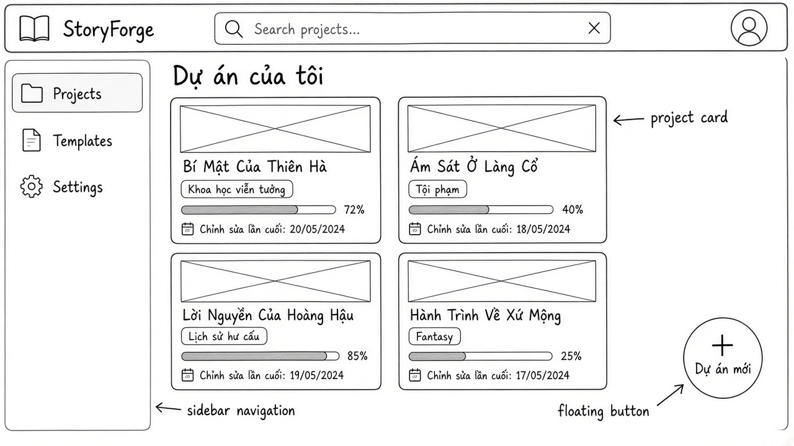
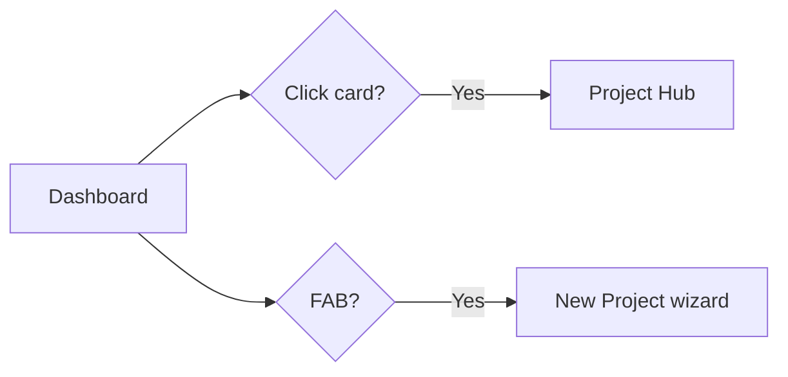
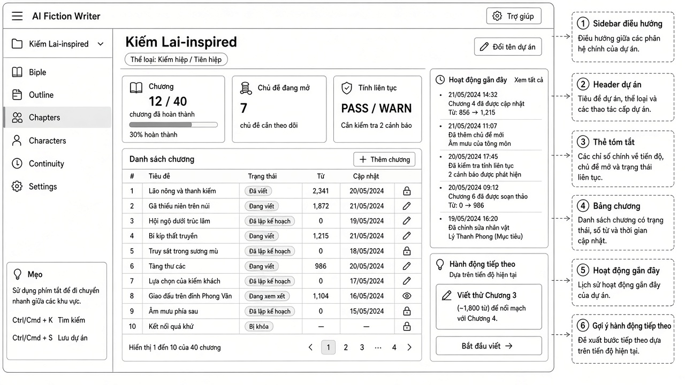
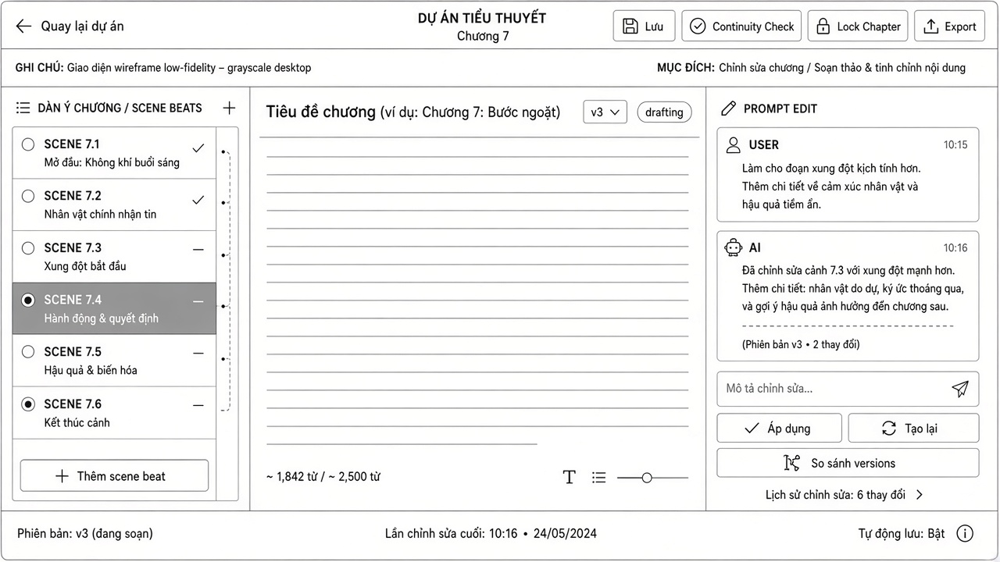
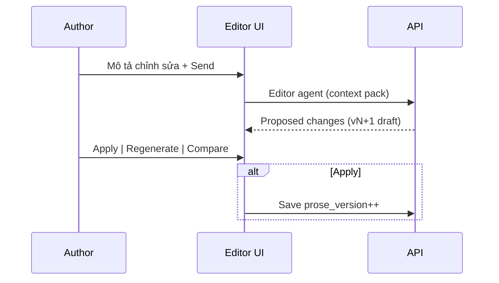
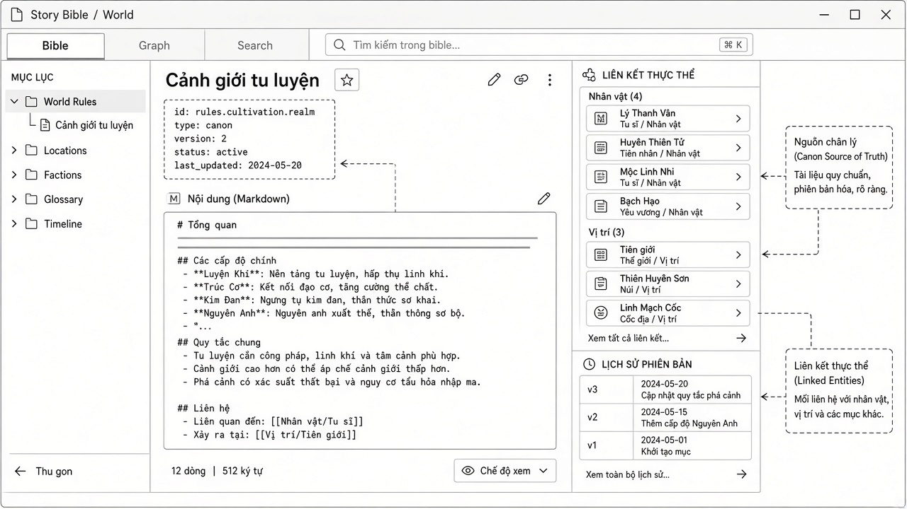
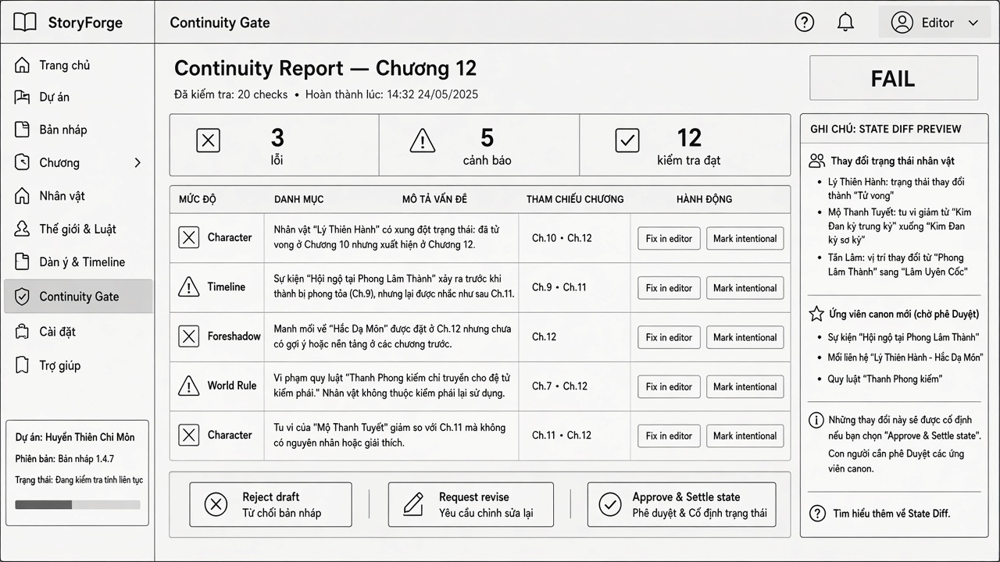
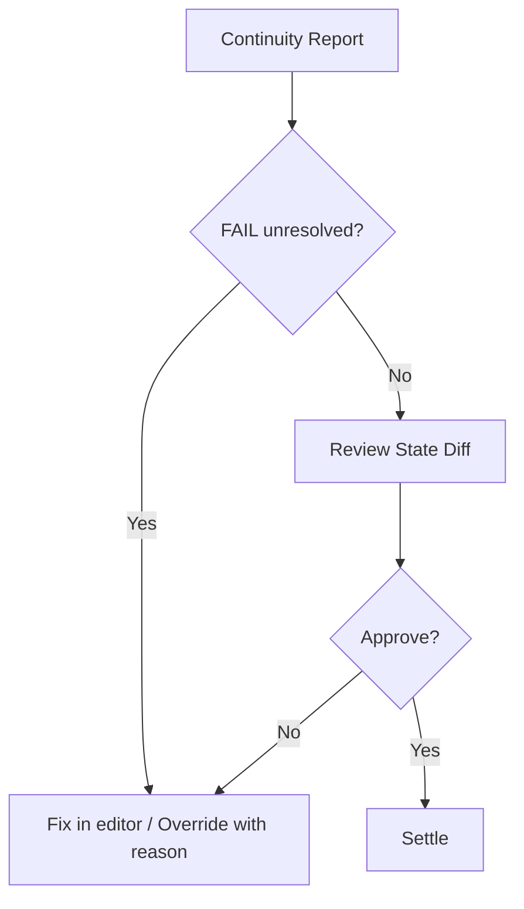
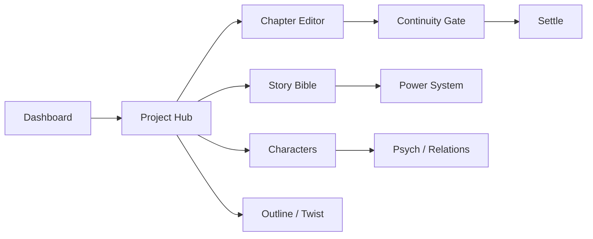

# StoryForge — Wireframe Catalog

> 5 wireframe lo-fi đã vẽ + spec text cho màn hình chưa vẽ. Images: `docs/wireframes/images/`.

---

## Mục lục màn hình

| # | Screen | Asset | User stories |
|---|--------|-------|--------------|
| 1 | Dashboard dự án | [image](../wireframes/images/dashboard-projects.png) | US-P02 |
| 2 | Project Hub / Chapter list | [image](../wireframes/images/project-hub.png) | US-H01, US-O01 |
| 3 | Chapter Editor + Prompt Edit | [image](../wireframes/images/chapter-editor.png) | US-W01–W03 |
| 4 | Story Bible / World | [image](../wireframes/images/story-bible.png) | US-B01–B03 |
| 5 | Continuity Gate + State diff | [image](../wireframes/images/continuity-gate.png) | US-CO01–CO03 |
| 6 | New Project wizard | text spec | US-P01 |
| 7 | Characters + Provisional inbox | text spec | US-C01–C03 |
| 8 | Outline / Timeline / Twist Board | text spec | US-O01–O03, US-T01 |
| 9 | Power System bible | text spec | US-PW01 |
| 10 | Psych / Relationship panels | text spec | US-C03 |

---

## 1. Dashboard dự án



### Layout zones

| Zone | Thành phần |
|------|------------|
| **Header** | Logo StoryForge, search projects, user avatar |
| **Sidebar** | Projects (active), Templates, Settings |
| **Main** | Title “Dự án của tôi”, grid project cards |
| **FAB** | “+ Dự án mới” bottom-right |

### Project card

- Cover placeholder, title, genre pill, progress bar + %, last edited date

### States

| State | UI |
|-------|-----|
| **Empty** | Illustration + “Chưa có dự án” + CTA tạo mới |
| **Loading** | Skeleton cards (4 placeholders) |
| **Error** | Banner “Không tải được dự án” + Retry |
| **Filtered empty** | “Không có kết quả cho ‘…’” + clear search |

### Primary flow



**Stories:** US-P02, US-P04

---

## 2. Project Hub / Chapter list



### Layout zones

| Zone | Thành phần |
|------|------------|
| **Sidebar** | Project switcher, Bible / Outline / Chapters / Characters / Continuity / Settings, Tips (⌘K, ⌘S) |
| **Header dự án** | Title, genre, “Đổi tên dự án” |
| **Summary cards** | Chapters progress, Open topics, Continuity PASS/WARN |
| **Chapter table** | #, Title, Status, Words, Updated, Actions |
| **Right rail** | Recent activity, Next action suggestion |

### Chapter status labels

`Đã viết` | `Đang viết` | `Đã lập kế hoạch` | `Đang xem xét` | `Bị khóa`

### States

| State | UI |
|-------|-----|
| **Empty chapters** | “Chưa có chương” + “+ Thêm chương” |
| **Loading** | Table skeleton + card skeletons |
| **Continuity WARN** | Amber badge on summary card; link to issues |

### Primary flow

Hub → select chapter row → Chapter Editor (writing) or Continuity Gate (reviewing)

**Stories:** US-H01, US-O01, US-W04

---

## 3. Chapter Editor + Prompt Edit



### Layout zones

| Zone | Thành phần |
|------|------------|
| **Top bar** | Back to project, project/chapter title, Save, Continuity Check, Lock, Export |
| **Left** | Scene beats list (7.1…7.6), add beat |
| **Center** | Chapter title, version dropdown, status tag, prose editor, word count |
| **Right** | **Prompt Edit** — instruction log, input, Apply / Regenerate / Compare |
| **Footer** | Version, last edit time, auto-save indicator |

### Critical interactions

#### Prompt Edit loop



- **Apply:** commit AI revision as new version
- **Regenerate:** same instruction, new sample
- **Compare:** side-by-side or inline diff vs previous version

### States

| State | UI |
|-------|-----|
| **Empty prose** | Placeholder “Bắt đầu viết hoặc dùng Prompt Edit…” |
| **Saving** | “Đang lưu…” in footer |
| **Locked chapter** | Editor read-only; banner explains unlock |
| **AI running** | Prompt panel spinner; Send disabled |

**Stories:** US-W01, US-W02, US-W03, US-CO04

---

## 4. Story Bible / World



### Layout zones

| Zone | Thành phần |
|------|------------|
| **Tabs** | Bible | Graph | Search |
| **Left TOC** | World Rules, Locations, Factions, Glossary, Timeline |
| **Center** | Entry title, metadata block, Markdown content |
| **Right** | Entity links, Version history |

### Metadata block (canon SoT)

```
id: rules.cultivation.realm
type: canon
version: 2
status: active
last_updated: 2024-05-20
```

### States

| State | UI |
|-------|-----|
| **No entry selected** | “Chọn mục từ mục lục” |
| **Edit mode** | Split or toggle preview; Save stages draft (pre-settle) |
| **Broken wiki-link** | Dashed link + “Tạo entry?” |

**Stories:** US-B01, US-B02, US-B03, US-B04

---

## 5. Continuity Gate + State diff



### Layout zones

| Zone | Thành phần |
|------|------------|
| **Header** | Report title, FAIL/WARN/PASS badge, check stats |
| **Issue table** | Level, Category, Description, Chapter refs, Actions |
| **Right panel** | **State diff preview** — character changes, new canon candidates |
| **Bottom bar** | Reject draft | Request revise | **Approve & Settle state** |

### Critical interactions

| Action | Behavior |
|--------|----------|
| **Fix in editor** | Navigate to chapter editor with issue context |
| **Mark intentional** | WARN → stored override; re-audit skips |
| **Reject draft** | No ledger write; chapter stays drafting |
| **Request revise** | Optional comment; status → reviewing |
| **Approve & Settle** | Atomic TXN: ledger append + bible_version++ |



### States

| State | UI |
|-------|-----|
| **Running check** | Progress in sidebar; table disabled |
| **Stale report** | Banner “Draft đã đổi — chạy lại check” |
| **Settle success** | Toast + redirect Hub; chapter locked |

**Stories:** US-CO01, US-CO02, US-CO03, US-T02

---

## 6. New Project wizard (text spec)

Chưa có wireframe image — spec dưới đây cho Phase 1 UI.

### ASCII layout

```
┌─────────────────────────────────────────────────────────────┐
│  StoryForge          Tạo dự án mới                    [X]   │
├─────────────────────────────────────────────────────────────┤
│  ● Basics ─── ○ Genre ─── ○ Template ─── ○ Confirm          │
├─────────────────────────────────────────────────────────────┤
│                                                             │
│   Tên dự án *        [________________________]             │
│   Mô tả ngắn         [________________________]             │
│   Ngôn ngữ prose     (•) Tiếng Việt  ( ) English            │
│                                                             │
│              [ Hủy ]              [ Tiếp theo → ]           │
└─────────────────────────────────────────────────────────────┘
```

**Step 2 — Genre:** cards xianxia, mystery, literary, romance, custom → sets `genre_profile` + rule pack.

**Step 3 — Template:** Blank | Kiếm hiệp starter | Trinh thám starter → seeds bible TOC + sample chapters count.

**Step 4 — Confirm:** summary + optional import markdown bible.

### States

| State | UI |
|-------|-----|
| **Validation error** | Inline under field; Next disabled |
| **Creating** | Spinner on Confirm; prevent double submit |
| **Slug conflict** | Suggest alternate slug |

**Stories:** US-P01

---

## 7. Characters + Provisional inbox (text spec)

### ASCII layout — Characters list

```
┌──────────┬──────────────────────────────────────────────────┐
│ Sidebar  │  Nhân vật                    [+ Thêm] [Inbox 12]│
│          ├──────────────────────────────────────────────────┤
│          │ Filter: [All tiers ▼] [Search...        ]        │
│          │ ┌────────────────────────────────────────────┐ │
│          │ │ T3 ★ Lý Thanh Vân    Protagonist    [Edit]│ │
│          │ │ T1   Mặc Khách A       Guest         [···] │ │
│          │ │ T0   Đệ tử ngoại môn   Seed          [···] │ │
│          │ └────────────────────────────────────────────┘ │
└──────────┴──────────────────────────────────────────────────┘
```

### Provisional inbox (modal or tab)

| Column | Content |
|--------|---------|
| Mention | Extracted name + snippet |
| Chapter | Source chapter_ref |
| Actions | Merge ▼ | Promote new | Reject |

### Character detail — tabs

- **Overview:** tier, role, aliases
- **Psyche:** see §10
- **Relationships:** see §10
- **Ledger tail:** last N state events
- **Appearances:** chapter list

### States

| State | UI |
|-------|-----|
| **Empty cast** | “Thêm nhân vật seed hoặc viết prose để extract” |
| **Inbox empty** | Tab hidden or badge 0 |
| **Merge conflict** | Side-by-side pick canonical fields |

**Stories:** US-C01, US-C02, US-C03

---

## 8. Outline / Timeline / Twist Board (text spec)

### 8a. Outline tree

```
┌─────────────────────────────────────────────────────────────┐
│ Outline                          [+ Act] [+ Chapter]        │
├─────────────────────────────────────────────────────────────┤
│ ▼ Act I — Khởi (Ch.1-10)                                    │
│    ├─ Ch.1  Giới thiệu          planned    [beats]         │
│    └─ Ch.2  Xung đột đầu        drafting   [beats]         │
│ ▼ Act II — …                                                │
└─────────────────────────────────────────────────────────────┘
```

Drag-drop reorder chapters; link beat plan to Chapter Editor.

### 8b. Timeline board

Horizontal swimlane: `World time` vs `Story chapters`. Anchor events draggable; continuity validates order.

### 8c. Twist board (Kanban)

| Cột | Cards |
|-----|-------|
| **Secrets** | secret_truth (author-only badge) |
| **Plants** | chapter, strength, linked secret |
| **Payoffs** | target chapter, required plant IDs |
| **Revealed** | settled reveals read-only |

### States

| State | UI |
|-------|-----|
| **Payoff without plants** | Red border on payoff card + link to continuity rule |
| **Loading** | Skeleton columns |

**Stories:** US-O01, US-O02, US-O03, US-T01, US-T02

---

## 9. Power System bible (text spec)

Sub-view under Story Bible → World Rules → Power System (xianxia projects).

### ASCII layout

```
┌─────────────────────────────────────────────────────────────┐
│ Power System — Cảnh giới tu luyện              [Edit]       │
├─────────────────────────────────────────────────────────────┤
│ Rank ladder (ordered):                                      │
│  1. Luyện Khí    [constraints...]              [+ Rank]     │
│  2. Trúc Cơ      ...                                        │
│ Priority gap: [ 2 ] ranks                                   │
├─────────────────────────────────────────────────────────────┤
│ Techniques:                                                 │
│  ID          Rank req   Sect      Cost                        │
│  technique.x  Trúc Cơ   Thanh Vân  100 linh thạch           │
└─────────────────────────────────────────────────────────────┘
```

### States

| State | UI |
|-------|-----|
| **Disabled (non-xianxia)** | “Genre không dùng power system” + link change genre |
| **Validation** | Non-monotonic ranks blocked on save |

**Stories:** US-PW01, US-PW02

---

## 10. Psych / Relationship panels (text spec)

Part of Character detail — có thể split panel trong Chapter Editor (POV character quick view).

### Psyche panel

```
┌─ Psyche Card ────────────────────────────────────────────────┐
│ Core traits    [ loyal ] [ stubborn ] [+ ]                  │
│ Wound          [ betrayal by mentor ]                        │
│ Desires / Fears                                            │
│ Moral boundaries  [ never harm children ]                  │
│ Speech patterns   [ short sentences, northern dialect ]    │
├─ PsychState timeline ──────────────────────────────────────┤
│ Ch.10  stress: high | belief: "mentor is dead"              │
│ Ch.7   stress: medium | ...                                 │
└─────────────────────────────────────────────────────────────┘
```

### Relationship panel

```
┌─ Relationships ──────────────────────────────────────────────┐
│ Lý Thanh Vân  — trust: ████░ — rival → ally (Ch.8)         │
│ Bạch Hạo      — trust: ██░░░ — secret debt                  │
│ [+ Add relationship]                                         │
└─────────────────────────────────────────────────────────────┘
```

Graph view (Phase 8+): optional force-directed mini-graph.

**Stories:** US-C03 + psychology / continuity categories

---

## Screen → Subsystem map



---

## Liên kết

- [04-user-stories.md](./04-user-stories.md)
- [06-build-plan.md](./06-build-plan.md) — phase giao UI
- [02-architecture.md](./02-architecture.md)
