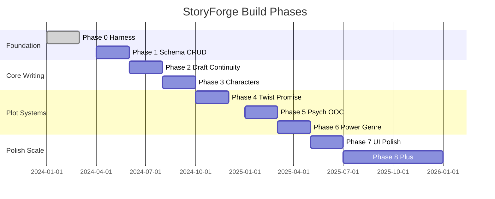

# StoryForge — Build Plan

> Phased delivery từ harness bootstrap đến full author product. **MVP scope** explicit ở cuối.

---

## Tổng quan phases

*(Timeline illustrative — không cam kết calendar; thứ tự phase và deps mới là binding.)*

---

## Phase 0 — Harness (DONE)

**Goal:** Repo sẵn sàng cho agent và CI; stubs app; docs/skills skeleton.

### Deliverables (current repo)

- [x] Monorepo `apps/web`, `apps/api`, `packages/shared`
- [x] `docs/architecture.md`, `domain-model.md`, `schema-draft.md`, `roadmap.md`
- [x] First-party skills `skills/storyforge-*`
- [x] Vendored AAS stack `vendor/aas-skills/`, `aas-stack.json`
- [x] Harness `scripts/harness/check.sh`, CI GitHub Actions
- [x] Docker Compose Postgres + Redis
- [x] Minimal FastAPI `/health`, Next.js placeholder
- [x] Product docs (this PR)

### Definition of done

- `make check` green on main
- AGENTS.md reading order clear

### Suggested PRs (historical)

| PR | Content |
|----|---------|
| bootstrap | monorepo + harness |
| skills | storyforge-* + AAS vendor |
| product-docs | docs/product/* + wireframes |

---

## Phase 1 — Schema / Migrations + Project / Bible CRUD

**Goal:** One project, bible v0 seed, dashboard + hub skeleton, ACL.

### Deliverables

| Item | Output |
|------|--------|
| Alembic migrations | `projects`, `bible_versions`, `chapters`, `characters` (T0) |
| Auth + ACL | project roles; RLS policies |
| API | CRUD projects, bible entries (draft staging), chapters list |
| Web | Dashboard wireframe, New Project wizard, Project Hub (read-only stats) |
| Bible UI | Story Bible browser (view/edit staging) |

### Dependencies

- Phase 0

### Definition of done

- Author creates project via wizard, seeds bible, sees hub chapter table
- All queries scoped `project_id`; cross-tenant test fails
- `make check` + migration up/down clean

### Suggested PR order

1. **`specs/phase-1`** — schema, OpenAPI, web screens, test strategy ([docs/specs/phase-1/README.md](../specs/phase-1/README.md))
2. **`api/phase-1-implementation`** — Alembic migrations, routers, Testcontainers tests, coverage ≥90%
3. **`web/phase-1-implementation`** — Dashboard, wizard, hub, bible browser against OpenAPI

PRs **2** and **3** run **in parallel** after specs merge.

**Skill focus:** `storyforge-db-design`, `storyforge-api-python`, `storyforge-web-next`, `storyforge-domain-canon`

---

## Phase 2 — Chapter Draft / Edit Versions + Basic Continuity

**Goal:** End-to-end write → check → settle v1 (deterministic only).

### Deliverables

| Item | Output |
|------|--------|
| Prose versions | `prose_versions`, `scene_beats` CRUD |
| Chapter Editor UI | beats sidebar, save, version dropdown |
| Deterministic continuity | death, timeline, location rules |
| Continuity Gate UI | issue table, FAIL blocks settle |
| State diff v1 | manual + simple extract stub |
| Settle transaction | ledger append + bible_version++ |
| Redis queue | async continuity job (optional sync MVP) |

### Dependencies

- Phase 1

### Definition of done

- Author writes ch.1, runs check, sees FAIL/WARN, approves diff, settles
- Bible version increments; chapter status `settled`
- Locked settled chapter read-only

### Suggested PR order

1. **`specs/phase-2`** — schema, OpenAPI, web screens, continuity rules, test strategy ([docs/specs/phase-2/README.md](../specs/phase-2/README.md))
2. **`api/phase-2-implementation`** — migrations `004`–`007`, continuity engine, settle TXN, Testcontainers tests, coverage ≥90% local
3. **`web/phase-2-implementation`** — Chapter Editor + Continuity Gate against OpenAPI

PRs **2** and **3** run **in parallel** after specs merge.

**Skill focus:** `storyforge-continuity`, `storyforge-domain-canon`

---

## Phase 3 — Characters Progressive + Provisional Inbox

**Goal:** Large cast support; extract mentions; merge workflow.

### Deliverables

| Item | Output |
|------|--------|
| Tier model | T0–T3 promote rules |
| Provisional inbox | `character_provisional` + UI |
| Fact extractor v1 | propose provisionals + character state |
| pgvector v1 | name/alias search for context packs |
| Characters UI | list, detail, inbox tab |

### Dependencies

- Phase 2 settle (extract runs on draft)

### Definition of done

- New name in prose → inbox row → merge creates canonical ID
- Context pack includes only scene characters + tier cap

### Suggested PR order

1. **`specs/phase-3`** — schema, OpenAPI, web screens, character lifecycle, test strategy ([docs/specs/phase-3/README.md](../specs/phase-3/README.md))
2. **`api/phase-3-implementation`** — migrations `008`–`010`, character CRUD, provisional inbox, extractor v1, search, Testcontainers tests, coverage ≥90%
3. **`web/phase-3-implementation`** — Characters list, detail, Provisional inbox against OpenAPI

PRs **2** and **3** run **in parallel** after specs merge.

**Skill focus:** `storyforge-characters`

---

## Phase 4 — Twist / Promise Ledger

**Goal:** Fair twist tracking; foreshadow continuity category.

### Deliverables

| Item | Output |
|------|--------|
| TwistPlan schema | secrets, plants, payoffs |
| Twist board UI | Kanban spec from wireframes |
| Continuity | payoff-without-plants FAIL |
| Writer context | plants-only strip secret_truth |

### Dependencies

- Phase 2 continuity framework

### Definition of done

- Register secret + plant; payoff chapter warns/fails without plant
- Mark intentional override works

### Suggested PR order

1. `db/twist_plans`
2. `api/twist-crud-continuity`
3. `web/twist-board`

**Skill focus:** `storyforge-twists`

---

## Phase 5 — Psych State + OOC

**Goal:** Earned psychology; PsychState ledger; OOC checks.

### Deliverables

| Item | Output |
|------|--------|
| Psyche card UI | character detail tab |
| PsychState append | on settle extract |
| Continuity | psychology category deterministic + LLM |
| Psych timeline | per character |

### Dependencies

- Phase 3 characters

### Definition of done

- Moral boundary violation → WARN/FAIL
- State diff shows psych snapshot proposals

**Skill focus:** `storyforge-psychology`

---

## Phase 6 — Power System + Genre Contracts

**Goal:** Xianxia anti-creep; genre rule packs.

### Deliverables

| Item | Output |
|------|--------|
| Power system bible UI | rank ladder, techniques |
| Cultivation ledger events | on settle |
| Deterministic rules | rank jump, technique eligibility |
| Genre rule packs | `genre_profile` config JSON |
| LLM integration | LiteLLM + Editor agent (Prompt Edit) |

### Dependencies

- Phase 2 settle, Phase 5 optional for parallel

### Definition of done

- Rank jump without breakthrough → FAIL
- Mystery vs xianxia different twist strictness
- Prompt Edit loop functional (Apply/Regenerate/Compare)

### Suggested PR order

1. `api/litellm-editor-agent`
2. `web/prompt-edit-panel`
3. `api/power-system-rules`
4. `web/power-system-bible`
5. `api/genre-rule-packs`

**Skill focus:** `storyforge-power-system`, `storyforge-continuity`

---

## Phase 7 — UI Polish

**Goal:** Production-grade UX; accessibility; taste-skill alignment.

### Deliverables

| Item | Output |
|------|--------|
| Design system | tokens, typography, dark mode |
| Wireframe parity | all 5 screens + wizard/inbox |
| External skills | taste-skill, ui-ux-pro-max on dev machines |
| Performance | optimistic UI, skeleton states |
| i18n | VI primary, EN secondary for chrome |

### Dependencies

- Phases 1–6 feature-complete for MVP screens

### Definition of done

- Empty/loading/error states on all primary screens
- `docs/product/05-wireframes.md` acceptance checklist passed

**Skill focus:** `storyforge-ui-external`

---

## Phase 8+ — Scene Engine, Relationships, Research, Series

**Goal:** Advanced story quality modules; export; scale.

### Deliverables (incremental)

| Module | Notes |
|--------|-------|
| Scene engine | beat goal/conflict/outcome lint |
| Relationship arcs | graph view, ledger events |
| Stakes ledger | act-level escalation |
| Research module | notes → promote to bible |
| Series projects | parent bible slice |
| Git mirror | markdown export jobs |
| Neo4j | optional if relationship queries painful |
| Export | EPUB/DOCX |
| Collaboration | realtime optional |

### Dependencies

- MVP shipped (Phases 1–7)

---

## MVP Scope (explicit)

**MVP = Phase 1 + Phase 2 + subset Phase 3 + deterministic continuity only**

| In MVP | Out of MVP |
|--------|------------|
| Dashboard, wizard, hub, bible browser | Twist board |
| Chapter editor (manual prose, beats) | Full Prompt Edit AI (Phase 6) — optional stub OK |
| Save versions, settle v1 | LLM continuity auditor |
| Deterministic continuity gate | Power system anti-creep (Phase 6) |
| Character T0 + manual promote | Provisional inbox auto-extract |
| Single author ACL | Multi-user collab |
| One project end-to-end | Export EPUB, Git mirror |

**MVP narrative:** Kim tạo dự án kiếm hiệp, seed bible cultivation, plan 3 chapters, viết ch.1 với beats, chạy continuity deterministic, settle, thấy bible version 2.

---

## Phase → Wireframe → User Story traceability

| Phase | Screens | Key stories |
|-------|---------|-------------|
| 1 | Dashboard, Wizard, Hub, Bible | US-P01, P02, H01, B01 |
| 2 | Chapter Editor, Continuity Gate | US-W01, CO01, CO03 |
| 3 | Characters, Inbox | US-C01, C02 |
| 4 | Twist board | US-T01, T02 |
| 5 | Psych panels | US-C03 |
| 6 | Prompt Edit, Power bible | US-W03, PW01 |
| 7 | Polish all | all UX AC |
| 8+ | Outline/Timeline advanced, export | US-O02, E01 |

---

## Risk & mitigations

| Risk | Mitigation |
|------|------------|
| LLM cost/latency | Beat-scoped packs; async queue; deterministic first |
| Schema churn | schema-draft.md + one migration per PR |
| Scope creep | MVP table above; Phase 8+ explicitly deferred |
| Agent inconsistency | storyforge-* skills + product docs canonical |

---

## Liên kết

- [01-vision-and-outcomes.md](./01-vision-and-outcomes.md)
- [05-wireframes.md](./05-wireframes.md)
- [docs/roadmap.md](../roadmap.md) — stub trỏ build plan
- Harness: `make check`, `scripts/harness/agent-preflight.sh`
