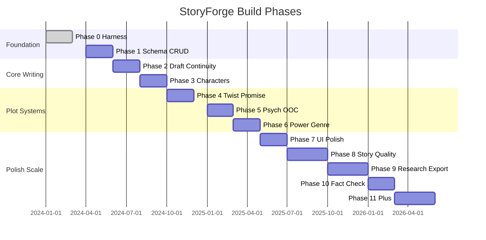

# StoryForge — Build Plan

> Phased delivery từ harness bootstrap đến full author product. **MVP scope** explicit ở cuối.

---

## Tổng quan phases

*(Timeline illustrative — không cam kết calendar; thứ tự phase và deps mới là binding.)*

---

## Phase 0 — Harness (DONE)

**Goal:** Repo sẵn sàng cho agent và CI; stubs app; docs/skills skeleton.

### Deliverables (current repo)

- [x] Monorepo `apps/web`, `apps/api`, `packages/shared`
- [x] `docs/architecture.md`, `domain-model.md`, `schema-draft.md`, `roadmap.md`
- [x] First-party skills `skills/storyforge-*`
- [x] Vendored AAS stack `vendor/aas-skills/`, `aas-stack.json`
- [x] Harness `scripts/harness/check.sh`, CI GitHub Actions
- [x] Docker Compose Postgres + Redis
- [x] Minimal FastAPI `/health`, Next.js placeholder
- [x] Product docs (this PR)

### Definition of done

- `make check` green on main
- AGENTS.md reading order clear

### Suggested PRs (historical)

| PR | Content |
|----|---------|
| bootstrap | monorepo + harness |
| skills | storyforge-* + AAS vendor |
| product-docs | docs/product/* + wireframes |

---

## Phase 1 — Schema / Migrations + Project / Bible CRUD

**Goal:** One project, bible v0 seed, dashboard + hub skeleton, ACL.

### Deliverables

| Item | Output |
|------|--------|
| Alembic migrations | `projects`, `bible_versions`, `chapters`, `characters` (T0) |
| Auth + ACL | project roles; RLS policies |
| API | CRUD projects, bible entries (draft staging), chapters list |
| Web | Dashboard wireframe, New Project wizard, Project Hub (read-only stats) |
| Bible UI | Story Bible browser (view/edit staging) |

### Dependencies

- Phase 0

### Definition of done

- Author creates project via wizard, seeds bible, sees hub chapter table
- All queries scoped `project_id`; cross-tenant test fails
- `make check` + migration up/down clean

### Suggested PR order

1. **`specs/phase-1`** — schema, OpenAPI, web screens, test strategy ([docs/specs/phase-1/README.md](../specs/phase-1/README.md))
2. **`api/phase-1-implementation`** — Alembic migrations, routers, Testcontainers tests, coverage ≥90%
3. **`web/phase-1-implementation`** — Dashboard, wizard, hub, bible browser against OpenAPI

PRs **2** and **3** run **in parallel** after specs merge.

**Skill focus:** `storyforge-db-design`, `storyforge-api-python`, `storyforge-web-next`, `storyforge-domain-canon`

---

## Phase 2 — Chapter Draft / Edit Versions + Basic Continuity

**Goal:** End-to-end write → check → settle v1 (deterministic only).

### Deliverables

| Item | Output |
|------|--------|
| Prose versions | `prose_versions`, `scene_beats` CRUD |
| Chapter Editor UI | beats sidebar, save, version dropdown |
| Deterministic continuity | death, timeline, location rules |
| Continuity Gate UI | issue table, FAIL blocks settle |
| State diff v1 | manual + simple extract stub |
| Settle transaction | ledger append + bible_version++ |
| Redis queue | async continuity job (optional sync MVP) |

### Dependencies

- Phase 1

### Definition of done

- Author writes ch.1, runs check, sees FAIL/WARN, approves diff, settles
- Bible version increments; chapter status `settled`
- Locked settled chapter read-only

### Suggested PR order

1. **`specs/phase-2`** — schema, OpenAPI, web screens, continuity rules, test strategy ([docs/specs/phase-2/README.md](../specs/phase-2/README.md))
2. **`api/phase-2-implementation`** — migrations `004`–`007`, continuity engine, settle TXN, Testcontainers tests, coverage ≥90% local
3. **`web/phase-2-implementation`** — Chapter Editor + Continuity Gate against OpenAPI

PRs **2** and **3** run **in parallel** after specs merge.

**Skill focus:** `storyforge-continuity`, `storyforge-domain-canon`

---

## Phase 3 — Characters Progressive + Provisional Inbox

**Goal:** Large cast support; extract mentions; merge workflow.

### Deliverables

| Item | Output |
|------|--------|
| Tier model | T0–T3 promote rules |
| Provisional inbox | `character_provisional` + UI |
| Fact extractor v1 | propose provisionals + character state |
| pgvector v1 | name/alias search for context packs |
| Characters UI | list, detail, inbox tab |

### Dependencies

- Phase 2 settle (extract runs on draft)

### Definition of done

- New name in prose → inbox row → merge creates canonical ID
- Context pack includes only scene characters + tier cap

### Suggested PR order

1. **`specs/phase-3`** — schema, OpenAPI, web screens, character lifecycle, test strategy ([docs/specs/phase-3/README.md](../specs/phase-3/README.md))
2. **`api/phase-3-implementation`** — migrations `008`–`010`, character CRUD, provisional inbox, extractor v1, search, Testcontainers tests, coverage ≥90%
3. **`web/phase-3-implementation`** — Characters list, detail, Provisional inbox against OpenAPI

PRs **2** and **3** run **in parallel** after specs merge.

**Skill focus:** `storyforge-characters`

---

## Phase 4 — Twist / Promise Ledger

**Goal:** Fair twist tracking; foreshadow continuity category.

### Deliverables

| Item | Output |
|------|--------|
| TwistPlan schema | secrets, plants, payoffs |
| Twist board UI | Kanban spec from wireframes |
| Continuity | payoff-without-plants FAIL |
| Writer context | plants-only strip secret_truth |

### Dependencies

- Phase 2 continuity framework

### Definition of done

- Register secret + plant; payoff chapter warns/fails without plant
- Mark intentional override works

### Suggested PR order

1. **`specs/phase-4`** — schema, OpenAPI, web screens, fairness rules, test strategy ([docs/specs/phase-4/README.md](../specs/phase-4/README.md))
2. **`api/phase-4-implementation`** — migrations `011`–`013`, twist CRUD, foreshadow continuity, context-pack strip, Testcontainers tests, coverage ≥90%
3. **`web/phase-4-implementation`** — Twist Board Kanban against OpenAPI

PRs **2** and **3** run **in parallel** after specs merge.

**Skill focus:** `storyforge-twists`

---

## Phase 5 — Psych State + OOC

**Goal:** Earned psychology; PsychState ledger; OOC checks.

### Deliverables

| Item | Output |
|------|--------|
| Psyche card UI | character detail tab |
| PsychState append | on settle extract |
| Continuity | psychology category deterministic + LLM |
| Psych timeline | per character |

### Dependencies

- Phase 3 characters

### Definition of done

- Moral boundary violation → WARN/FAIL
- State diff shows psych snapshot proposals
- PsychState timeline visible per character
- Deterministic psychology continuity category active

### Suggested PR order

1. **`specs/phase-5`** — schema, OpenAPI, web screens, OOC rules, test strategy ([docs/specs/phase-5/README.md](../specs/phase-5/README.md))
2. **`api/phase-5-implementation`** — migrations `014`–`015`, psyche/psych routes, psychology continuity, settle extract, Testcontainers tests, coverage ≥90%
3. **`web/phase-5-implementation`** — Character Psyche tab + PsychState timeline against OpenAPI

PRs **2** and **3** run **in parallel** after specs merge.

**Skill focus:** `storyforge-psychology`

---

## Phase 6 — Power System + Genre Contracts

**Goal:** Xianxia anti-creep; genre rule packs.

### Deliverables

| Item | Output |
|------|--------|
| Power system bible UI | rank ladder, techniques |
| Cultivation ledger events | on settle |
| Deterministic rules | rank jump, technique eligibility |
| Genre rule packs | `genre_profile` config JSON |
| LLM integration | LiteLLM + Editor agent (Prompt Edit) |

### Dependencies

- Phase 2 settle, Phase 5 optional for parallel

### Definition of done

- Rank jump without breakthrough → FAIL
- Mystery vs xianxia different twist strictness
- Prompt Edit loop functional (Apply/Regenerate/Compare)

### Suggested PR order

1. **`specs/phase-6`** — schema, OpenAPI, web screens, power rules, genre contracts, prompt-edit contract, test strategy ([docs/specs/phase-6/README.md](../specs/phase-6/README.md))
2. **`api/phase-6-implementation`** — migrations `016`–`019`, power routes, genre pack, prompt-edit + FakeLLM, power continuity, settle extract, Testcontainers tests, coverage ≥90%
3. **`web/phase-6-implementation`** — Power System bible, Prompt Edit panel, genre settings against OpenAPI

PRs **2** and **3** run **in parallel** after specs merge.

**Skill focus:** `storyforge-power-system`, `storyforge-continuity`

---

## Phase 7 — UI Polish

**Goal:** Production-grade UX; accessibility; design system; wireframe parity; i18n (VI primary, EN secondary for chrome).

### Deliverables

| Item | Output |
|------|--------|
| Design system | tokens, typography, light/dark, shared components |
| Wireframe parity | all 10 wireframe screens + wizard/inbox states |
| External skills | taste-skill, ui-ux-pro-max on dev machines |
| Performance | skeletons, safe optimistic UI, route loading |
| i18n | `messages/vi.json`, `messages/en.json`; no hard-coded chrome |
| Accessibility | WCAG AA; jest-axe smoke on primary routes |
| Client prefs | theme + locale in `localStorage` (no Phase 7 API) |

### Dependencies

- Phases 1–6 feature-complete for MVP screens

### Definition of done

- Empty/loading/error/success states on all primary screens ([screen-parity](../specs/phase-7/screen-parity.md))
- `docs/product/05-wireframes.md` acceptance checklist passed
- `make test-web-cov` ≥90% on Phase 7 polish modules locally

### Suggested PR order

1. **`specs/phase-7`** — design system, screen parity, a11y, i18n, performance, web screens, test strategy ([docs/specs/phase-7/README.md](../specs/phase-7/README.md))
2. **`web/phase-7-implementation`** — design tokens, components, i18n, a11y, wireframe parity across routes

**No default API PR** — theme/locale are client-only unless server prefs explicitly scoped later.

**Skill focus:** `storyforge-web-next`, `storyforge-ui-external`

---

## Phase 8 — Story Quality (Slice 1)

**Goal:** Scene structure lint, relationship arcs, and stakes escalation — extending chapter / continuity / settle loops (deterministic first).

### Deliverables (Slice 1 — in scope)

| Module | Notes |
|--------|-------|
| Scene engine | Beat `goal` / `conflict` / `outcome`; deterministic lint; Continuity Gate category `scene_structure` |
| Relationship arcs | `relationships` + `relationship_events` ledger; Postgres graph read model (no Neo4j) |
| Stakes ledger | Act checkpoints; flat-middle lint; bible snapshot `world.stakes` on settle |

### Out of scope (Phase 9+)

| Module | Notes |
|--------|-------|
| Research module | notes → promote to bible |
| Series projects | parent bible slice |
| Git mirror | markdown export jobs |
| Neo4j | optional if relationship queries painful |
| Export | EPUB/DOCX |
| Collaboration | realtime optional |
| Full Outline tree + Timeline swimlane | advanced planning UI |

### Dependencies

- Phases 1–7 complete (MVP + UI polish)

### Definition of done

- Scene beats carry structure fields; lint FAIL/WARN in Gate under `scene_structure`
- Relationship graph from settled events; settle appends `relationship_change`
- Stakes board with act columns; flat-middle WARN; snapshot on settle
- `make test-api-cov` / `make test-web-cov` ≥ 90% on Phase 8 modules locally

### Suggested PR order

1. **`specs/phase-8`** — schema, OpenAPI, web screens, scene/relationship/stakes rules, test strategy ([docs/specs/phase-8/README.md](../specs/phase-8/README.md))
2. **`api/phase-8-implementation`** — migrations `020`–`023`, scene lint, relationship + stakes routes, continuity categories, settle extract, Testcontainers tests, coverage ≥90%
3. **`web/phase-8-implementation`** — Scene lint panel, Relationship graph, Stakes board against OpenAPI

PRs **2** and **3** run **in parallel** after specs merge.

**Skill focus:** `storyforge-architecture`, `storyforge-domain-canon`, `storyforge-continuity`, `storyforge-db-design`, `storyforge-api-python`, `storyforge-web-next`

---

## Phase 9 — Research, Series, Export (Slice 1)

**Goal:** Research workflow, multi-book series inheritance, and async export pipelines — deferred modules from Phase 8.

### Deliverables (Slice 1 — in scope)

| Module | Notes |
|--------|-------|
| Research module | Notes attached to project; link characters/places/facts; search; promote → bible **staging** (human approve before settle) |
| Series projects | Parent `Series` entity; child projects share read-only parent bible slice; explicit override staging |
| Export | EPUB + DOCX chapter jobs; Git markdown mirror zip; Redis job queue; local artifact download |

### Out of scope (Phase 10+)

| Module | Notes |
|--------|-------|
| Neo4j | optional if Postgres graph queries painful |
| Realtime collaboration | presence / multi-user editing |
| Multi-user ACL beyond Phase 1 stub | invite flows, team roles |
| LLM research autofill | deterministic/manual promote first in Phase 9 |
| S3 / cloud artifact storage | local/tmp + Testcontainers-friendly in Phase 9 |
| Real git push | stub only in Phase 9 |
| Outline tree + Timeline swimlane | advanced planning UI |
| Motif + ending promises UI | cross-book tracking |

### Dependencies

- Phases 1–8 complete (Story Quality Slice 1 merged)

### Definition of done

- Research promote creates staging row; note marked promoted; settle unchanged
- Series child shows inherited slice; override creates flagged staging entry
- Export jobs: pending → running → done/failed; download artifact; settled vs draft scope documented
- Continuity: research/series WARN-only — export does not affect Gate
- `make test-api-cov` / `make test-web-cov` ≥ 90% on Phase 9 modules locally

### Suggested PR order

1. **`specs/phase-9`** — schema, OpenAPI, web screens, research/series/export rules, test strategy ([docs/specs/phase-9/README.md](../specs/phase-9/README.md))
2. **`api/phase-9-implementation`** — migrations `024`–`027`, research/series/export routes, Redis worker, Testcontainers tests, coverage ≥90%
3. **`web/phase-9-implementation`** — Research inbox, Series hub, Export panel against OpenAPI

PRs **2** and **3** run **in parallel** after specs merge.

**Skill focus:** `storyforge-architecture`, `storyforge-domain-canon`, `storyforge-continuity`, `storyforge-db-design`, `storyforge-api-python`, `storyforge-web-next`

---

## Phase 10 — Real-World Fact Check

**Goal:** Verify chapter claims against external sources (history, geography, tech, dates, public figures) — **distinct from** internal Continuity Gate (canon/bible/ledgers). Ships **before** genre craft LLM writing packs (Phase 11+).

### Deliverables (in scope)

| Module | Notes |
|--------|-------|
| Claim extraction | From chapter prose + optional research notes; configurable categories |
| Verification jobs | Async Redis queue (export pattern); FakeVerifier + Wikipedia/Wikidata stub + research-note evidence |
| Fact Check report | Severity, claim span, proposed correction, citation snapshots, confidence |
| Project reality mode | `reality_anchors`: `off` \| `soft` \| `strict` |
| Integration | Separate Fact Check panel; optional WARN-only Gate bridge when strict; default advisory (never blocks settle) |
| Research link | Promote citation → Phase 9 research note |

### Out of scope (Phase 11+)

| Module | Notes |
|--------|-------|
| Genre craft LLM packs | Snowflake, Hero's Journey, style enhancer |
| Neo4j | optional graph backend |
| Realtime collaboration | presence / multi-user editing |
| Paid search APIs | hard dependencies |
| Automatic prose rewrite | without human apply |
| LLM research autofill | optional overlap with Phase 9 deferred items |

### Dependencies

- Phases 1–9 complete (Research module provides evidence store)

### Definition of done

- FakeVerifier completes deterministically in tests; no live HTTP in CI
- Author actions: accept fix → Prompt Edit handoff, intentional fiction, dismiss, promote evidence
- `reality_anchors` modes filter extraction/verification correctly
- Continuity bridge WARN-only when strict; default never blocks settle
- `make test-api-cov` / `make test-web-cov` ≥ 90% on Phase 10 modules locally

### Suggested PR order

1. **`specs/phase-10`** — schema, OpenAPI, web screens, provider contracts, test strategy ([docs/specs/phase-10/README.md](../specs/phase-10/README.md))
2. **`api/phase-10-implementation`** — migrations `028`–`031`, extraction, providers, Redis worker, Testcontainers tests, coverage ≥90%
3. **`web/phase-10-implementation`** — Fact Check panel, reality settings against OpenAPI

PRs **2** and **3** run **in parallel** after specs merge.

**Skill focus:** `storyforge-architecture`, `storyforge-domain-canon`, `storyforge-continuity`, `storyforge-db-design`, `storyforge-api-python`, `storyforge-web-next`

---

## Phase 11+ — Genre Craft & Scale

**Goal:** Genre craft LLM writing packs, graph DB option, collaboration, advanced planning UI, cloud export — deferred until Phase 10 ships.

| Module | Notes |
|--------|-------|
| Genre craft LLM packs | Snowflake, Hero's Journey, style enhancer |
| Neo4j | optional relationship / knowledge graph |
| Realtime collaboration | optional |
| Full multi-user ACL | beyond stub |
| LLM research autofill | citation extraction |
| S3 presigned artifacts | production export storage |
| Real git push mirror | deploy keys |
| Outline / Timeline advanced | planning UI |
| Motif + ending promises | series arc tracking |

### Dependencies

- Phase 10 Fact Check

---

## MVP Scope (explicit)

**MVP = Phase 1 + Phase 2 + subset Phase 3 + deterministic continuity only**

| In MVP | Out of MVP |
|--------|------------|
| Dashboard, wizard, hub, bible browser | Twist board |
| Chapter editor (manual prose, beats) | Full Prompt Edit AI (Phase 6) — optional stub OK |
| Save versions, settle v1 | LLM continuity auditor |
| Deterministic continuity gate | Power system anti-creep (Phase 6) |
| Character T0 + manual promote | Provisional inbox auto-extract |
| Single author ACL | Multi-user collab |
| One project end-to-end | Export EPUB, Git mirror |

**MVP narrative:** Kim tạo dự án kiếm hiệp, seed bible cultivation, plan 3 chapters, viết ch.1 với beats, chạy continuity deterministic, settle, thấy bible version 2.

---

## Phase → Wireframe → User Story traceability

| Phase | Screens | Key stories |
|-------|---------|-------------|
| 1 | Dashboard, Wizard, Hub, Bible | US-P01, P02, H01, B01 |
| 2 | Chapter Editor, Continuity Gate | US-W01, CO01, CO03 |
| 3 | Characters, Inbox | US-C01, C02 |
| 4 | Twist board | US-T01, T02 |
| 5 | Psych panels | US-C03 |
| 6 | Prompt Edit, Power bible | US-W03, PW01 |
| 7 | Polish all | all UX AC |
| 8 | Scene lint, Relationship graph, Stakes board | US-C03, US-O01 (partial) |
| 9 | Research inbox, Series hub, Export panel | US-E01, US-E02 |
| 10 | Fact Check panel, Reality settings | US-W01 (external verify) |
| 11+ | Outline/Timeline advanced, genre craft packs, collaboration | US-O02, E03 |

---

## Risk & mitigations

| Risk | Mitigation |
|------|------------|
| LLM cost/latency | Beat-scoped packs; async queue; deterministic first |
| Schema churn | schema-draft.md + one migration per PR |
| Scope creep | MVP table above; Phase 8+ explicitly deferred |
| Agent inconsistency | storyforge-* skills + product docs canonical |

---

## Liên kết

- [01-vision-and-outcomes.md](./01-vision-and-outcomes.md)
- [05-wireframes.md](./05-wireframes.md)
- [docs/roadmap.md](../roadmap.md) — stub trỏ build plan
- Harness: `make check`, `scripts/harness/agent-preflight.sh`
