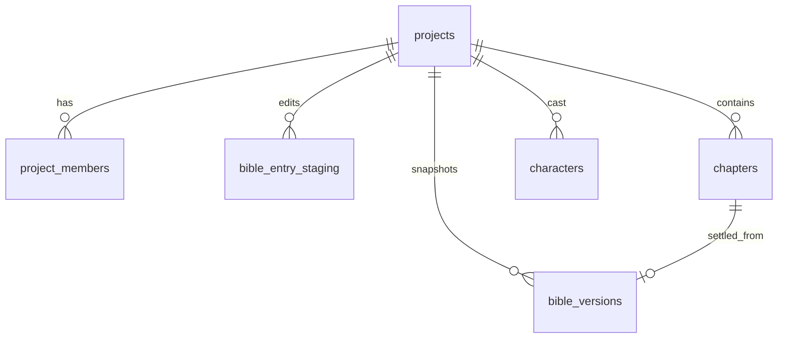

# Phase 1 Database Schema

> **Canonical for Phase 1.** Supersedes sketch sections in [schema-draft.md](../../schema-draft.md) for tables listed here.  
> **Migration tool:** Alembic (`apps/api/alembic/` — created in implementation PR).

---

## Design principles

1. **Multi-tenant:** Every row in tenant tables carries `project_id`. Application code and integration tests must reject cross-project access.
2. **Append-only where noted:** `bible_versions` — no UPDATE/DELETE on existing rows.
3. **Staging vs settled canon:** Editable bible content lives in `bible_entry_staging`. Settled snapshots live in `bible_versions.snapshot_json`. Phase 1 does not implement settle merge.
4. **Auth stub:** `X-User-Id` header (UUID string). ACL enforced via `project_members`.
5. **UUID PKs:** `gen_random_uuid()` default on all PK columns.

---

## Extensions

```sql
CREATE EXTENSION IF NOT EXISTS "pgcrypto";  -- gen_random_uuid()
```

`pgvector` is **not** required in Phase 1.

---

## Enums

PostgreSQL native enums (Alembic: create once in `001_core` revision).

### `project_status`

| Value | Meaning |
|-------|---------|
| `active` | Visible on dashboard default list |
| `archived` | Hidden from default list; data retained |

### `project_member_role`

| Value | Permissions (Phase 1) |
|-------|------------------------|
| `owner` | Full CRUD; delete/archive project |
| `editor` | CRUD on bible staging, chapters, characters |
| `viewer` | Read-only |

### `project_language`

| Value | Notes |
|-------|-------|
| `vi` | Vietnamese prose default |
| `en` | English prose |
| `mixed` | Author-defined |

### `genre_profile`

| Value | Notes |
|-------|-------|
| `xianxia` | Cultivation / kiếm hiệp rule pack |
| `mystery` | Trinh thám rule pack |
| `literary` | General literary |
| `romance` | Romance beats |
| `custom` | Minimal seed; author fills bible |

### `project_template`

| Value | Notes |
|-------|-------|
| `blank` | Empty bible TOC |
| `xianxia_starter` | Pre-seed cultivation rules + sample TOC |
| `mystery_starter` | Pre-seed detective structure TOC |

### `bible_section`

| Value | TOC group |
|-------|-----------|
| `world_rules` | World Rules |
| `locations` | Locations |
| `factions` | Factions |
| `glossary` | Glossary |
| `timeline` | Timeline |
| `characters` | Character bible entries (not cast table) |
| `objects` | Named objects / artifacts |

### `chapter_status`

| Value | UI label (VI) | Phase 1 |
|-------|---------------|---------|
| `planned` | Đã lập kế hoạch | Default for stub chapters |
| `drafting` | Đang viết | Metadata only |
| `continuity_pending` | Đang xem xét | Metadata only |
| `settled` | Đã viết | Metadata only |
| `locked` | Bị khóa | Metadata only |

---

## Tables

### `projects`

Top-level tenant root.

| Column | Type | Constraints | Notes |
|--------|------|-------------|-------|
| `id` | `uuid` | PK, DEFAULT `gen_random_uuid()` | |
| `slug` | `text` | NOT NULL, UNIQUE globally | URL-safe; derived from title on create |
| `title` | `text` | NOT NULL | Display name |
| `description` | `text` | NULL | Short summary from wizard |
| `language` | `project_language` | NOT NULL, DEFAULT `'vi'` | Prose language |
| `genre_profile` | `genre_profile` | NOT NULL, DEFAULT `'custom'` | Drives template seeds |
| `template` | `project_template` | NOT NULL, DEFAULT `'blank'` | Wizard selection |
| `status` | `project_status` | NOT NULL, DEFAULT `'active'` | |
| `bible_version_current` | `integer` | NOT NULL, DEFAULT `0` | Points to latest settled version |
| `settings` | `jsonb` | NOT NULL, DEFAULT `'{}'` | Future: tone, word targets |
| `created_by` | `uuid` | NOT NULL | User from `X-User-Id` at create |
| `created_at` | `timestamptz` | NOT NULL, DEFAULT `now()` | |
| `updated_at` | `timestamptz` | NOT NULL, DEFAULT `now()` | Touch on any project mutation |

**Indexes:**

- `UNIQUE (slug)`
- `INDEX projects_created_by_status_idx ON projects (created_by, status, updated_at DESC)` — dashboard list

**Rules:**

- `bible_version_current` may only increment via settle transaction (Phase 2). Phase 1 sets `0` on create and inserts `bible_versions` row version `0`.
- Archive = `status = 'archived'` (soft delete); hard DELETE not exposed in Phase 1 API.

---

### `project_members`

ACL membership (present in Phase 1; auth stubbed).

| Column | Type | Constraints | Notes |
|--------|------|-------------|-------|
| `id` | `uuid` | PK, DEFAULT `gen_random_uuid()` | |
| `project_id` | `uuid` | NOT NULL, FK → `projects(id)` ON DELETE CASCADE | |
| `user_id` | `uuid` | NOT NULL | Matches `X-User-Id` |
| `role` | `project_member_role` | NOT NULL, DEFAULT `'owner'` | |
| `created_at` | `timestamptz` | NOT NULL, DEFAULT `now()` | |

**Indexes:**

- `UNIQUE (project_id, user_id)`
- `INDEX project_members_user_id_idx ON project_members (user_id)`

**Rules:**

- Project create MUST insert creator as `owner` in same transaction.
- All project-scoped API handlers verify membership before data access.

---

### `bible_versions`

**Append-only.** Immutable settled canon snapshots.

| Column | Type | Constraints | Notes |
|--------|------|-------------|-------|
| `id` | `uuid` | PK, DEFAULT `gen_random_uuid()` | |
| `project_id` | `uuid` | NOT NULL, FK → `projects(id)` ON DELETE CASCADE | |
| `version` | `integer` | NOT NULL | 0 = seed at project create |
| `snapshot_json` | `jsonb` | NOT NULL | Full bible snapshot at this version |
| `settled_from_chapter_id` | `uuid` | NULL, FK → `chapters(id)` ON DELETE SET NULL | NULL for v0 seed |
| `created_at` | `timestamptz` | NOT NULL, DEFAULT `now()` | |

**Indexes:**

- `UNIQUE (project_id, version)`
- `INDEX bible_versions_project_id_version_desc_idx ON bible_versions (project_id, version DESC)`

**Append-only rules:**

- **No UPDATE** on existing rows (including `snapshot_json`).
- **No DELETE** of historical versions.
- Phase 1: only INSERT version `0` at project creation.

**`snapshot_json` shape (v0 seed):**

```json
{
  "version": 0,
  "entries": [
    {
      "entry_key": "world_rules.cultivation.realms",
      "section": "world_rules",
      "title": "Cảnh giới tu luyện",
      "content_md": "...",
      "metadata": { "type": "canon", "status": "active" }
    }
  ],
  "generated_from_template": "xianxia_starter"
}
```

---

### `bible_entry_staging`

Working copies for bible edits **before settle**. Phase 1 CRUD targets this table.

| Column | Type | Constraints | Notes |
|--------|------|-------------|-------|
| `id` | `uuid` | PK, DEFAULT `gen_random_uuid()` | |
| `project_id` | `uuid` | NOT NULL, FK → `projects(id)` ON DELETE CASCADE | |
| `entry_key` | `text` | NOT NULL | Stable id e.g. `world_rules.cultivation.realms` |
| `section` | `bible_section` | NOT NULL | TOC grouping |
| `title` | `text` | NOT NULL | |
| `content_md` | `text` | NOT NULL, DEFAULT `''` | Markdown body |
| `metadata` | `jsonb` | NOT NULL, DEFAULT `'{}'` | type, status, entity links |
| `base_bible_version` | `integer` | NOT NULL | Version staging branched from |
| `created_by` | `uuid` | NOT NULL | |
| `created_at` | `timestamptz` | NOT NULL, DEFAULT `now()` | |
| `updated_at` | `timestamptz` | NOT NULL, DEFAULT `now()` | |

**Indexes:**

- `UNIQUE (project_id, entry_key)`
- `INDEX bible_entry_staging_project_section_idx ON bible_entry_staging (project_id, section, title)`

**Rules:**

- CREATE/UPDATE allowed in Phase 1.
- DELETE allowed (author removes draft entry); does not mutate `bible_versions`.
- `base_bible_version` set to `projects.bible_version_current` on create.
- On settle (Phase 2): staging merged into new snapshot; staging rows may be reconciled — not specified here.

**Alternative considered:** single `bible_entries` table — rejected to keep settled (`bible_versions`) and working (staging) physically separate per domain canon skill.

---

### `chapters`

Chapter list metadata for Project Hub. No prose in Phase 1.

| Column | Type | Constraints | Notes |
|--------|------|-------------|-------|
| `id` | `uuid` | PK, DEFAULT `gen_random_uuid()` | |
| `project_id` | `uuid` | NOT NULL, FK → `projects(id)` ON DELETE CASCADE | |
| `number` | `integer` | NOT NULL | 1-based display order |
| `title` | `text` | NOT NULL | |
| `status` | `chapter_status` | NOT NULL, DEFAULT `'planned'` | |
| `word_count` | `integer` | NOT NULL, DEFAULT `0` | Stub 0 until Phase 2 |
| `bible_version_at_draft` | `integer` | NULL | Set when drafting starts (Phase 2) |
| `created_at` | `timestamptz` | NOT NULL, DEFAULT `now()` | |
| `updated_at` | `timestamptz` | NOT NULL, DEFAULT `now()` | |

**Indexes:**

- `UNIQUE (project_id, number)`
- `INDEX chapters_project_id_number_idx ON chapters (project_id, number ASC)`

**Rules:**

- Phase 1 API: LIST + optional POST stub (single placeholder chapter from template optional).
- No prose_versions or scene_beats tables in Phase 1 migrations.

---

### `characters`

T0 minimal cast seeds (canonical character IDs for later ledgers).

| Column | Type | Constraints | Notes |
|--------|------|-------------|-------|
| `id` | `uuid` | PK, DEFAULT `gen_random_uuid()` | Canonical ID |
| `project_id` | `uuid` | NOT NULL, FK → `projects(id)` ON DELETE CASCADE | |
| `display_name` | `text` | NOT NULL | |
| `role_one_liner` | `text` | NULL | T0 seed description |
| `tier` | `smallint` | NOT NULL, DEFAULT `0` | Phase 1: always 0 |
| `psyche_card` | `jsonb` | NOT NULL, DEFAULT `'{}'` | Empty until Phase 5 |
| `created_at` | `timestamptz` | NOT NULL, DEFAULT `now()` | |
| `updated_at` | `timestamptz` | NOT NULL, DEFAULT `now()` | |

**Indexes:**

- `UNIQUE (project_id, display_name)` — prevent duplicate T0 names per project
- `INDEX characters_project_id_tier_idx ON characters (project_id, tier, display_name)`

**Rules:**

- Phase 1 API: LIST only (seeds may be inserted by project template transaction).
- No `character_provisional` table in Phase 1.

---

## Entity relationship (Phase 1)



---

## Multi-tenant isolation

| Rule | Enforcement |
|------|-------------|
| All SELECT/INSERT/UPDATE on tenant tables include `project_id` | Repository layer + SQLAlchemy filters |
| URL `{project_id}` must match row scope | `Depends(require_project_access)` |
| User not in `project_members` | HTTP `404 Not Found` (do not leak existence) |
| Wrong `project_id` on nested resource | HTTP `404 Not Found` |
| Cross-tenant integration test | Required — see [test-strategy.md](./test-strategy.md) |

Optional Phase 2+: Postgres RLS policies mirroring application checks.

---

## Seed transaction (project create)

Single DB transaction:

1. INSERT `projects`
2. INSERT `project_members` (creator = owner)
3. INSERT `bible_versions` (version 0, `snapshot_json` from template)
4. INSERT `bible_entry_staging` rows copied from template (if any)
5. OPTIONAL INSERT stub `chapters` from template chapter count
6. OPTIONAL INSERT T0 `characters` from template

Rollback on any failure.

---

## Migration checklist (implementation PR)

- [ ] `001_core_enums_and_projects` — enums, projects, project_members
- [ ] `002_bible_staging_versions` — bible_versions, bible_entry_staging
- [ ] `003_chapters_characters` — chapters, characters
- [ ] Seed data fixtures for integration tests only (not production seeds)

---

## Deferred tables (do not create in Phase 1)

From [schema-draft.md](../../schema-draft.md): `scene_beats`, `prose_versions`, `ledger_events`, `character_provisional`, `twist_plans`, `continuity_reports`, `canon_embeddings` — see [Phase 2 schema](../phase-2/schema.md) for the first four continuity-related tables.

---

## Links

- [openapi.yaml](./openapi.yaml)
- [storyforge-db-design](../../../skills/storyforge-db-design/SKILL.md)
- [storyforge-domain-canon](../../../skills/storyforge-domain-canon/SKILL.md)
