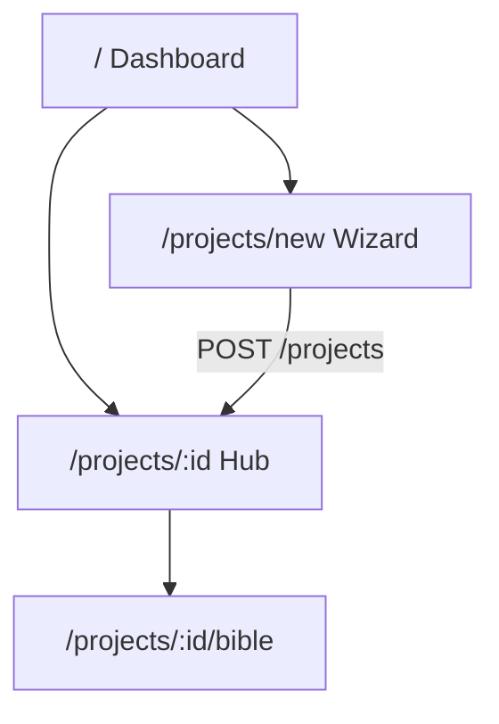

# Phase 1 Web Screens

> Maps [openapi.yaml](./openapi.yaml) → UI from [05-wireframes.md](../../product/05-wireframes.md).  
> **Phase 1 screens:** Dashboard (#1), New Project wizard (#6), Project Hub (#2), Story Bible (#4).  
> **Excluded:** Chapter Editor (#3), Continuity Gate (#5), Prompt Edit, Characters inbox (#7), Twist/Outline (#8), Power System (#9), Psych (#10).

---

## Shared conventions

| Topic | Rule |
|-------|------|
| API client | Fetch wrapper adds `X-User-Id` from stub session (localStorage dev default) |
| Types | Generate from OpenAPI or hand-maintain under `apps/web/lib/api/types.ts` |
| MSW | Handlers must match OpenAPI schemas for offline dev/tests |
| i18n | Vietnamese UI copy; English for dev-only debug |
| Routing | App Router: `/`, `/projects/new`, `/projects/[projectId]`, `/projects/[projectId]/bible` |

---

## Screen 1 — Dashboard (`/`)

**Wireframe:** [dashboard-projects.png](../../wireframes/images/dashboard-projects.png)  
**Stories:** US-P02, US-P04 (archive via project settings — defer UI to PATCH if needed)

### API mapping

| UI action | Endpoint |
|-----------|----------|
| Load grid | `GET /projects?page=1&page_size=20&status=active` |
| Search | `GET /projects?q={query}` |
| Open project | Navigate to `/projects/{id}` |
| New project FAB | Navigate to `/projects/new` |

### Components

| Component | Data | Notes |
|-----------|------|-------|
| `ProjectGrid` | `ProjectSummary[]` | Cards with title, genre pill, progress %, last edited |
| `ProjectCard` | single summary | Cover placeholder image |
| `SearchBar` | local state → `q` param | Debounce 300ms |
| `EmptyState` | — | "Chưa có dự án" + CTA |
| `LoadingSkeleton` | — | 4 card skeletons |
| `ErrorBanner` | error code | "Không tải được dự án" + Retry |

### States

| State | Trigger | UI |
|-------|---------|-----|
| Loading | Initial fetch | Skeleton grid |
| Empty | `total_items === 0` | Illustration + FAB highlight |
| Error | 401/5xx | Banner + retry |
| Filtered empty | `q` with no hits | "Không có kết quả" + clear |
| Success | 200 | Grid of cards |

### Out of scope Phase 1

- Archive/restore UI (API supports PATCH status)
- Real user avatar / OAuth

---

## Screen 2 — New Project wizard (`/projects/new`)

**Wireframe:** [new-project-wizard.png](../../wireframes/images/new-project-wizard.png)  
**Story:** US-P01

### Wizard steps

| Step | Fields | Maps to API |
|------|--------|-------------|
| 1 Basics | title, description, language | `ProjectCreateRequest` partial |
| 2 Genre | genre card selection | `genre_profile` |
| 3 Template | blank / xianxia_starter / mystery_starter | `template` |
| 4 Confirm | summary review | — |
| Submit | — | `POST /projects` |

Note: Wireframe shows 4 steps; optional "Seed bible" is implied by `template` selection (server-side seed).

### API mapping

| UI action | Endpoint |
|-----------|----------|
| Create | `POST /projects` with full body |
| Slug conflict | 409 → show suggested slug; allow edit slug field (optional Phase 1) |

### Components

| Component | Notes |
|-----------|-------|
| `WizardLayout` | Step indicator, Back/Next |
| `BasicsStep` | Validated title required |
| `GenreStep` | Cards: xianxia, mystery, literary, romance, custom |
| `TemplateStep` | Radio cards with descriptions |
| `ConfirmStep` | Read-only summary |
| `WizardSubmitButton` | Disabled while pending |

### States

| State | UI |
|-------|-----|
| Validation error | Inline field errors; Next disabled |
| Creating | Spinner on Confirm; prevent double submit |
| Success | Redirect to `/projects/{id}` (Project Hub) |
| Error 409 | Slug conflict message |
| Error other | Toast + stay on Confirm |

---

## Screen 3 — Project Hub (`/projects/[projectId]`)

**Wireframe:** [project-hub.png](../../wireframes/images/project-hub.png)  
**Stories:** US-H01, US-O01 (outline tab stub — link disabled Phase 1)

### API mapping

| UI action | Endpoint |
|-----------|----------|
| Load header + stats | `GET /projects/{id}` |
| Chapter table | `GET /projects/{id}/chapters` |
| Sidebar Bible link | Navigate to bible route |
| Sidebar Characters | List only — link to stub page or disabled badge "Phase 3" |

### Components

| Component | Data |
|-----------|------|
| `ProjectHeader` | title, genre_profile, rename (PATCH title — optional) |
| `SummaryCards` | chapter_count, bible_entry_count, stub continuity PASS |
| `ChapterTable` | Chapter[] — columns #, title, status, words, updated |
| `ProjectSidebar` | nav: Bible, Chapters (active), Characters (read-only list Phase 1 optional) |
| `RecentActivity` | stub empty — "Chưa có hoạt động" |

### Summary cards (Phase 1 stubs)

| Card | Source |
|------|--------|
| Chapters progress | `chapter_count` + count where status != planned |
| Open topics | Static 0 or hidden |
| Continuity | Static "—" or "N/A" — no Continuity Gate |

### States

| State | UI |
|-------|-----|
| Loading | Table + card skeletons |
| Empty chapters | "Chưa có chương" (template may pre-seed) |
| Error 404 | "Không tìm thấy dự án" → link Dashboard |
| Success | Full hub layout |

### Out of scope Phase 1

- Click row → Chapter Editor
- Continuity WARN badges with real data
- Prompt Edit, Continuity Gate nav items hidden or disabled

---

## Screen 4 — Story Bible (`/projects/[projectId]/bible`)

**Wireframe:** [story-bible.png](../../wireframes/images/story-bible.png)  
**Stories:** US-B01, US-B02 (version display read-only), US-B03 partial

### API mapping

| UI action | Endpoint |
|-----------|----------|
| Load TOC | `GET /projects/{id}/bible/entries?page_size=100` |
| Filter section | `?section=world_rules` |
| Select entry | `GET /projects/{id}/bible/entries/{entry_id}` |
| Save edit | `PATCH .../entries/{entry_id}` |
| New entry | `POST .../entries` |
| Version history panel | `GET .../bible/versions` + get v0 detail |
| Delete entry | `DELETE .../entries/{entry_id}` |

### Components

| Component | Notes |
|-----------|-------|
| `BibleLayout` | Tabs: Bible (active), Graph (disabled), Search (disabled Phase 1) |
| `BibleTOC` | Group by `section`; tree from entry_key segments |
| `BibleEntryViewer` | title, metadata block, rendered markdown |
| `BibleEntryEditor` | textarea/MD editor; Save → PATCH |
| `MetadataBlock` | id=entry_key, type, base_bible_version, updated_at |
| `VersionHistoryPanel` | List from versions API; read-only |
| `EntityLinksPanel` | Parse metadata.linked_entities — stub empty OK |

### Metadata block (display)

```text
id: world_rules.cultivation.realms
type: canon
base_version: 0
status: active (staging)
last_updated: 2026-09-12
```

Show badge **"Staging"** when entry exists in staging (all Phase 1 edits are staging).

### States

| State | UI |
|-------|-----|
| No selection | "Chọn mục từ mục lục" |
| Loading entry | Content skeleton |
| View mode | Rendered markdown |
| Edit mode | Editor + Save/Cancel |
| Saving | Disable Save; show spinner |
| Save error | Inline error |
| Empty TOC | "Chưa có mục bible" + create CTA |
| Broken wiki-link | Dashed link — "Tạo entry?" → POST prefilled |

### Canon UX rules

1. Saving never shows "canon version incremented" — only staging updated.
2. Version panel shows v0 from settle seed; no settle button in Phase 1.
3. Do not allow UI that implies silent overwrite of settled snapshot.

### Out of scope Phase 1

- ⌘K search (US-B04)
- Graph tab
- Diff vN vs vN+1 (Phase 2)

---

## Route map



---

## Phase 1 UI module list (for coverage)

Paths under `apps/web/` to include in ≥90% coverage gate:

| Module | Path suggestion |
|--------|-----------------|
| API client | `lib/api/client.ts`, `lib/api/projects.ts`, `lib/api/bible.ts` |
| Dashboard | `app/page.tsx`, `components/dashboard/*` |
| Wizard | `app/projects/new/*`, `components/wizard/*` |
| Hub | `app/projects/[projectId]/page.tsx`, `components/hub/*` |
| Bible | `app/projects/[projectId]/bible/*`, `components/bible/*` |
| Shared | `components/ui/*` used by above |

Exclude from Phase 1 coverage gate: Chapter Editor, Continuity Gate, Prompt Edit stubs.

---

## MSW fixtures (testing)

Minimum handlers mirroring OpenAPI:

- `GET /projects` — empty + populated
- `POST /projects` — 201 + 409
- `GET /projects/:id` — 200 + 404
- `GET/PATCH /projects/:id/bible/entries` — CRUD cycle
- `GET /projects/:id/chapters` — list
- `GET /projects/:id/characters` — list

---

## Links

- [api-contracts.md](./api-contracts.md)
- [test-strategy.md](./test-strategy.md)
- [05-wireframes.md](../../product/05-wireframes.md)
