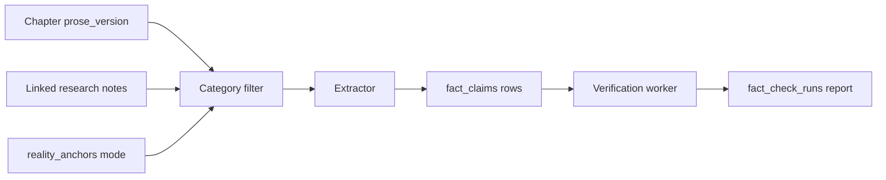

# Phase 10 — Real-World Fact Check

> **Skills:** `storyforge-domain-canon`, `storyforge-architecture`, `storyforge-continuity`  
> **Product:** External verification distinct from internal continuity ([03-domain-and-subsystems.md](../../product/03-domain-and-subsystems.md))

---

## Purpose

Authors writing historical fiction, thrillers, or grounded SF need to verify **real-world claims** in chapter prose against **external sources** — without conflating that work with **Continuity Gate** checks (canon, bible, ledgers, character state).

Fact Check is **advisory by default**: it surfaces mismatches, cites sources, and proposes corrections. The author decides whether to fix prose, mark intentional fiction, or dismiss.

---

## Key concepts

| Concept | Description |
|---------|-------------|
| **Claim** | Atomic verifiable statement extracted from prose (date, place, person, event, tech, scientific/medical) |
| **Claim span** | Character offsets + excerpt in source prose version |
| **Verification run** | Async job: extract claims → verify via providers → persist report |
| **Issue** | Claim + verification outcome: severity, confidence, citations, optional proposed correction |
| **Citation** | Immutable snapshot: URL, title, snippet, `retrieved_at`, provider id |
| **Reality anchors** | Project mode controlling which claims are checked |
| **Author disposition** | Per-claim action: accept fix, intentional fiction, dismiss, promote evidence |

---

## Claim categories (configurable)

Default enabled categories on `project_reality_settings.enabled_categories`:

| Category | Examples | Notes |
|----------|----------|-------|
| `date` | "in March 1945", "Tuesday, 9/11" | Normalized ISO when possible |
| `place` | "Berlin", "Silicon Valley", "Mount Everest" | Geo + administrative |
| `organization` | "NASA", "Red Cross", "Tesla Inc." | Companies, NGOs, governments |
| `technology` | "iPhone 15", "Enigma machine", "CRISPR" | Tools, products, techniques |
| `historical_event` | "Battle of Hastings", "Moon landing" | Named events with dates |
| `scientific_medical` | "penicillin treats syphilis", "speed of light" | Factual assertions |
| `public_figure` | "Einstein", "Queen Elizabeth II" | Named real people (not fictional characters) |

**Configuration:** Project settings JSON array; empty = all defaults. Pure fantasy projects set `reality_anchors=off` or disable categories.

**Anchor markers (soft mode):** Authors may wrap prose in `[[anchor]]...[[/anchor]]` (or UI "Mark as reality anchor") so only marked spans are extracted when `reality_anchors=soft`.

---

## Reality anchors mode

| Mode | Extraction | Verification | Gate bridge |
|------|------------|--------------|-------------|
| `off` | Skipped — run returns empty report with `skipped_reason: reality_off` | No provider calls | None |
| `soft` | Only anchor-marked spans + claims linked to research notes flagged `use_as_evidence` | Providers run on extracted set | None |
| `strict` | All enabled categories in chapter prose | Full provider pipeline | Open issues may appear as WARN in Continuity Gate (`fact_check` category) |

**Default:** `soft` for new projects; wizard may suggest `off` for pure fantasy, `strict` for historical fiction.

### Additional project settings

| Field | Type | Default | Description |
|-------|------|---------|-------------|
| `reality_anchors` | enum | `soft` | `off` \| `soft` \| `strict` |
| `enabled_categories` | string[] | all | Subset of claim categories |
| `fact_check_blocks_settle` | boolean | `false` | When `true`, unresolved FAIL-severity issues block settle (opt-in) |
| `auto_run_on_save` | boolean | `false` | Enqueue run after prose save (debounced) |
| `include_research_notes` | boolean | `true` | Pass linked research notes as evidence input |

---

## Claim extraction pipeline



### Extractor stages (implementation)

1. **Deterministic pass** — regex/heuristics for dates, capitalized place-like phrases, known org patterns, `@anchor` markers.
2. **Optional LLM assist** — behind `STORYFORGE_FACT_CHECK_LLM_EXTRACT=1`; FakeLLM in tests; never required for MVP.
3. **Research note merge** — notes linked to chapter (`research_note_links.link_type=chapter`) or tagged `fact-check` contribute claims with `source_type=research_note`.

Each claim stores:

```json
{
  "category": "date",
  "text": "March 1945",
  "normalized_text": "1945-03",
  "span": { "start": 142, "end": 154, "excerpt": "...in March 1945, the..." },
  "source_type": "prose",
  "source_prose_version_id": "uuid",
  "confidence_extract": 0.85
}
```

---

## Verification and severities

| Severity | Meaning | Default blocks settle? |
|----------|---------|------------------------|
| `pass` | Claim verified or low-risk | No |
| `warn` | Possible mismatch or low confidence | No |
| `fail` | Clear contradiction with cited source | Only if `fact_check_blocks_settle=true` |

**Confidence:** Provider returns `0.0`–`1.0`. UI shows badge; threshold for FAIL default `0.75` (configurable in provider result, not project setting Phase 10).

### Issue shape

```json
{
  "claim_id": "uuid",
  "severity": "warn",
  "summary": "Berlin Wall fell in 1989, not 1985",
  "proposed_correction": "November 1989",
  "confidence": 0.91,
  "citations": [
    {
      "provider": "wikidata_stub",
      "url": "https://www.wikidata.org/wiki/Q5083",
      "title": "Berlin Wall",
      "snippet": "Opened: 9 November 1989",
      "retrieved_at": "2026-09-14T12:00:00Z"
    }
  ],
  "author_disposition": null
}
```

---

## Author actions (per claim)

| Action | API | Effect |
|--------|-----|--------|
| **Accept fix proposal** | `POST .../claims/{id}/accept-fix` | Opens Prompt Edit prefill or creates bible/chapter **staging note** with proposed correction — **no prose mutation** |
| **Mark intentional / fiction** | `POST .../claims/{id}/disposition` body `{ "disposition": "intentional_fiction" }` | Issue hidden from strict Gate bridge; audit logged |
| **Dismiss** | `disposition: "dismissed"` | Hidden from default report filter; re-run may resurface unless fingerprint overridden |
| **Promote evidence** | `POST .../claims/{id}/promote-evidence` | Creates Phase 9 `research_note` from primary citation + claim excerpt |

**Dispositions:** `open` (default) \| `intentional_fiction` \| `dismissed` \| `accepted_fix` \| `evidence_promoted`

**Invariant:** No action writes to `bible_versions` or auto-increments `bible_version`.

---

## Job lifecycle

Same Redis pattern as Phase 9 export ([export.md](../phase-9/export.md)):

| Status | Meaning |
|--------|---------|
| `pending` | Run row inserted; queued |
| `running` | Worker extracting / verifying |
| `done` | Report complete |
| `failed` | `error_message` set |

Queue: `storyforge:fact_check_runs`  
Sync test mode: `STORYFORGE_FACT_CHECK_SYNC=1`

---

## Privacy and ethics

1. **No silent scrape of private documents** — HTTP providers fetch only:
   - Public URLs author explicitly attached to research notes
   - Configured public lookup endpoints (Wikipedia/Wikidata stub)
2. **No exfiltration** — Chapter prose sent to external APIs only when author enqueues run AND `STORYFORGE_FACT_CHECK_HTTP=1`; default off in dev/test.
3. **Citation snapshots** — Stored in `fact_citations.snapshot_json` at retrieval time; report reproducible even if live URL changes.
4. **Tenant isolation** — Claims and citations scoped by `project_id`; cross-tenant → `404`.

---

## Continuity Gate integration (optional bridge)

Fact Check remains a **separate panel**. Bridge rules:

| Condition | Gate behavior |
|-----------|---------------|
| `reality_anchors` ≠ `strict` | No fact-check issues in Gate |
| `reality_anchors=strict` | Open issues with severity `warn` or `fail` (excluding `intentional_fiction` / `dismissed`) appear as **`fact_check` category**, **WARN-only in Gate UI** — even if issue severity was `fail` |
| `fact_check_blocks_settle=true` | Settle endpoint checks fact-check FAIL dispositions separately from Gate — **not** merged into continuity FAIL categories |

**Continuity codes (bridge):**

| Code | Severity in Gate | When |
|------|------------------|------|
| `fact_check_unverified_claim` | WARN | strict mode; open warn issue |
| `fact_check_contradiction` | WARN | strict mode; open fail issue (Gate never FAIL from fact_check) |

Authors may mark intentional via fact-check disposition — **not** continuity override fingerprint (separate stores).

---

## API surface (summary)

| Method | Path | Purpose |
|--------|------|---------|
| GET/PATCH | `/projects/{id}/reality-settings` | Project reality mode + categories |
| POST | `/projects/{id}/chapters/{chapter_id}/fact-check/runs` | Enqueue run → `202` |
| GET | `/projects/{id}/chapters/{chapter_id}/fact-check/runs` | List runs |
| GET | `/projects/{id}/chapters/{chapter_id}/fact-check/runs/{run_id}` | Report + issues |
| GET | `/projects/{id}/fact-check/runs/{run_id}` | Same (project-scoped alias) |
| POST | `/projects/{id}/fact-check/claims/{claim_id}/disposition` | Author disposition |
| POST | `/projects/{id}/fact-check/claims/{claim_id}/accept-fix` | Staging / Prompt Edit handoff |
| POST | `/projects/{id}/fact-check/claims/{claim_id}/promote-evidence` | Citation → research note |

See [openapi.yaml](./openapi.yaml) and [api-contracts.md](./api-contracts.md).

---

## Web touchpoints

- Fact Check panel on chapter editor (tab or sidebar — **not** inside Gate issue table)
- Project settings → Reality mode section
- Claim row: excerpt highlight, citations, action buttons
- Link to research note after promote

See [web-screens.md](./web-screens.md).

---

## Multi-tenant isolation

All queries filter `project_id`. Cross-tenant run/claim id → `404`.

---

## Deferred (Phase 11+)

- Genre craft writing packs integration
- Paid search API providers (Google Knowledge Graph, etc.)
- Batch fact-check across all chapters
- Series-level shared fact-check rule packs
