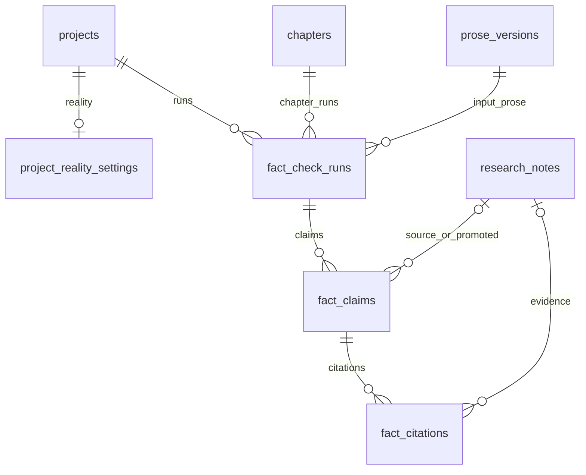

# Phase 10 Database Schema — Real-World Fact Check

> **Canonical for Phase 10.** Extends [Phase 9 schema](../phase-9/schema.md).  
> **Migration tool:** Alembic (`apps/api/alembic/` — continue from Phase 9 `027`).

---

## Design principles (unchanged + Phase 10)

1. **Multi-tenant:** Every row carries `project_id` (directly or via FK chain).
2. **Advisory by default:** Fact-check tables do not mutate `bible_versions` or ledgers.
3. **Citation immutability:** `fact_citations` append-only; snapshots for reproducible reports.
4. **Separate from continuity:** `continuity_reports` unchanged; bridge reads fact-check dispositions at check time.
5. **Redis queue:** Worker reads run id from queue; Postgres is SoT for run status.
6. **Human-in-the-loop:** Dispositions on claims; accept-fix creates staging handoff only.

---

## Migration from Phase 9

| Revision | Content |
|----------|---------|
| `028_project_reality_settings` | `project_reality_settings` (1:1 with projects) |
| `029_fact_check_runs` | `fact_check_runs` |
| `030_fact_claims` | `fact_claims` |
| `031_fact_citations` | `fact_citations` + indexes |

**Current main head after Phase 9:** `027_bible_staging_series_meta` — Phase 10 starts at `028`.

---

## `028_project_reality_settings`

### `project_reality_settings`

One row per project (create on project insert or first access upsert).

| Column | Type | Constraints | Notes |
|--------|------|-------------|-------|
| `project_id` | `uuid` | PK, FK → `projects(id)` ON DELETE CASCADE | |
| `reality_anchors` | `text` | NOT NULL, DEFAULT `'soft'` | `off` \| `soft` \| `strict` |
| `enabled_categories` | `jsonb` | NOT NULL, DEFAULT `'[]'` | Empty array = all categories enabled |
| `fact_check_blocks_settle` | `boolean` | NOT NULL, DEFAULT `false` | Opt-in settle block |
| `auto_run_on_save` | `boolean` | NOT NULL, DEFAULT `false` | Debounced enqueue |
| `include_research_notes` | `boolean` | NOT NULL, DEFAULT `true` | Evidence from Phase 9 notes |
| `updated_at` | `timestamptz` | NOT NULL, DEFAULT `now()` | |

**Indexes:**

- PK on `project_id` only

---

## `029_fact_check_runs`

### `fact_check_runs`

| Column | Type | Constraints | Notes |
|--------|------|-------------|-------|
| `id` | `uuid` | PK, DEFAULT `gen_random_uuid()` | |
| `project_id` | `uuid` | NOT NULL, FK → `projects(id)` ON DELETE CASCADE | |
| `chapter_id` | `uuid` | NOT NULL, FK → `chapters(id)` ON DELETE CASCADE | |
| `prose_version_id` | `uuid` | NOT NULL, FK → `prose_versions(id)` ON DELETE CASCADE | Input snapshot |
| `requested_by_user_id` | `uuid` | NOT NULL | |
| `status` | `text` | NOT NULL, DEFAULT `'pending'` | `pending` \| `running` \| `done` \| `failed` |
| `options_json` | `jsonb` | NOT NULL, DEFAULT `'{}'` | `force_refresh`, category override |
| `summary_json` | `jsonb` | NULL | `{ pass, warn, fail, skipped, total_claims }` when done |
| `skipped_reason` | `text` | NULL | e.g. `reality_off` |
| `error_message` | `text` | NULL | When failed |
| `started_at` | `timestamptz` | NULL | |
| `finished_at` | `timestamptz` | NULL | |
| `created_at` | `timestamptz` | NOT NULL, DEFAULT `now()` | |

**Indexes:**

- `INDEX fact_check_runs_chapter_created_idx ON fact_check_runs (chapter_id, created_at DESC)`
- `INDEX fact_check_runs_project_created_idx ON fact_check_runs (project_id, created_at DESC)`
- `INDEX fact_check_runs_status_pending_idx ON fact_check_runs (status, created_at) WHERE status = 'pending'`

**Immutability:** `prose_version_id`, `options_json`, `chapter_id`, `project_id` immutable after insert.

---

## `030_fact_claims`

### `fact_claims`

| Column | Type | Constraints | Notes |
|--------|------|-------------|-------|
| `id` | `uuid` | PK, DEFAULT `gen_random_uuid()` | |
| `project_id` | `uuid` | NOT NULL, FK → `projects(id)` ON DELETE CASCADE | Denormalized ACL |
| `run_id` | `uuid` | NOT NULL, FK → `fact_check_runs(id)` ON DELETE CASCADE | |
| `category` | `text` | NOT NULL | See fact-check.md categories |
| `text` | `text` | NOT NULL | Raw claim text |
| `normalized_text` | `text` | NULL | For provider lookup |
| `span_start` | `integer` | NULL | Char offset in prose |
| `span_end` | `integer` | NULL | |
| `span_excerpt` | `text` | NULL | Surrounding context |
| `source_type` | `text` | NOT NULL | `prose` \| `research_note` \| `anchor_marker` |
| `source_research_note_id` | `uuid` | NULL, FK → `research_notes(id)` ON DELETE SET NULL | |
| `severity` | `text` | NOT NULL, DEFAULT `'pass'` | `pass` \| `warn` \| `fail` |
| `confidence` | `numeric(4,3)` | NULL | 0.000–1.000 |
| `summary` | `text` | NULL | Issue summary |
| `proposed_correction` | `text` | NULL | |
| `author_disposition` | `text` | NOT NULL, DEFAULT `'open'` | See fact-check.md |
| `disposition_at` | `timestamptz` | NULL | |
| `disposition_by_user_id` | `uuid` | NULL | |
| `promoted_research_note_id` | `uuid` | NULL, FK → `research_notes(id)` ON DELETE SET NULL | After promote-evidence |
| `provider_results_json` | `jsonb` | NOT NULL, DEFAULT `'[]'` | Per-provider audit trail |
| `created_at` | `timestamptz` | NOT NULL, DEFAULT `now()` | |

**Indexes:**

- `INDEX fact_claims_run_idx ON fact_claims (run_id)`
- `INDEX fact_claims_project_disposition_idx ON fact_claims (project_id, author_disposition) WHERE author_disposition = 'open'`

**Disposition updates:** Only `author_disposition`, `disposition_*`, `promoted_research_note_id` mutable after insert.

---

## `031_fact_citations`

### `fact_citations`

Append-only citation snapshots.

| Column | Type | Constraints | Notes |
|--------|------|-------------|-------|
| `id` | `uuid` | PK, DEFAULT `gen_random_uuid()` | |
| `project_id` | `uuid` | NOT NULL, FK → `projects(id)` ON DELETE CASCADE | |
| `claim_id` | `uuid` | NOT NULL, FK → `fact_claims(id)` ON DELETE CASCADE | |
| `provider_id` | `text` | NOT NULL | |
| `url` | `text` | NOT NULL | |
| `title` | `text` | NOT NULL | |
| `snippet` | `text` | NOT NULL, DEFAULT `''` | |
| `retrieved_at` | `timestamptz` | NOT NULL | |
| `snapshot_json` | `jsonb` | NOT NULL, DEFAULT `'{}'` | Full provider payload |
| `research_note_id` | `uuid` | NULL, FK → `research_notes(id)` ON DELETE SET NULL | |
| `created_at` | `timestamptz` | NOT NULL, DEFAULT `now()` | |

**Indexes:**

- `INDEX fact_citations_claim_idx ON fact_citations (claim_id)`

**Immutability:** All columns immutable after insert.

---

## Entity relationship (Phase 10 extension)

---

## Redis (not Postgres)

| Key pattern | Purpose |
|-------------|---------|
| `storyforge:fact_check_runs` | List queue — LPUSH enqueue, BRPOP worker |
| `storyforge:fact_check_run:{id}:lock` | Optional short TTL lock while running |
| `storyforge:fc_cache:{provider}:{hash}` | Citation cache (see providers.md) |

---

## Continuity engine reads (no writes)

When `reality_anchors=strict`, continuity check **reads** open `fact_claims` for chapter's latest done run:

- Maps to WARN-only `fact_check_*` codes
- Never inserts into `continuity_reports` from fact-check worker directly
- Settle block (if enabled) reads `fact_check_blocks_settle` + open fail dispositions

---

## Multi-tenant isolation (unchanged)

- All queries filter by `project_id`.
- Cross-tenant → HTTP `404`.

---

## Migration checklist (implementation PR)

- [ ] `028_project_reality_settings` — reality mode table
- [ ] `029_fact_check_runs` — run lifecycle
- [ ] `030_fact_claims` — claims + dispositions
- [ ] `031_fact_citations` — immutable citations
- [ ] Integration tests: enqueue → FakeVerifier → report; disposition; promote-evidence → research note
- [ ] Redis Testcontainers or `STORYFORGE_FACT_CHECK_SYNC=1`

---

## Deferred (Phase 11+)

Genre craft tables, paid API provider credentials, batch run scheduling.

---

## Links

- [Phase 9 schema](../phase-9/schema.md)
- [fact-check.md](./fact-check.md)
- [providers.md](./providers.md)
- [openapi.yaml](./openapi.yaml)
