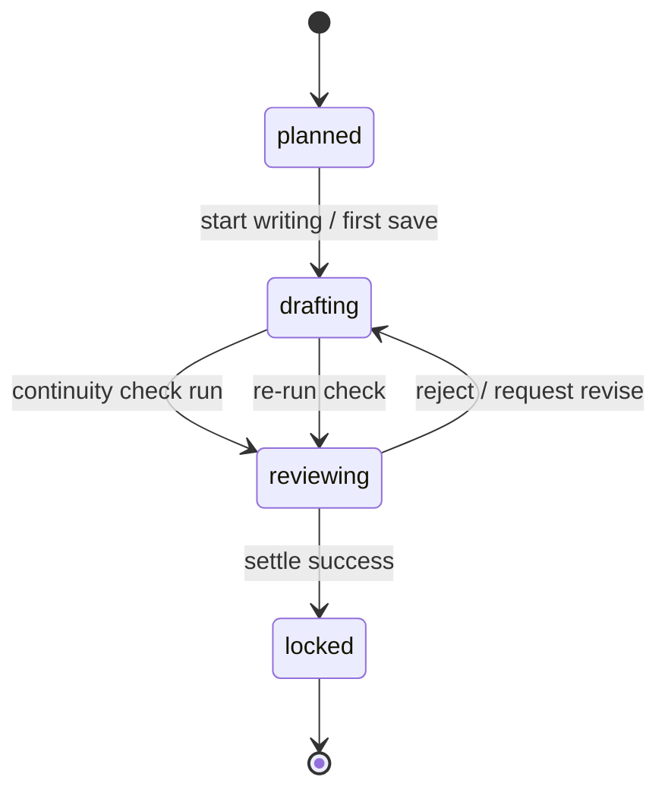
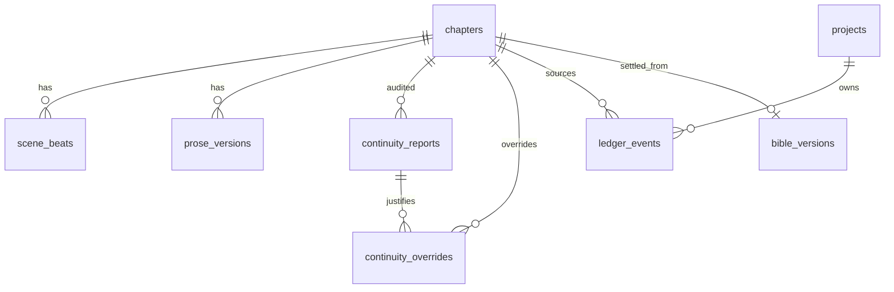

# Phase 2 Database Schema

> **Canonical for Phase 2.** Extends [Phase 1 schema](../phase-1/schema.md). Supersedes sketch sections in [schema-draft.md](../../schema-draft.md) for tables listed here.  
> **Migration tool:** Alembic (`apps/api/alembic/` — continue from Phase 1 `003`).

---

## Design principles (unchanged + Phase 2)

1. **Multi-tenant:** Every tenant row carries `project_id` (directly or via `chapter_id` → `chapters.project_id`).
2. **Append-only ledgers:** `ledger_events`, `prose_versions`, `bible_versions`, `continuity_reports` — no UPDATE of historical rows.
3. **Settle is one transaction:** Ledger append + bible snapshot + staging reconcile + chapter lock — all or nothing.
4. **Auth stub:** `X-User-Id` header; ACL via `project_members` (unchanged).

---

## Migration from Phase 1

| Revision | Content |
|----------|---------|
| `004_chapter_status_reviewing` | Enum migration: rename `continuity_pending` → `reviewing`; update existing rows |
| `005_scene_beats_prose_versions` | `scene_beats`, `prose_versions`; chapter columns |
| `006_ledger_events` | `ledger_events` + indexes |
| `007_continuity_settle` | `continuity_reports`, `continuity_overrides` |

**Enum migration SQL (conceptual):**

```sql
ALTER TYPE chapter_status RENAME VALUE 'continuity_pending' TO 'reviewing';
```

If PostgreSQL version lacks `RENAME VALUE`, use add-new + backfill + drop-old pattern documented in implementation PR.

**Phase 1 enum values retained:** `planned`, `drafting`, `settled`, `locked`.  
**Renamed:** `continuity_pending` → **`reviewing`**.

---

## Enums (Phase 2 additions / changes)

### `chapter_status` (updated)

| Value | UI label (VI) | Editable prose/beats? | Notes |
|-------|---------------|------------------------|-------|
| `planned` | Đã lập kế hoạch | No (until start drafting) | Default from template |
| `drafting` | Đang viết | Yes | Set on first prose save or explicit PATCH |
| `reviewing` | Đang xem xét | Yes (fixes before settle) | After continuity check submitted |
| `settled` | Đã chốt | No — transitions to `locked` at end of settle TXN | Brief instant state optional; prefer direct → `locked` |
| `locked` | Bị khóa | **Read-only** | Terminal after successful settle |

**Allowed transitions:**



| From | To | Trigger |
|------|-----|---------|
| `planned` | `drafting` | First `POST .../prose-versions` or `PATCH` status |
| `drafting` | `reviewing` | `POST .../continuity-check` (sync) |
| `reviewing` | `drafting` | Reject / request revise (API or UI) |
| `reviewing` | `locked` | Successful `POST .../settle` |
| `*` | — | No transition out of `locked` in Phase 2 |

`settled` may be written transiently inside settle TXN before `locked`, or omitted — API returns `locked` as final status.

### `prose_source`

| Value | Meaning |
|-------|---------|
| `human` | Author typed / pasted |
| `ai_writer` | Reserved Phase 6 |
| `ai_editor` | Reserved Phase 6 |

Phase 2 API accepts only `human`.

### `continuity_result`

| Value | Meaning |
|-------|---------|
| `pass` | No FAIL issues; WARN may remain |
| `warn` | WARN issues only |
| `fail` | One or more FAIL issues without override |

### `continuity_severity`

| Value | Blocks settle? |
|-------|----------------|
| `pass` | No |
| `warn` | No (unless author wants to fix) |
| `fail` | Yes — unless overridden |

### `continuity_category` (Phase 2 subset)

| Value | Rules doc |
|-------|-------------|
| `character` | Death/status |
| `timeline` | Monotonic order |
| `location` | Same-time conflicts |
| `world_rule` | Bible staging vs prose |
| `bible_staging` | Staging conflict with settled canon |

Deferred categories (not in Phase 2 checks): `foreshadow`, `psychology`, `power_system`.

### `ledger_entity_type`

| Value | Phase 2 usage |
|-------|---------------|
| `character` | Status, location events |
| `object` | Reserved — schema only |
| `knowledge` | Reserved |
| `promise` | Reserved Phase 4 |

### `ledger_event_type` (Phase 2 subset)

| Value | Payload keys (examples) |
|-------|------------------------|
| `status_change` | `{ "from": "alive", "to": "deceased" }` |
| `location_change` | `{ "from": "...", "to": "..." }` |
| `timeline_anchor` | `{ "anchor_key": "...", "ordinal": 3 }` |
| `bible_promote` | `{ "entry_key": "...", "staging_id": "..." }` |

---

## Tables (Phase 2 new)

### `scene_beats`

Ordered beat plan per chapter (sidebar in Chapter Editor).

| Column | Type | Constraints | Notes |
|--------|------|-------------|-------|
| `id` | `uuid` | PK, DEFAULT `gen_random_uuid()` | |
| `project_id` | `uuid` | NOT NULL, FK → `projects(id)` ON DELETE CASCADE | Denormalized for tenant filter |
| `chapter_id` | `uuid` | NOT NULL, FK → `chapters(id)` ON DELETE CASCADE | |
| `beat_key` | `text` | NOT NULL | Display key e.g. `1.1`, `7.4` |
| `summary` | `text` | NOT NULL, DEFAULT `''` | Beat description |
| `sort_order` | `integer` | NOT NULL | Stable ordering within chapter |
| `completed` | `boolean` | NOT NULL, DEFAULT `false` | Checkbox in UI |
| `created_at` | `timestamptz` | NOT NULL, DEFAULT `now()` | |
| `updated_at` | `timestamptz` | NOT NULL, DEFAULT `now()` | |

**Indexes:**

- `UNIQUE (chapter_id, beat_key)`
- `UNIQUE (chapter_id, sort_order)`
- `INDEX scene_beats_chapter_id_sort_idx ON scene_beats (chapter_id, sort_order ASC)`
- `INDEX scene_beats_project_id_idx ON scene_beats (project_id)`

**Rules:**

- CRUD blocked when chapter `status = locked` (`409`).
- `project_id` MUST match parent chapter's project (application check + optional trigger).

---

### `prose_versions`

Append-only prose snapshots per chapter.

| Column | Type | Constraints | Notes |
|--------|------|-------------|-------|
| `id` | `uuid` | PK, DEFAULT `gen_random_uuid()` | |
| `project_id` | `uuid` | NOT NULL, FK → `projects(id)` ON DELETE CASCADE | |
| `chapter_id` | `uuid` | NOT NULL, FK → `chapters(id)` ON DELETE CASCADE | |
| `version` | `integer` | NOT NULL | 1-based per chapter |
| `content` | `text` | NOT NULL | Full chapter prose |
| `word_count` | `integer` | NOT NULL | Computed on insert |
| `source` | `prose_source` | NOT NULL, DEFAULT `'human'` | |
| `created_by` | `uuid` | NOT NULL | `X-User-Id` |
| `created_at` | `timestamptz` | NOT NULL, DEFAULT `now()` | |

**Indexes:**

- `UNIQUE (chapter_id, version)`
- `INDEX prose_versions_chapter_id_version_desc_idx ON prose_versions (chapter_id, version DESC)`

**Append-only rules:**

- **No UPDATE** of `content` after insert.
- **No DELETE** of historical versions in Phase 2.
- New save = INSERT with `version = MAX(version) + 1`.
- `chapters.word_count` updated to latest version's `word_count` on each insert.

---

### `ledger_events`

Append-only settle stream for character/world state (generic ledger table).

| Column | Type | Constraints | Notes |
|--------|------|-------------|-------|
| `id` | `uuid` | PK, DEFAULT `gen_random_uuid()` | |
| `project_id` | `uuid` | NOT NULL, FK → `projects(id)` ON DELETE CASCADE | |
| `entity_type` | `ledger_entity_type` | NOT NULL | |
| `entity_id` | `uuid` | NOT NULL | e.g. `characters.id` |
| `event_type` | `ledger_event_type` | NOT NULL | |
| `payload` | `jsonb` | NOT NULL, DEFAULT `'{}'` | Event-specific body |
| `chapter_id` | `uuid` | NOT NULL, FK → `chapters(id)` ON DELETE RESTRICT | Source chapter |
| `chapter_number` | `integer` | NOT NULL | Denormalized from `chapters.number` |
| `prose_version` | `integer` | NOT NULL | Prose version settled |
| `settled_at` | `timestamptz` | NULL | NULL = proposed/draft; set on settle |
| `supersedes_event_id` | `uuid` | NULL, FK → `ledger_events(id)` | Correction chain |
| `created_at` | `timestamptz` | NOT NULL, DEFAULT `now()` | |

**Indexes:**

- `INDEX ledger_events_project_entity_idx ON ledger_events (project_id, entity_type, entity_id, settled_at DESC NULLS LAST)`
- `INDEX ledger_events_chapter_id_idx ON ledger_events (chapter_id, created_at DESC)`
- `INDEX ledger_events_unsettled_idx ON ledger_events (project_id, chapter_id) WHERE settled_at IS NULL`

**Append-only rules:**

- **No UPDATE** of `payload`, `entity_type`, or `entity_id` after insert.
- Settle TXN may UPDATE `settled_at` from NULL → timestamp (only mutation allowed).
- Corrections: INSERT new row with `supersedes_event_id` pointing to prior event.

**Phase 2 flow:**

1. State diff preview proposes events with `settled_at IS NULL` (optional — may be inline in report JSON only for MVP).
2. Settle TXN INSERTs approved events with `settled_at = now()` OR updates preview rows.

MVP recommendation: settle INSERTs fresh rows with `settled_at` set; do not rely on unsettled rows in DB for Phase 2.

---

### `continuity_reports`

Immutable audit results per check run.

| Column | Type | Constraints | Notes |
|--------|------|-------------|-------|
| `id` | `uuid` | PK, DEFAULT `gen_random_uuid()` | |
| `project_id` | `uuid` | NOT NULL, FK → `projects(id)` ON DELETE CASCADE | |
| `chapter_id` | `uuid` | NOT NULL, FK → `chapters(id)` ON DELETE CASCADE | |
| `prose_version` | `integer` | NOT NULL | Version audited |
| `result` | `continuity_result` | NOT NULL | Aggregate |
| `issues_json` | `jsonb` | NOT NULL, DEFAULT `'[]'` | Array of issue objects |
| `state_diff_json` | `jsonb` | NOT NULL, DEFAULT `'{}'` | Proposed ledger + bible patches |
| `stats_json` | `jsonb` | NOT NULL, DEFAULT `'{}'` | `{ "passed", "warnings", "errors" }` |
| `rule_pack_version` | `text` | NOT NULL, DEFAULT `'deterministic-v1'` | |
| `created_by` | `uuid` | NOT NULL | |
| `created_at` | `timestamptz` | NOT NULL, DEFAULT `now()` | |

**Indexes:**

- `INDEX continuity_reports_chapter_id_created_desc ON continuity_reports (chapter_id, created_at DESC)`

**Append-only:** INSERT only; each check creates a new report.

**`issues_json` item shape:**

```json
{
  "fingerprint": "character:uuid:death_violation:line42",
  "severity": "fail",
  "category": "character",
  "code": "character_deceased_appears_alive",
  "message": "Nhân vật 'Lý Phong' đã chết ở ch.3 nhưng xuất hiện sống ở đoạn này",
  "chapter_refs": [1],
  "entity_ids": ["770e8400-e29b-41d4-a716-446655440002"],
  "evidence": { "prose_excerpt": "...", "ledger_event_id": null }
}
```

---

### `continuity_overrides`

Author-marked intentional issues (WARN or FAIL).

| Column | Type | Constraints | Notes |
|--------|------|-------------|-------|
| `id` | `uuid` | PK, DEFAULT `gen_random_uuid()` | |
| `project_id` | `uuid` | NOT NULL, FK → `projects(id)` ON DELETE CASCADE | |
| `chapter_id` | `uuid` | NOT NULL, FK → `chapters(id)` ON DELETE CASCADE | |
| `issue_fingerprint` | `text` | NOT NULL | Matches `issues_json[].fingerprint` |
| `severity_at_override` | `continuity_severity` | NOT NULL | Snapshot at mark time |
| `reason` | `text` | NOT NULL | Author explanation (min 1 char) |
| `report_id` | `uuid` | NOT NULL, FK → `continuity_reports(id)` | Report that contained issue |
| `created_by` | `uuid` | NOT NULL | |
| `created_at` | `timestamptz` | NOT NULL, DEFAULT `now()` | |
| `revoked_at` | `timestamptz` | NULL | NULL = active |

**Indexes:**

- `UNIQUE (chapter_id, issue_fingerprint) WHERE revoked_at IS NULL` — partial unique for active overrides
- `INDEX continuity_overrides_chapter_id_idx ON continuity_overrides (chapter_id)`

**Rules:**

- Re-run continuity check skips issues with active override (same fingerprint).
- FAIL with active override does not block settle.
- Revoke = set `revoked_at` (soft); issue reappears on next check.

---

## Phase 1 table changes

### `chapters` (columns added / behavior)

| Column | Change | Notes |
|--------|--------|-------|
| `status` | enum adds `reviewing`; rename from `continuity_pending` | See transitions above |
| `word_count` | now maintained from latest `prose_versions` | Was stub 0 in Phase 1 |
| `bible_version_at_draft` | set on first prose save | Pins canon for draft |
| `current_prose_version` | **NEW** `integer` NULL | Pointer to latest prose version |
| `settled_at` | **NEW** `timestamptz` NULL | Set on successful settle |
| `locked_at` | **NEW** `timestamptz` NULL | Same as settle completion |

**New index:** `INDEX chapters_project_status_idx ON chapters (project_id, status, number)`.

---

## Bible staging → snapshot rules (settle)

On **chapter settle** (not standalone bible settle):

1. Read all `bible_entry_staging` rows for `project_id`.
2. Merge into copy of `bible_versions.snapshot_json` at `projects.bible_version_current`.
3. INSERT new `bible_versions` row at `version = current + 1` with:
   - `settled_from_chapter_id = chapter.id`
   - `snapshot_json` = merged result
4. UPDATE `projects.bible_version_current = version + 1`.
5. **Staging reconcile:**
   - Rows whose content matches new snapshot → DELETE from staging OR reset `base_bible_version` to new version (implementation picks one; prefer DELETE merged keys + keep divergent staging).
   - Rows edited during chapter draft with `base_bible_version < new_version` → keep in staging for author review.
6. Staging entries promoted via state diff may also create `ledger_events` with `event_type = bible_promote`.

**Invariant:** Never UPDATE an existing `bible_versions.snapshot_json` row.

---

## Settle transaction (atomic)

Single PostgreSQL transaction for `POST .../chapters/{chapter_id}/settle`:

| Step | Action |
|------|--------|
| 1 | Verify chapter `status = reviewing` |
| 2 | Load latest `continuity_reports` for chapter; verify no unresolved FAIL (overrides count) |
| 3 | Load approved `state_diff_json` from report (or request body echo with idempotency) |
| 4 | INSERT `ledger_events` rows with `settled_at = now()` |
| 5 | Merge staging → INSERT `bible_versions` N+1 |
| 6 | UPDATE `projects.bible_version_current` |
| 7 | Reconcile `bible_entry_staging` per rules above |
| 8 | UPDATE chapter: `status = locked`, `settled_at`, `locked_at`, timestamps |
| 9 | COMMIT |

On any failure → ROLLBACK; no partial bible version bump.

**Idempotency:** `Idempotency-Key` header; duplicate successful key returns same response without double append.

---

## Entity relationship (Phase 2 extension)



---

## Multi-tenant isolation (unchanged)

Same rules as Phase 1 — all queries filter by `project_id`; cross-tenant → HTTP 404.

Nested resources (`beats`, `prose_versions`) validate `chapter.project_id = {project_id}`.

---

## Migration checklist (implementation PR)

- [ ] `004_chapter_status_reviewing` — enum rename + chapter columns
- [ ] `005_scene_beats_prose_versions`
- [ ] `006_ledger_events`
- [ ] `007_continuity_settle`
- [ ] Integration tests: settle atomicity, cross-tenant, FAIL blocks settle

---

## Deferred tables (do not create in Phase 2)

From [schema-draft.md](../../schema-draft.md): `character_provisional`, `twist_plans`, `twist_plants`, `twist_payoffs`, `psych_states`, `canon_embeddings`.

---

## Links

- [Phase 1 schema](../phase-1/schema.md)
- [continuity-rules.md](./continuity-rules.md)
- [openapi.yaml](./openapi.yaml)
- [api-contracts.md](./api-contracts.md)
