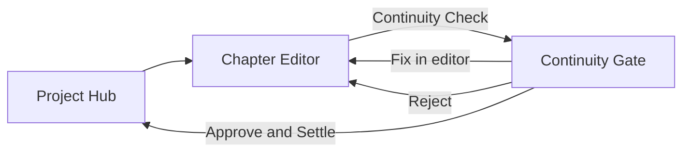

# Phase 2 Web Screens

> Maps [openapi.yaml](./openapi.yaml) → UI from [05-wireframes.md](../../product/05-wireframes.md).  
> **Phase 2 screens:** Chapter Editor (#3), Continuity Gate (#5).  
> **Stub only:** Prompt Edit panel (right rail) — disabled with "Phase 6" badge.

---

## Shared conventions

| Topic | Rule |
|-------|------|
| API client | Same fetch wrapper + `X-User-Id` as Phase 1 |
| Types | Extend from Phase 2 OpenAPI |
| MSW | Handlers for all Phase 2 routes |
| Routing | `/projects/[projectId]/chapters/[chapterId]` (editor), `.../continuity` (gate) |

---

## Hub updates (Phase 2 delta on Screen 2)

**Wireframe:** [project-hub.png](../../wireframes/images/project-hub.png)

| UI change | Behavior |
|-----------|----------|
| Chapter row click | `planned`/`drafting` → Editor; `reviewing` → Continuity Gate; `locked` → Editor read-only |
| Status column | Map `reviewing` → "Đang xem xét" |
| Continuity card | Show latest report badge per open chapter (optional MVP: count `reviewing`) |

| UI action | Endpoint |
|-----------|----------|
| Load chapters | `GET /projects/{id}/chapters` |

---

## Screen 3 — Chapter Editor (`/projects/[projectId]/chapters/[chapterId]`)

**Wireframe:** [chapter-editor.png](../../wireframes/images/chapter-editor.png)  
**Stories:** US-W01, US-W02, US-CO04

### Layout zones → components

| Zone | Component | Data source |
|------|-----------|-------------|
| Top bar | `ChapterEditorHeader` | `GET .../chapters/{id}` |
| Left | `SceneBeatsPanel` | `GET .../beats` |
| Center | `ProseEditor`, `VersionDropdown` | `GET .../prose-versions`, save → `POST` |
| Right | `PromptEditPanelStub` | Disabled — "Sắp ra mắt Phase 6" |
| Footer | `EditorFooter` | `updated_at`, auto-save state |

### API mapping

| UI action | Endpoint |
|-----------|----------|
| Load chapter | `GET /projects/{id}/chapters/{chapterId}` |
| Start drafting | `PATCH .../chapters/{chapterId}` `{ "status": "drafting" }` or implicit on first save |
| Load beats | `GET .../chapters/{chapterId}/beats` |
| Add/edit/delete beat | `POST` / `PATCH` / `DELETE .../beats/{beatId}` |
| Load prose versions | `GET .../prose-versions` |
| Load specific version | `GET .../prose-versions/{version}` |
| Save prose (human) | `POST .../prose-versions` `{ "content": "..." }` |
| Compare metadata | `GET .../prose-versions/compare?from=1&to=3` |
| Run continuity | `POST .../continuity-check` → navigate to Gate |
| Back to hub | Client route |

### States

| State | Trigger | UI |
|-------|---------|-----|
| Loading | Initial | Skeleton beats + editor |
| Empty prose | No versions | Placeholder "Bắt đầu viết…" |
| Saving | POST prose in flight | Footer "Đang lưu…" |
| Drafting | status=drafting | Full edit |
| Locked | status=locked | Read-only banner; Save/beat edit disabled |
| Error 404 | Wrong id / tenant | "Không tìm thấy chương" |
| Error 409 | Beat edit on locked | Toast |

### Out of scope Phase 2

- Prompt Edit Apply/Regenerate/Compare (Phase 6)
- Export chapter
- Lock/unlock manual toggle (lock only via settle)

---

## Screen 5 — Continuity Gate (`/projects/[projectId]/chapters/[chapterId]/continuity`)

**Wireframe:** [continuity-gate.png](../../wireframes/images/continuity-gate.png)  
**Stories:** US-CO01, US-CO03

### Layout zones → components

| Zone | Component | Data source |
|------|-----------|-------------|
| Header | `ContinuityReportHeader` | Latest report `result`, stats |
| Issue table | `ContinuityIssueTable` | `issues_json[]` |
| Row actions | `MarkIntentionalButton` | `POST .../continuity-overrides` |
| Right panel | `StateDiffPanel` | `state_diff_json` from report or `GET .../state-diff` |
| Bottom bar | `ContinuityActionsBar` | settle / reject / revise |

### API mapping

| UI action | Endpoint |
|-----------|----------|
| Load latest report | `GET .../continuity-reports/latest` |
| Re-run check | `POST .../continuity-check` |
| Mark intentional | `POST .../continuity-overrides` `{ "issue_fingerprint", "reason" }` |
| Fix in editor | Navigate to editor with `?highlight=` optional |
| State diff refresh | `GET .../state-diff?prose_version=N` |
| Reject draft | `PATCH .../chapters/{id}` `{ "status": "drafting" }` |
| Request revise | Same as reject + optional comment (local only Phase 2) |
| Approve & Settle | `POST .../chapters/{chapterId}/settle` + `Idempotency-Key` |

### Issue table columns

| Column | Source |
|--------|--------|
| Level | `issue.severity` — badge FAIL/WARN |
| Category | `issue.category` |
| Description | `issue.message` |
| Chapter refs | `issue.chapter_refs` |
| Actions | Mark intentional (WARN/FAIL); Fix link |

### Bottom bar rules

| Button | Enabled when |
|--------|--------------|
| Reject draft | Always (unless locked) |
| Request revise | Same as reject |
| Approve & Settle | No effective FAIL; chapter `reviewing`; latest report exists |
| Approve & Settle | Disabled + tooltip if FAIL unresolved |

### States

| State | UI |
|-------|-----|
| Loading report | Table skeleton |
| PASS | Green badge; settle enabled |
| WARN only | Yellow badge; settle enabled |
| FAIL | Red badge; settle disabled until fix/override |
| Settling | Bottom bar spinner; idempotent retry safe |
| Settle success | Toast + redirect to Hub; chapter locked |
| Settle 409 | Show error `continuity_fail_blocks_settle` |

---

## Navigation flow

---

## Phase 2 module coverage (Vitest)

Listed in [test-strategy.md](./test-strategy.md):

- `components/chapter-editor/**`
- `components/continuity-gate/**`
- `app/projects/[projectId]/chapters/**`

---

## Links

- [Phase 1 web screens](../phase-1/web-screens.md)
- [api-contracts.md](./api-contracts.md)
- [05-wireframes.md](../../product/05-wireframes.md)
