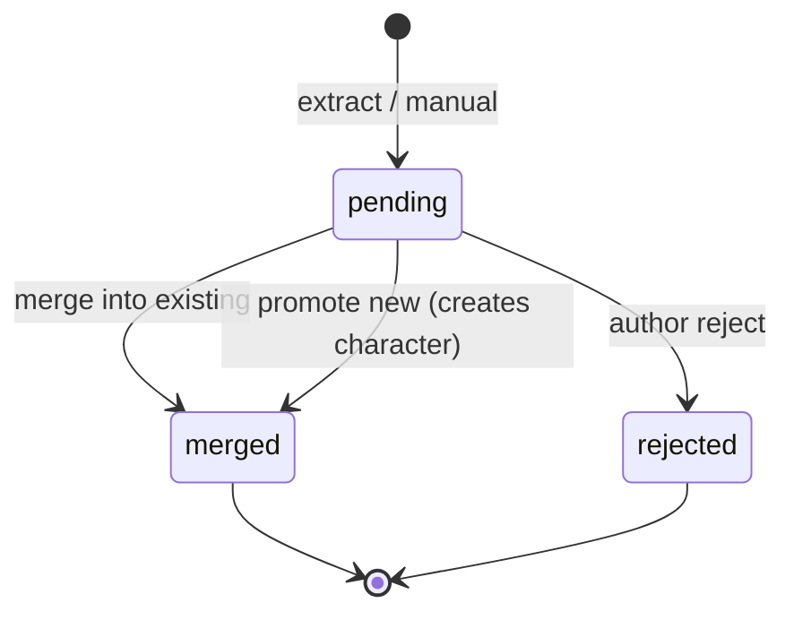

# Phase 3 Character Lifecycle — T0–T3, Extract, Merge

> Product rules for progressive characters and provisional inbox.  
> **Skill:** `storyforge-characters` — this doc is the Phase 3 canonical elaboration.

---

## Tier model (T0 → T3)

| Tier | Label | Minimum fields | Typical source |
|------|-------|----------------|----------------|
| **T0** | Seed | `display_name`, `role_one_liner` (one line) | Project template, manual create, promote-new from inbox |
| **T1** | Stub | T0 + `voice_hint` OR first relation note in `metadata` | Recurrence suggest, manual promote |
| **T2** | Active | T1 + `psyche_card` skeleton (≥1 trait OR goal) | Scene participant recurrence, manual promote |
| **T3** | Principal | T2 + arc note OR secret stub + psyche minimum (traits + moral boundary) | **Manual only** — never auto |

### Promote rules

| Rule | Behavior |
|------|----------|
| Manual promote | `PATCH .../characters/{id}/promote-tier` or UI tier badge → next tier if fields satisfied |
| Recurrence suggest | After N appearances (default N=3 across distinct chapters), API sets `tier_suggest: true` on GET — **no auto tier bump** |
| T3 gate | Promote to T3 rejected (`422 tier_requirements_not_met`) unless psyche minimum present |
| Demote | **Not supported Phase 3** — archive character instead |
| Auto-promote to T3 | **Forbidden** |

### Field enrichment (progressive)

Authors deepen characters lazily:

1. **T0** — cast list / outline seeds only.
2. **T1** — first dialogue or beat mention → author may add voice hint.
3. **T2** — recurring in scenes → psyche skeleton when character matters for continuity.
4. **T3** — POV principals and long-arc leads — full card before OOC checks matter (Phase 5).

`psyche_card` is **nullable** until T2+; empty object allowed at T2 skeleton.

---

## Character status (`characters.status`)

| Status | Meaning |
|--------|---------|
| `established` | Canonical cast member (default after merge or manual create) |
| `provisional` | Canonical row created from inbox **promote-new** awaiting author review (optional fast path) |
| `archived` | Hidden from default list; UUID retained for ledger history |

**Note:** Inbox rows live in `character_provisional` with `pending|merged|rejected`. Do not confuse with `characters.status = provisional` (post-promote review state).

---

## Provisional inbox lifecycle

### Extract → inbox

1. Author saves prose or runs **Extract** on draft chapter.
2. Fact extractor v1 scans latest `prose_versions.content`:
   - **Heuristic v1 (canonical):** capitalized token sequences (VI/EN), `@Name` mentions, quoted `"..."` names, beat `summary` name tokens.
   - **LLM v1 (optional):** disabled by default; `extractor_mode=llm` future flag.
3. For each candidate mention:
   - Skip if matches existing `display_name` or `aliases` (case-folded).
   - Skip if fingerprint exists in pending provisionals.
   - INSERT `character_provisional` with `status=pending`, snippet, `proposed_fields`.

### Author actions

| Action | API | Result |
|--------|-----|--------|
| **Merge** into existing | `POST .../provisionals/{id}/merge` `{ "target_character_id": "..." }` | Add alias if needed; update `last_seen_*`; provisional → `merged` |
| **Promote new** | `POST .../provisionals/{id}/merge` `{ "create_new": true, "display_name": "..." }` | INSERT `characters` (T0 default); link `merged_from_provisional_id`; provisional → `merged` |
| **Reject** | `POST .../provisionals/{id}/reject` | provisional → `rejected`; no character row |

### Merge invariants

- **Idempotent:** Re-POST merge on already `merged` provisional returns `200` with same `character_id` (no duplicate aliases).
- **No ledger writes** during merge — ledger events only on chapter settle referencing **canonical** `characters.id`.
- **Alias collision:** Merging mention "Phong" into character with display_name "Lý Phong" appends alias `"Phong"` if not present.
- **Conflict:** Merge into archived character → `409 character_archived`.

---

## Extract trigger points

| Trigger | When | Notes |
|---------|------|-------|
| Manual | `POST .../chapters/{id}/extract-characters` | Author clicks "Quét nhân vật" in editor or inbox |
| On save (optional) | After `POST .../prose-versions` | Debounced; project setting `auto_extract_characters: false` default |
| Continuity hook (optional) | After `POST .../continuity-check` | Adds name mentions to state diff preview only — **not** auto-merge |

Phase 3 canonical path: **manual extract** + optional debounced save hook behind flag.

---

## Context pack character subset

When building agent context for a scene/chapter:

1. Collect character IDs from scene beats + explicit POV (`chapters.pov_character_id` if set).
2. Always include **T3** principals referenced in chapter metadata.
3. Resolve names via `GET .../characters/search?q=` (ILIKE v1) for ambiguous tokens.
4. **Cap:** max **12** stub (T0/T1) bios in pack; prefer tier DESC, then recency (`last_seen_chapter_id`).
5. Prefer **ledger tail** (last 5 events) over full biography.

See [api-contracts.md](./api-contracts.md) for `POST .../context-packs/characters` request shape.

---

## Duplicate detection

| Layer | Mechanism |
|-------|-----------|
| Exact name | `UNIQUE (project_id, display_name)` for established characters |
| Alias match | Case-folded search on `aliases` jsonb before creating provisional |
| Fingerprint | `character_provisional.mention_fingerprint` = hash(project_id + normalized_mention + chapter_id) |
| Vector (optional) | `canon_embeddings` cosine similarity > 0.92 suggests merge target in UI |

---

## Failure modes & mitigations

| Failure | Mitigation |
|---------|------------|
| Inbox overflow | Filter stale (`pending` + chapter older than N); bulk reject API future |
| False-positive extract | Reject + optional blocklist in project settings |
| Duplicate UUIDs for same person | Merge workflow + alias accumulation |
| Token overflow in context | Tier cap + search subset endpoint |

---

## Links

- [schema.md](./schema.md)
- [openapi.yaml](./openapi.yaml)
- [web-screens.md](./web-screens.md)
- [storyforge-characters](../../../skills/storyforge-characters/SKILL.md)
