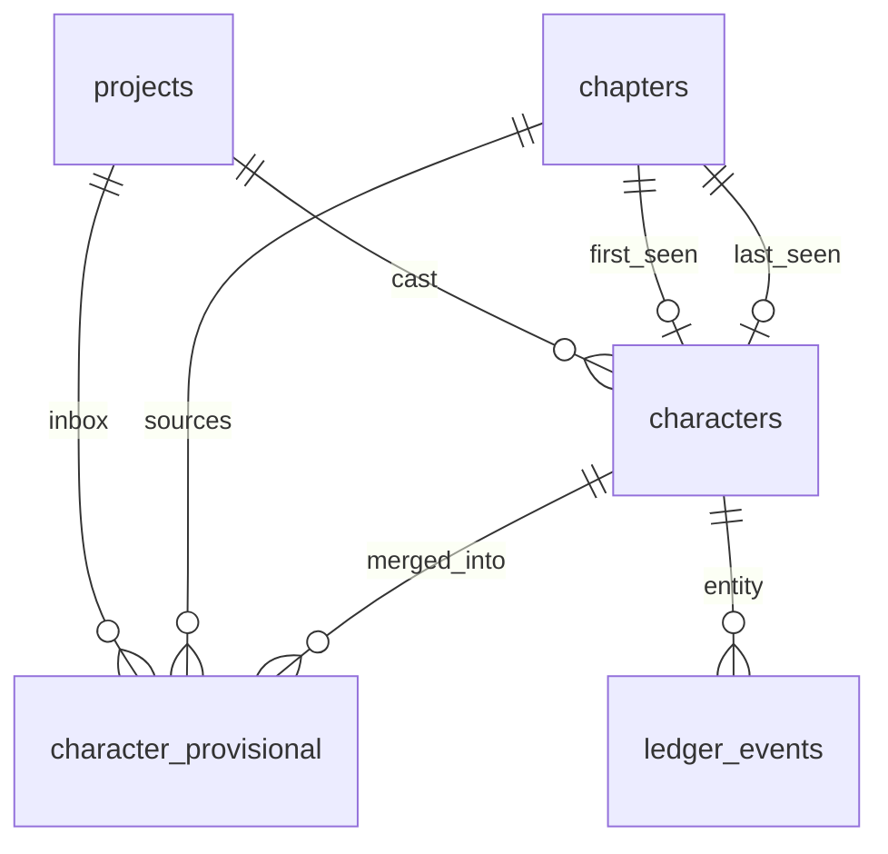

# Phase 3 Database Schema

> **Canonical for Phase 3.** Extends [Phase 2 schema](../phase-2/schema.md). Supersedes character sections in [schema-draft.md](../../schema-draft.md).  
> **Migration tool:** Alembic (`apps/api/alembic/` — continue from Phase 2 `007`).

---

## Design principles (unchanged + Phase 3)

1. **Multi-tenant:** Every row carries `project_id` (directly or via FK chain).
2. **Canonical IDs stable:** `characters.id` never changes; renames update `display_name` / `aliases`.
3. **Provisional ≠ ledger entity:** No `ledger_events.entity_id` pointing at `character_provisional.id`.
4. **Lazy depth:** Thousands of T0/T1 rows acceptable; indexes support tier + name search.
5. **Search v1 default:** ILIKE + GIN on aliases jsonb; pgvector optional stub.

---

## Migration from Phase 2

| Revision | Content |
|----------|---------|
| `008_characters_progressive` | Extend `characters`: aliases, status, chapter refs, tier 0–3, nullable psyche |
| `009_character_provisional` | `character_provisional` inbox table + enums |
| `010_character_search_v1` | Search indexes; optional `pgvector` + `canon_embeddings` stub |

---

## Enums (Phase 3 additions)

### `character_status`

| Value | Meaning |
|-------|---------|
| `established` | Active canonical cast member |
| `provisional` | New from inbox promote-new; awaiting author confirmation |
| `archived` | Soft-hidden; ledger history retained |

### `provisional_status`

| Value | Meaning |
|-------|---------|
| `pending` | Awaiting author action |
| `merged` | Resolved into canonical character |
| `rejected` | Author dismissed mention |

### `extractor_source`

| Value | Meaning |
|-------|---------|
| `heuristic` | Rule/token extractor v1 (default) |
| `manual` | Author-created provisional row |
| `llm` | Optional LLM extractor (feature flag) |

---

## Phase 1/2 table changes

### `characters` (extended)

Replaces Phase 1 T0-only shape. Migration `008` ALTERs existing table.

| Column | Type | Constraints | Notes |
|--------|------|-------------|-------|
| `id` | `uuid` | PK, DEFAULT `gen_random_uuid()` | **Canonical ID** — immutable |
| `project_id` | `uuid` | NOT NULL, FK → `projects(id)` ON DELETE CASCADE | |
| `display_name` | `text` | NOT NULL | Primary display label |
| `role_one_liner` | `text` | NULL | T0 minimum |
| `tier` | `smallint` | NOT NULL, DEFAULT `0`, CHECK `tier BETWEEN 0 AND 3` | T0–T3 |
| `aliases` | `jsonb` | NOT NULL, DEFAULT `'[]'` | Array of strings; see alias rules |
| `psyche_card` | `jsonb` | NULL | Lazy — NULL until T2+ enrichment |
| `status` | `character_status` | NOT NULL, DEFAULT `'established'` | |
| `first_seen_chapter_id` | `uuid` | NULL, FK → `chapters(id)` ON DELETE SET NULL | Set on first merge/extract link |
| `last_seen_chapter_id` | `uuid` | NULL, FK → `chapters(id)` ON DELETE SET NULL | Updated on merge/extract |
| `appearance_count` | `integer` | NOT NULL, DEFAULT `0` | Distinct chapter mentions (denormalized) |
| `merged_from_provisional_id` | `uuid` | NULL | Set when created from inbox promote-new |
| `metadata` | `jsonb` | NOT NULL, DEFAULT `'{}'` | `voice_hint`, `tier_suggest`, relations stub |
| `created_at` | `timestamptz` | NOT NULL, DEFAULT `now()` | |
| `updated_at` | `timestamptz` | NOT NULL, DEFAULT `now()` | |

**Indexes:**

- `UNIQUE (project_id, display_name) WHERE status != 'archived'` — partial unique (allows re-use after archive optional; implementation may use full unique)
- `INDEX characters_project_tier_name_idx ON characters (project_id, tier DESC, display_name)`
- `INDEX characters_project_status_idx ON characters (project_id, status, updated_at DESC)`
- `INDEX characters_last_seen_idx ON characters (project_id, last_seen_chapter_id)`
- `GIN INDEX characters_aliases_gin ON characters USING gin (aliases jsonb_path_ops)` — alias containment queries

**Alias rules:**

- `aliases` stores alternate spellings / shortened names (e.g. `["Phong", "Lý đại ca"]`).
- Case-fold at application layer for matching; store display form as author entered.
- Merge into existing **appends** normalized alias if mention text differs from `display_name`.
- Optional future: normalize to separate `character_aliases` table if jsonb query limits hit — Phase 3 uses jsonb only.

**Tier transition (DB):**

- Application validates tier requirements; DB CHECK only enforces `0–3`.
- No trigger auto-promote.

**Psyche card lazy load:**

- Phase 1 rows: migrate `psyche_card = '{}'` → `NULL` where empty.
- API returns `{}` in JSON for null (presentation layer).

---

### `character_provisional` (new)

Inbox for extracted mentions before canonical merge.

| Column | Type | Constraints | Notes |
|--------|------|-------------|-------|
| `id` | `uuid` | PK, DEFAULT `gen_random_uuid()` | **Not** a ledger entity_id |
| `project_id` | `uuid` | NOT NULL, FK → `projects(id)` ON DELETE CASCADE | |
| `mention_text` | `text` | NOT NULL | Normalized extract token / phrase |
| `mention_fingerprint` | `text` | NOT NULL | Dedupe key — see below |
| `chapter_id` | `uuid` | NOT NULL, FK → `chapters(id)` ON DELETE CASCADE | Source chapter |
| `prose_version` | `integer` | NOT NULL | Prose version at extract time |
| `snippet` | `text` | NOT NULL, DEFAULT `''` | ±80 char context excerpt |
| `proposed_fields` | `jsonb` | NOT NULL, DEFAULT `'{}'` | `{ "display_name", "role_one_liner", "suggested_tier" }` |
| `status` | `provisional_status` | NOT NULL, DEFAULT `'pending'` | |
| `extractor_source` | `extractor_source` | NOT NULL, DEFAULT `'heuristic'` | |
| `matched_character_id` | `uuid` | NULL, FK → `characters(id)` ON DELETE SET NULL | Search suggestion |
| `merged_character_id` | `uuid` | NULL, FK → `characters(id)` ON DELETE SET NULL | Set on merge/promote-new |
| `resolved_by` | `uuid` | NULL | `X-User-Id` on merge/reject |
| `resolved_at` | `timestamptz` | NULL | |
| `created_at` | `timestamptz` | NOT NULL, DEFAULT `now()` | |

**Fingerprint:**

```text
mention_fingerprint = sha256(project_id || ':' || lower(trim(mention_text)) || ':' || chapter_id)
```

**Indexes:**

- `UNIQUE (project_id, mention_fingerprint) WHERE status = 'pending'` — no duplicate pending rows
- `INDEX character_provisional_project_status_idx ON character_provisional (project_id, status, created_at DESC)`
- `INDEX character_provisional_chapter_idx ON character_provisional (chapter_id, status)`

**Rules:**

- INSERT only from extractor or manual API; status updates on merge/reject (no hard DELETE Phase 3).
- `merged` / `rejected` rows retained for audit.
- Cross-tenant: validate `chapter.project_id = project_id`.

---

## Search v1 — ILIKE (canonical Phase 3)

Migration `010` adds expression index for case-insensitive name search:

```sql
CREATE INDEX characters_display_name_lower_idx
  ON characters (project_id, lower(display_name) text_pattern_ops);
```

**Search query (application):**

```sql
SELECT id, display_name, tier, aliases
FROM characters
WHERE project_id = :pid
  AND status != 'archived'
  AND (
    lower(display_name) LIKE lower(:q) || '%'
    OR aliases @> to_jsonb(ARRAY[:q]::text[])  -- exact alias match
  )
ORDER BY tier DESC, appearance_count DESC
LIMIT :limit;
```

Used by:

- `GET .../characters/search`
- `POST .../context-packs/characters` internal resolution

---

## Optional: `canon_embeddings` + pgvector (stub)

Phase 3 **does not require** pgvector for MVP. Document upgrade path:

| Approach | Phase 3 default | Upgrade |
|----------|-----------------|---------|
| Name/alias lookup | ILIKE + jsonb aliases | Keep as fallback |
| Semantic similarity | Not implemented | `canon_embeddings` + `vector(1536)` |

If enabled (`010_character_search_v1` optional branch):

```sql
CREATE EXTENSION IF NOT EXISTS vector;

CREATE TABLE canon_embeddings (
  id uuid PRIMARY KEY DEFAULT gen_random_uuid(),
  project_id uuid NOT NULL REFERENCES projects(id) ON DELETE CASCADE,
  source_type text NOT NULL,  -- 'character_name', 'character_alias', 'bible'
  source_id uuid NOT NULL,
  label text NOT NULL,
  embedding vector(1536),
  created_at timestamptz NOT NULL DEFAULT now()
);

CREATE INDEX canon_embeddings_project_source_idx
  ON canon_embeddings (project_id, source_type, source_id);
-- CREATE INDEX ... USING hnsw (embedding vector_cosine_ops);  -- when populated
```

**Population:** deferred — embeddings empty in Phase 3 stub. API documents `search_mode: keyword|vector` with `keyword` default.

---

## Promote / merge transaction rules

### Merge into existing (single TXN)

| Step | Action |
|------|--------|
| 1 | Load provisional; verify `status = pending` |
| 2 | Load target character; verify same `project_id`, not `archived` |
| 3 | Append `mention_text` to `aliases` if distinct |
| 4 | UPDATE character `last_seen_chapter_id`, bump `appearance_count` |
| 5 | UPDATE provisional `status = merged`, set `merged_character_id`, `resolved_*` |
| 6 | COMMIT |

Idempotent: if already `merged` with same `merged_character_id`, return success.

### Promote new (single TXN)

| Step | Action |
|------|--------|
| 1 | Load provisional; verify `status = pending` |
| 2 | INSERT `characters` (tier=0, status=`provisional` or `established` per request) |
| 3 | SET `merged_from_provisional_id`, chapter refs from provisional |
| 4 | UPDATE provisional → `merged` |
| 5 | COMMIT |

### Tier promote (single TXN)

| Step | Action |
|------|--------|
| 1 | Validate tier requirements ([character-lifecycle.md](./character-lifecycle.md)) |
| 2 | UPDATE `characters.tier = tier + 1`, touch `updated_at` |
| 3 | Clear `metadata.tier_suggest` if present |

---

## Entity relationship (Phase 3 extension)



---

## Multi-tenant isolation (unchanged)

Same rules as Phase 1–2:

- All queries filter by `project_id`.
- Nested resources validate parent chain (`provisional.chapter.project_id`).
- Cross-tenant → HTTP `404`.

---

## Migration checklist (implementation PR)

- [ ] `008_characters_progressive` — ALTER characters, backfill aliases `[]`, psyche NULL
- [ ] `009_character_provisional` — inbox table + enums
- [ ] `010_character_search_v1` — ILIKE indexes; optional pgvector stub (feature flag)
- [ ] Integration tests: merge idempotency, cross-tenant, no ledger on provisional

---

## Deferred tables (do not create in Phase 3)

From [schema-draft.md](../../schema-draft.md): `twist_plans`, `twist_plants`, `psych_states`, `character_aliases` (standalone — jsonb sufficient Phase 3).

---

## Links

- [Phase 2 schema](../phase-2/schema.md)
- [character-lifecycle.md](./character-lifecycle.md)
- [openapi.yaml](./openapi.yaml)
- [api-contracts.md](./api-contracts.md)
