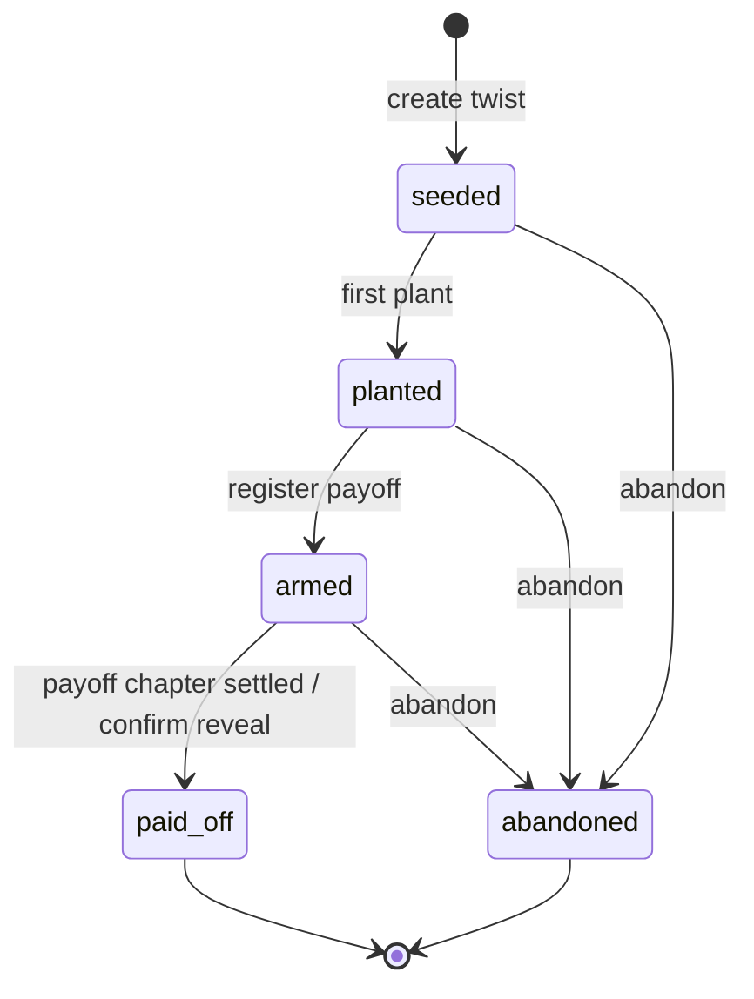
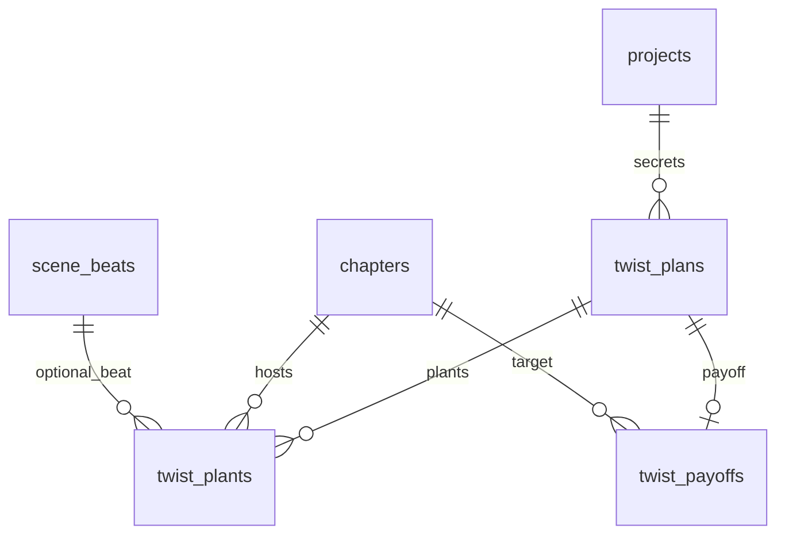

# Phase 4 Database Schema

> **Canonical for Phase 4.** Extends [Phase 3 schema](../phase-3/schema.md). Supersedes twist sections in [schema-draft.md](../../schema-draft.md).  
> **Migration tool:** Alembic (`apps/api/alembic/` — continue from Phase 3 `010`).

---

## Design principles (unchanged + Phase 4)

1. **Multi-tenant:** Every row carries `project_id` (directly or via FK chain).
2. **Author-only secrets:** `secret_truth` never exposed to Writer context builders or public bible snapshots.
3. **Plants are mutable; payoffs are versioned lightly:** Plants UPDATE allowed on draft chapters; payoff `required_plant_ids` validated at continuity check time.
4. **Promise reuse:** Promises share `twist_plans` with `kind = promise` — no separate promise ledger table in Phase 4.
5. **Fairness at continuity check:** Engine reads twist tables; does not mutate them during check.

---

## Migration from Phase 3

| Revision | Content |
|----------|---------|
| `011_twist_plans` | `twist_plans` table + enums `twist_plan_status`, `twist_plan_kind` |
| `012_twist_plants` | `twist_plants` + enum `plant_salience` |
| `013_twist_payoffs` | `twist_payoffs` + indexes for board + continuity |

---

## Enums (Phase 4 additions)

### `twist_plan_status`

| Value | Board column (primary) | Meaning |
|-------|------------------------|---------|
| `seeded` | **Secrets** | Secret registered; zero plants |
| `planted` | **Plants** | ≥1 plant; payoff not yet armed |
| `armed` | **Payoffs** | Payoff registered; awaiting target chapter reveal |
| `paid_off` | **Revealed** | Payoff chapter settled / reveal confirmed |
| `abandoned` | — (hidden default) | Author abandoned; excluded from Writer context |

### `twist_plan_kind`

| Value | Meaning |
|-------|---------|
| `twist` | Plot secret / reveal (default) |
| `promise` | Character or plot promise tracked with same fairness gates |

### `plant_salience`

| Value | Continuity weight | UI label (VI) |
|-------|-------------------|-----------------|
| `soft` | Counts toward `min_plants`; lower auditor weight (Phase 6 LLM) | Nhẹ |
| `hard` | Counts toward `min_plants`; higher weight | Rõ |

Phase 4 deterministic engine treats both as counting plants; salience stored for Phase 6 LLM weighting.

---

## Tables (Phase 4 new)

### `twist_plans`

Author-only secret registry + optional misdirection and constraints.

| Column | Type | Constraints | Notes |
|--------|------|-------------|-------|
| `id` | `uuid` | PK, DEFAULT `gen_random_uuid()` | Stable twist/promise id |
| `project_id` | `uuid` | NOT NULL, FK → `projects(id)` ON DELETE CASCADE | |
| `title` | `text` | NOT NULL | Board card label (not the secret) |
| `secret_truth` | `text` | NOT NULL | **Author-only** ground fact |
| `status` | `twist_plan_status` | NOT NULL, DEFAULT `'seeded'` | Lifecycle — see transitions |
| `kind` | `twist_plan_kind` | NOT NULL, DEFAULT `'twist'` | `twist` or `promise` |
| `misdirection` | `text` | NULL | Optional false trail notes |
| `constraints_json` | `jsonb` | NOT NULL, DEFAULT `'{}'` | Constrained facts, knowledge walls — see [fairness-rules.md](./fairness-rules.md) |
| `genre_strictness` | `text` | NULL | Override project default: `strict`, `relaxed` |
| `created_by` | `uuid` | NOT NULL | `X-User-Id` |
| `created_at` | `timestamptz` | NOT NULL, DEFAULT `now()` | |
| `updated_at` | `timestamptz` | NOT NULL, DEFAULT `now()` | |

**`constraints_json` shape (documented, not DB-enforced):**

```json
{
  "constrained_facts": [
    { "key": "killer_identity", "must_remain_hidden_until_payoff": true }
  ],
  "knowledge_walls": [
    { "character_id": "uuid", "must_not_know_before_chapter": 12 }
  ],
  "min_plants_before_payoff": 1
}
```

**Indexes:**

- `INDEX twist_plans_project_status_idx ON twist_plans (project_id, status, updated_at DESC)`
- `INDEX twist_plans_project_kind_idx ON twist_plans (project_id, kind, status)`

**Update rules:**

- `secret_truth`, `misdirection`, `constraints_json` — UPDATE allowed anytime (author tool).
- `status` — UPDATE via validated transitions (application layer).
- **Never DELETE** if `status = paid_off` — archive via `abandoned` only for active twists.

**Author-only column policy:**

- API responses for Writer/agent routes with `role=writer` MUST omit `secret_truth` and `misdirection`.
- List/detail for author UI include full fields.

---

### `twist_plants`

Fair hints linked to chapters (and optional beats).

| Column | Type | Constraints | Notes |
|--------|------|-------------|-------|
| `id` | `uuid` | PK, DEFAULT `gen_random_uuid()` | |
| `project_id` | `uuid` | NOT NULL, FK → `projects(id)` ON DELETE CASCADE | Denormalized tenant filter |
| `twist_id` | `uuid` | NOT NULL, FK → `twist_plans(id)` ON DELETE CASCADE | |
| `chapter_id` | `uuid` | NOT NULL, FK → `chapters(id)` ON DELETE CASCADE | Plant chapter |
| `beat_id` | `uuid` | NULL, FK → `scene_beats(id)` ON DELETE SET NULL | Optional beat link |
| `salience` | `plant_salience` | NOT NULL, DEFAULT `'soft'` | soft \| hard |
| `snippet` | `text` | NOT NULL, DEFAULT `''` | Author note or prose excerpt |
| `prose_span_start` | `integer` | NULL | Optional char offset in chapter prose |
| `prose_span_end` | `integer` | NULL | Optional char offset end |
| `sort_order` | `integer` | NOT NULL, DEFAULT `0` | Order within twist |
| `created_at` | `timestamptz` | NOT NULL, DEFAULT `now()` | |
| `updated_at` | `timestamptz` | NOT NULL, DEFAULT `now()` | |

**Indexes:**

- `INDEX twist_plants_twist_id_idx ON twist_plants (twist_id, sort_order ASC)`
- `INDEX twist_plants_chapter_id_idx ON twist_plants (chapter_id, twist_id)`
- `INDEX twist_plants_project_id_idx ON twist_plants (project_id)`

**Rules:**

- INSERT first plant on twist → application may auto-transition twist `seeded` → `planted`.
- UPDATE/DELETE blocked when parent chapter `status = locked` (`409 chapter_locked`).
- `project_id` MUST match twist and chapter project (application check).

**Writer context exposure:** `id`, `twist_id`, `chapter_id`, `beat_id`, `salience`, `snippet` only — no parent `secret_truth`.

---

### `twist_payoffs`

Payoff target chapter with required plant ids and minimum plant count gate.

| Column | Type | Constraints | Notes |
|--------|------|-------------|-------|
| `id` | `uuid` | PK, DEFAULT `gen_random_uuid()` | |
| `project_id` | `uuid` | NOT NULL, FK → `projects(id)` ON DELETE CASCADE | |
| `twist_id` | `uuid` | NOT NULL, FK → `twist_plans(id)` ON DELETE CASCADE | |
| `target_chapter_id` | `uuid` | NOT NULL, FK → `chapters(id)` ON DELETE CASCADE | Payoff chapter |
| `required_plant_ids` | `uuid[]` | NOT NULL, DEFAULT `'{}'` | Explicit plant id list |
| `min_plants` | `integer` | NOT NULL, DEFAULT `1`, CHECK `min_plants >= 0` | Minimum count gate |
| `revealed_at` | `timestamptz` | NULL | Set when twist → `paid_off` |
| `created_at` | `timestamptz` | NOT NULL, DEFAULT `now()` | |
| `updated_at` | `timestamptz` | NOT NULL, DEFAULT `now()` | |

**Indexes:**

- `UNIQUE (twist_id)` — one payoff row per twist in Phase 4
- `INDEX twist_payoffs_target_chapter_idx ON twist_payoffs (target_chapter_id, twist_id)`
- `INDEX twist_payoffs_project_id_idx ON twist_payoffs (project_id)`

**Rules:**

- INSERT payoff → twist status → `armed` (if was `planted` or `seeded`).
- `required_plant_ids` must reference plants belonging to same `twist_id` (422 on mismatch).
- If `required_plant_ids` empty and `min_plants > 0`, continuity uses count of plants with `chapter.number < target_chapter.number`.
- On target chapter settle with successful reveal flow → `revealed_at = now()`, twist `status = paid_off`.

---

## Status transitions (`twist_plans.status`)



| From | To | Trigger |
|------|-----|---------|
| `seeded` | `planted` | First `twist_plants` INSERT |
| `planted` | `armed` | `twist_payoffs` INSERT |
| `armed` | `paid_off` | Target chapter settle + reveal confirm OR manual PATCH |
| `*` (not `paid_off`) | `abandoned` | Author abandon action |
| `paid_off` | — | Terminal — no transition out |

Direct `seeded` → `armed` allowed if payoff created with zero plants (continuity will FAIL until plants added or override).

---

## Promise ledger reuse (no extra table)

Phase 4 **does not** add `promise_ledger` or extend `ledger_events.entity_type` for promises.

| Approach | Phase 4 |
|----------|---------|
| Plot/character promises | `twist_plans.kind = promise` |
| Promise text | `secret_truth` (author-only) or `title` for non-secret promises |
| Fairness gates | Same plant/payoff rules via `twist_plants` / `twist_payoffs` |
| Settled promise canon | Optional future: `ledger_events` with `entity_type = promise` on settle — **deferred**; Phase 4 uses twist `paid_off` only |

If product later needs ledger-backed promises, add migration in Phase 5+ without breaking twist ids.

---

## Continuity engine reads (no writes)

On `POST .../continuity-check`, foreshadow rules query:

```sql
-- Payoffs targeting this chapter
SELECT tp.*, t.title, t.secret_truth, t.constraints_json, t.genre_strictness
FROM twist_payoffs tp
JOIN twist_plans t ON t.id = tp.twist_id
WHERE tp.project_id = :project_id
  AND tp.target_chapter_id = :chapter_id
  AND t.status NOT IN ('abandoned', 'paid_off');
```

Engine compares plant counts and prose hints — see [fairness-rules.md](./fairness-rules.md).

---

## Entity relationship (Phase 4 extension)



---

## Multi-tenant isolation (unchanged)

- All queries filter by `project_id`.
- Nested resources validate chain (`plant.chapter.project_id`, `payoff.target_chapter.project_id`).
- Cross-tenant → HTTP `404`.
- **Never leak `secret_truth`** in error messages for Writer-scoped routes — use twist `title` in issues.

---

## Migration checklist (implementation PR)

- [ ] `011_twist_plans` — table + enums
- [ ] `012_twist_plants` — plants + salience enum
- [ ] `013_twist_payoffs` — payoffs + unique twist_id
- [ ] Integration tests: cross-tenant, payoff-without-plants FAIL, context pack strip
- [ ] Verify Writer context endpoint omits `secret_truth` (automated contract test)

---

## Deferred (do not create in Phase 4)

From [schema-draft.md](../../schema-draft.md): `psych_states`, standalone `promise_ledger`, Neo4j twist graph.

---

## Links

- [Phase 3 schema](../phase-3/schema.md)
- [fairness-rules.md](./fairness-rules.md)
- [openapi.yaml](./openapi.yaml)
- [api-contracts.md](./api-contracts.md)
