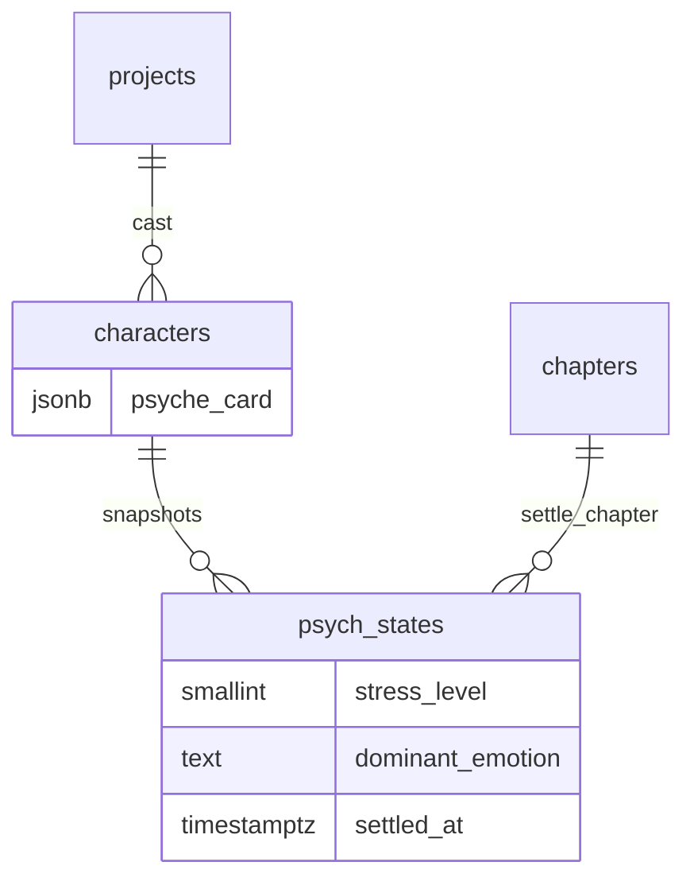

# Phase 5 Database Schema

> **Canonical for Phase 5.** Extends [Phase 4 schema](../phase-4/schema.md). Supersedes psych sections in [schema-draft.md](../../schema-draft.md).  
> **Migration tool:** Alembic (`apps/api/alembic/` — continue from Phase 4 `013`).

---

## Design principles (unchanged + Phase 5)

1. **Multi-tenant:** Every row carries `project_id` (directly or via FK chain).
2. **Psyche card is stable:** Updated via author edit or approved extract — not on every prose save.
3. **PsychState is append-only:** One settled snapshot per `(character_id, chapter_id)`; no UPDATE/DELETE after settle.
4. **Earned change:** Belief/value shifts require trigger refs or arc flags — enforced in continuity + extract confidence.
5. **Deterministic checks read-only:** Psychology rules query `characters.psyche_card` + prior `psych_states`; do not mutate during check.

---

## Migration from Phase 4

| Revision | Content |
|----------|---------|
| `014_psyche_card_schema` | Document + optional CHECK/trigger for jsonb shape; backfill legacy Phase 3 keys |
| `015_psych_states` | `psych_states` table + unique settled snapshot constraint |

---

## `characters.psyche_card` (formalized jsonb)

Phase 1–3 stored loose jsonb (`traits`, `goals`, `moral_boundaries`). Phase 5 **canonical shape**:

| Field | Type | Required (T3) | Description |
|-------|------|---------------|-------------|
| `drive` | `string` | recommended | Core motivation — what they pursue |
| `need` | `string` | recommended | Deep emotional need beneath drive |
| `wound` | `string` | recommended | Formative hurt shaping behavior |
| `fear` | `string` | recommended | Primary fear / avoidance |
| `value_hierarchy` | `string[]` | **yes (T3)** | Ordered values, highest first (e.g. `["gia đình", "công lý", "sức mạnh"]`) |
| `defense` | `string` | optional | Default coping mechanism under stress |
| `voice_taboo` | `string[]` | optional | Speech patterns they avoid / never say |
| `stress_behavior` | `string` | optional | Behavior under high stress |
| `relationship_lens` | `object[]` | optional | Per-target templates — see below |
| `moral_boundaries` | `string[]` | **yes (T3)** | Lines they will not cross without arc flag |
| `arc_flags` | `object` | optional | Earned-change overrides — see below |

**`relationship_lens[]` item shape:**

```json
{
  "target_character_id": "770e8400-e29b-41d4-a716-446655440002",
  "role_label": "rival",
  "trust_level": 2,
  "notes": "Mutual respect after Ch.7 duel"
}
```

| Field | Type | Notes |
|-------|------|-------|
| `target_character_id` | uuid | Canonical character id |
| `role_label` | string | rival, ally, mentor, … |
| `trust_level` | integer 0–5 | Wireframe trust bar mapping |
| `notes` | string | Sticky note for arc shifts |

**`arc_flags` shape (optional):**

```json
{
  "allow_moral_break": false,
  "expected_arc_beats": ["betrayal_ch7", "redemption_ch15"],
  "current_arc_beat": "betrayal_ch7"
}
```

**Legacy migration (`014`):**

- Map Phase 3 `traits[]` → `drive` (first trait) + retain in `_legacy.traits` if needed for read compat.
- Map `goals[]` → `need` or `active_goal` hints in extract only.
- Preserve existing `moral_boundaries` — required for T3 gate unchanged.

**Update rules:**

- Author `PATCH .../psyche-card` — full or partial merge at application layer.
- Extract may propose `psyche_card_patch` in state_diff — author approves at settle.
- **Not** updated automatically on continuity check or draft save.

**Example document:**

```json
{
  "drive": "Báo thù cho gia tộc",
  "need": "Được công nhận xứng đáng",
  "wound": "Chứng kiến sư phụ hy sinh vô ích",
  "fear": "Trở thành kẻ phản bội như địch thủ",
  "value_hierarchy": ["gia đình", "công lý", "sức mạnh"],
  "defense": "Lạnh lùng, né tránh cảm xúc",
  "voice_taboo": ["xin lỗi", "tôi yếu đuối"],
  "stress_behavior": "Im lặng, rút kiếm",
  "moral_boundaries": ["không giết vô tội", "không phản bội sư môn"],
  "relationship_lens": [
    {
      "target_character_id": "880e8400-e29b-41d4-a716-446655440003",
      "role_label": "rival",
      "trust_level": 1,
      "notes": "Đối thủ kiếm đạo"
    }
  ],
  "arc_flags": {
    "allow_moral_break": false,
    "expected_arc_beats": ["breakthrough_ch12"],
    "current_arc_beat": null
  }
}
```

---

## Tables (Phase 5 new)

### `psych_states`

Append-only emotional/belief snapshot per character per chapter, written on settle.

| Column | Type | Constraints | Notes |
|--------|------|-------------|-------|
| `id` | `uuid` | PK, DEFAULT `gen_random_uuid()` | Stable psych state id |
| `project_id` | `uuid` | NOT NULL, FK → `projects(id)` ON DELETE CASCADE | Tenant filter |
| `character_id` | `uuid` | NOT NULL, FK → `characters(id)` ON DELETE CASCADE | |
| `chapter_id` | `uuid` | NOT NULL, FK → `chapters(id)` ON DELETE CASCADE | Settle chapter |
| `stress_level` | `smallint` | NOT NULL, CHECK `0 <= stress_level <= 10` | 0 calm → 10 breaking |
| `dominant_emotion` | `text` | NOT NULL, DEFAULT `''` | e.g. anger, grief, resolve |
| `active_goal` | `text` | NOT NULL, DEFAULT `''` | Scene/chapter-level goal |
| `belief_updates` | `jsonb` | NOT NULL, DEFAULT `'[]'` | Earned belief shifts — see shape |
| `relationship_stance` | `jsonb` | NOT NULL, DEFAULT `'[]'` | Per-target stance deltas |
| `value_pressure` | `text` | NULL | Which value in hierarchy is under pressure |
| `arc_beat` | `text` | NULL | Named arc milestone reached this chapter |
| `trigger_event_refs` | `jsonb` | NOT NULL, DEFAULT `'[]'` | Ledger event ids or beat ids supporting change |
| `settled_at` | `timestamptz` | NOT NULL | Immutable once written |
| `created_at` | `timestamptz` | NOT NULL, DEFAULT `now()` | Same as settle time typically |

**`belief_updates[]` item shape:**

```json
{
  "from_belief": "Sư phụ vô tội",
  "to_belief": "Sư phụ che giấu sự thật",
  "confidence": "extract_stub",
  "trigger_ref": "beat:660e8400-e29b-41d4-a716-446655440010"
}
```

**`relationship_stance[]` item shape:**

```json
{
  "target_character_id": "880e8400-e29b-41d4-a716-446655440003",
  "stance": "distrust",
  "trust_delta": -2,
  "notes": "Phát hiện nói dối"
}
```

**Indexes:**

- `UNIQUE psych_states_character_chapter_settled_idx ON psych_states (character_id, chapter_id) WHERE settled_at IS NOT NULL`
- `INDEX psych_states_project_character_chapter_idx ON psych_states (project_id, character_id, chapter_id DESC)`
- `INDEX psych_states_character_timeline_idx ON psych_states (character_id, settled_at DESC)`

**Immutability rules:**

- **INSERT** only via settle transaction (or approved state_diff replay).
- **No UPDATE** after row committed with `settled_at`.
- **No DELETE** of settled rows — compensating INSERT in later chapter if correction needed (domain event, not in-place edit).
- Application layer MUST reject `PATCH`/`DELETE` on settled psych_states → `409 psych_state_immutable`.

**Draft proposals (pre-settle):**

- Proposed snapshots live in `continuity_reports.state_diff_json.psych_state_proposals[]` only.
- Not persisted to `psych_states` until settle succeeds.

---

## Entity relationship (Phase 5 extension)



---

## Continuity engine reads (no writes)

On `POST .../continuity-check`, psychology rules query:

```sql
-- Latest psych state before this chapter for scene characters
SELECT ps.*
FROM psych_states ps
JOIN chapters c ON c.id = ps.chapter_id
JOIN chapters target ON target.id = :chapter_id
WHERE ps.project_id = :project_id
  AND ps.character_id = ANY(:scene_character_ids)
  AND c.number < target.number
ORDER BY ps.character_id, c.number DESC;
```

Plus `characters.psyche_card` for moral boundaries and value hierarchy — see [ooc-rules.md](./ooc-rules.md).

---

## Multi-tenant isolation (unchanged)

- All queries filter by `project_id`.
- Nested resources validate chain (`psych_state.character.project_id`, `psych_state.chapter.project_id`).
- Cross-tenant → HTTP `404`.

---

## Migration checklist (implementation PR)

- [ ] `014_psyche_card_schema` — backfill + validation helper
- [ ] `015_psych_states` — table + unique constraint + indexes
- [ ] Integration tests: cross-tenant, immutability 409, settle append
- [ ] Verify T3 promote still requires `value_hierarchy` + `moral_boundaries`

---

## Deferred (do not create in Phase 5)

From [schema-draft.md](../../schema-draft.md): power cultivation ledger, standalone relationship graph tables, LLM audit log.

---

## Links

- [Phase 4 schema](../phase-4/schema.md)
- [ooc-rules.md](./ooc-rules.md)
- [openapi.yaml](./openapi.yaml)
- [api-contracts.md](./api-contracts.md)
