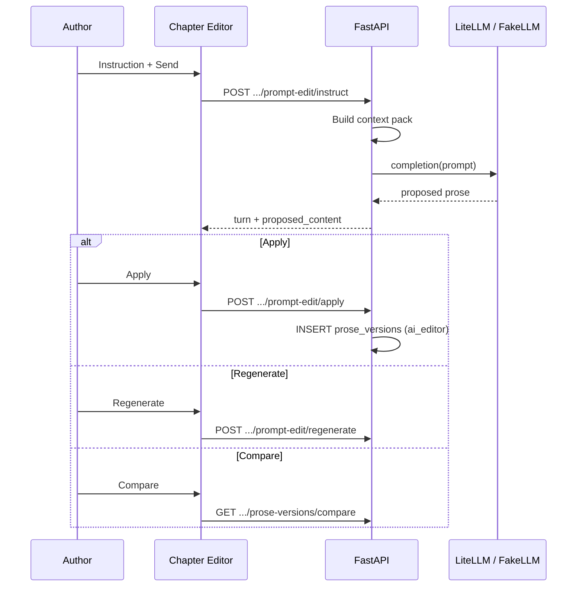

# Phase 6 Prompt Edit — LiteLLM, Context Pack, UX Contract

> Canonical contract for AI-assisted prose revision in Chapter Editor.  
> Implements US-W03; replaces Phase 2 **stub** panel with functional loop.

**Human-in-the-loop:** Prompt Edit never auto-settles. Apply creates a new `prose_versions` row; author runs continuity + settle separately.

---

## Architecture



---

## LLM provider configuration

**Server-side only.** Never commit API keys.

| Env var | Default | Purpose |
|---------|---------|---------|
| `STORYFORGE_LLM_PROVIDER` | `fake` | `fake` \| `litellm` |
| `LITELLM_MODEL` | — | e.g. `gpt-4o`, `anthropic/claude-3-5-sonnet` |
| `LITELLM_API_BASE` | — | Optional proxy/gateway URL |
| `OPENAI_API_KEY`, `ANTHROPIC_API_KEY`, … | — | LiteLLM standard env (document in `.env.example` only) |
| `STORYFORGE_LLM_TIMEOUT_SEC` | `60` | Request timeout |
| `STORYFORGE_LLM_MAX_OUTPUT_TOKENS` | `4096` | Cap completion size |

**FakeLLM (default for tests + local dev):**

- Deterministic transformation: append `\n\n[AI_EDIT: {instruction_hash}]` or apply simple regex rules from instruction keywords.
- No network calls; `provider=fake`, `model=fake-llm`.
- Integration tests **must** use FakeLLM unless explicitly marked `@pytest.mark.llm_live` (skipped in CI).

**Real LiteLLM (opt-in):**

```bash
export STORYFORGE_LLM_PROVIDER=litellm
export LITELLM_MODEL=gpt-4o
export OPENAI_API_KEY=sk-...
```

Document in `docs/agent-setup.md` — not required for `make check`.

---

## Context pack inputs (Editor agent)

Built server-side on each `instruct` / `regenerate`:

| Slice | Source | Bound |
|-------|--------|-------|
| `chapter_meta` | `chapters`, current beat selection | title, number, status |
| `prose_current` | Latest or `base_prose_version` content | Full chapter (Phase 6); future beat-scoped |
| `scene_beats` | `scene_beats` for chapter | Summaries list |
| `bible_snippets` | Staging + settled snapshot at `bible_version_at_draft` | Top-K by beat keywords (stub: fixed limit 8) |
| `style_guide` | `projects.settings.style_guide` | Tone, POV, taboo words |
| `characters_in_scene` | Beat metadata + name match | Tier-capped stubs from Phase 3 pack |
| `twist_plants` | Phase 4 context strip | **No** `secret_truth` |
| `psych_snapshots` | Phase 5 pack | Scene cast only |
| `power_snippets` | If module enabled | Rank ladder labels, technique names (no spoilers) |

**Endpoint (internal):** composes existing `POST .../context-packs/*` helpers — no separate public route required in Phase 6.

**Prompt template (sketch):**

```
You are StoryForge Editor. Revise the chapter prose per author instruction.
Preserve canon facts. Output full revised chapter text only.
Instruction: {instruction}
Style: {style_guide}
Beats: {beats}
Current prose: {prose}
```

Templates live in API code; escape user `instruction` (injection hardening per security rules).

---

## API operations

| Operation | Method | Path | Behavior |
|-----------|--------|------|----------|
| Instruct | POST | `.../prompt-edit/instruct` | New turn; returns `proposed_content` (not saved as version) |
| Regenerate | POST | `.../prompt-edit/regenerate` | Re-run last instruction; new turn_index |
| Apply | POST | `.../prompt-edit/apply` | Body: `{ turn_id }` → INSERT `prose_versions`, `source=ai_editor` |
| Session log | GET | `.../prompt-edit/sessions` | Instruction history for chapter |
| Compare | GET | `.../prose-versions/compare?from=&to=` | **Existing** Phase 2 route |

**Locked chapters:** all mutating routes → `409 chapter_locked`.

**Rate limit (Phase 6 stub):** Max 30 instruct/regenerate per chapter per hour per user — Redis Phase 8; in-memory counter OK for MVP implementation.

---

## Apply / Regenerate / Compare UX contract

| Action | UI | API | Result |
|--------|-----|-----|--------|
| **Send** | Instruction textarea + Send | `instruct` | Turn appears in log; preview in diff panel |
| **Apply** | Primary button enabled when proposal exists | `apply` | New version in dropdown; editor content updates; session `applied` |
| **Regenerate** | Secondary — same instruction | `regenerate` | New proposal; prior turn kept in log |
| **Compare** | Opens modal / split view | `compare` + fetch version bodies | Side-by-side or inline diff vs `base_prose_version` |
| **Discard** | Optional link | PATCH session `discarded` | Clears pending proposal UI |

**Instruction log:** User message + AI status (model, latency) — no full prose in log row (expand to preview).

**Version dropdown:** Applied AI versions show `ai_editor` badge (Phase 2 `ProseSource` enum).

---

## Cost & safety notes

| Topic | Policy |
|-------|--------|
| **Cost** | Log `token_usage` on each turn; no billing UI in Phase 6 |
| **Secrets** | Keys only in env; `.env.example` placeholders |
| **Injection** | Sanitize instruction; template escaping; max instruction length 4000 chars |
| **Content** | No LLM calls from browser — API/workers only |
| **PII** | Do not send author email in prompts |
| **Failure** | Provider error → 502 with `llm_provider_error`; turn stored with `error_code` |
| **Audit** | `prompt_edit_turns` retained for debug; no auto-delete in Phase 6 |

---

## Data model summary

- **`prompt_edit_sessions`** — one per chapter edit flow (see [schema.md](./schema.md))
- **`prompt_edit_turns`** — append-only log
- **`prose_versions`** — canonical applied output (`source=ai_editor`, optional `prompt_edit_turn_id`)

Alternative considered: store proposals only in turns until Apply — **chosen** to keep draft proposals out of version list until author commits.

---

## Out of scope

- Writer agent full draft generation (`ai_writer` source — future)
- Beat-scoped partial chapter replace (Phase 8 scene engine)
- Streaming SSE responses (optional stretch — sync MVP OK)

---

## Links

- [openapi.yaml](./openapi.yaml)
- [api-contracts.md](./api-contracts.md)
- [web-screens.md](./web-screens.md)
- [test-strategy.md](./test-strategy.md)
- [05-wireframes.md](../../product/05-wireframes.md) §3
