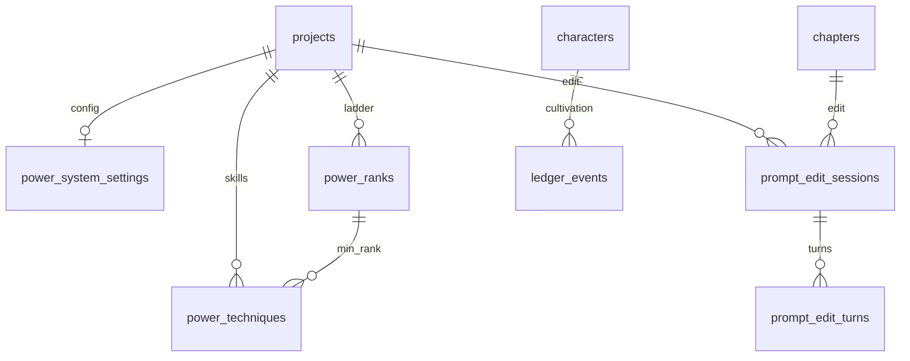

# Phase 6 Database Schema

> **Canonical for Phase 6.** Extends [Phase 5 schema](../phase-5/schema.md). Supersedes power/genre/prompt sections in [schema-draft.md](../../schema-draft.md).  
> **Migration tool:** Alembic (`apps/api/alembic/` — continue from Phase 5 `015`).

---

## Design principles (unchanged + Phase 6)

1. **Multi-tenant:** Every row carries `project_id` (directly or via FK chain).
2. **Hybrid power storage:** Structured staging in dedicated tables; settled canon mirrored in `bible_versions.snapshot_json.world.power_system`.
3. **Cultivation ledger append-only:** Rank/technique changes via `ledger_events` on settle only.
4. **Genre packs are project-scoped JSON:** `projects.genre_rule_pack_json` — tunable without migration for new thresholds.
5. **Prompt Edit audit trail:** Sessions + turns log instructions; applied prose lives in `prose_versions`.

---

## Storage design: power system

| Layer | Location | Purpose |
|-------|----------|---------|
| **Staging (author edit)** | `power_ranks`, `power_techniques`, `power_system_settings` | CRUD with stable UUIDs, sort order, validation |
| **Draft proposals** | `continuity_reports.state_diff_json` | Pre-settle cultivation proposals |
| **Settled canon** | `bible_versions.snapshot_json.world.power_system` | Immutable snapshot at bible version N |
| **Runtime ledger** | `ledger_events` | Per-character cultivation history |

**Rationale:** Dedicated tables give relational CRUD and FK integrity; bible snapshot preserves versioned canon for continuity at `bible_version_at_draft`. Non-xianxia projects may leave tables empty and set `power_system_settings.enabled = false`.

---

## Migration from Phase 5

| Revision | Content |
|----------|---------|
| `016_power_system` | `power_system_settings`, `power_ranks`, `power_techniques` |
| `017_genre_rule_pack` | `projects.genre_rule_pack_json` + seed defaults by `genre_profile` |
| `018_prompt_edit` | `prompt_edit_sessions`, `prompt_edit_turns` |
| `019_ledger_power_events` | Extend `ledger_event_type` enum: `cultivation_change`, `technique_learned`, `resource_consumed` |

---

## `power_system_settings`

One row per project (create on xianxia template or first power API call).

| Column | Type | Constraints | Notes |
|--------|------|-------------|-------|
| `project_id` | `uuid` | PK, FK → `projects(id)` ON DELETE CASCADE | Tenant key |
| `enabled` | `boolean` | NOT NULL, DEFAULT `false` | False for mystery/literary unless author enables |
| `priority_gap` | `smallint` | NOT NULL, DEFAULT `2` | Min rank delta for guaranteed outcome (anti-creep) |
| `max_rank_jump_per_chapter` | `smallint` | NOT NULL, DEFAULT `1` | Stages allowed without `breakthrough_flag` |
| `require_breakthrough_event` | `boolean` | NOT NULL, DEFAULT `true` | Rank jump needs ledger `cultivation_change` with `breakthrough: true` |
| `updated_at` | `timestamptz` | NOT NULL, DEFAULT `now()` | |

---

## `power_ranks`

Ordered cultivation ladder — staging until copied to bible on settle.

| Column | Type | Constraints | Notes |
|--------|------|-------------|-------|
| `id` | `uuid` | PK, DEFAULT `gen_random_uuid()` | Stable rank id (referenced by techniques + ledger) |
| `project_id` | `uuid` | NOT NULL, FK → `projects(id)` ON DELETE CASCADE | |
| `rank_key` | `text` | NOT NULL | Machine key e.g. `qi_refining`, `foundation` |
| `display_name` | `text` | NOT NULL | Author-facing label e.g. "Luyện Khí" |
| `sort_order` | `integer` | NOT NULL | Monotonic ladder position (0 = lowest) |
| `sub_stages` | `jsonb` | NOT NULL, DEFAULT `'[]'` | Optional sub-ranks — see shape |
| `constraints_md` | `text` | NOT NULL, DEFAULT `''` | Notes: lifespan, resources, sect gates |
| `created_at` | `timestamptz` | NOT NULL, DEFAULT `now()` | |
| `updated_at` | `timestamptz` | NOT NULL, DEFAULT `now()` | |

**`sub_stages[]` item shape:**

```json
{ "key": "early", "display_name": "Sơ kỳ", "sort_order": 0 }
```

**Indexes:**

- `UNIQUE power_ranks_project_key_idx ON power_ranks (project_id, rank_key)`
- `UNIQUE power_ranks_project_sort_idx ON power_ranks (project_id, sort_order)`
- `INDEX power_ranks_project_id_idx ON power_ranks (project_id)`

**Validation (application):**

- `sort_order` must be unique and gap-free (0..N-1) on save batch.
- Deleting a rank referenced by `power_techniques.min_rank_id` → `409 rank_in_use`.

---

## `power_techniques`

Techniques with eligibility requirements — staging until bible settle.

| Column | Type | Constraints | Notes |
|--------|------|-------------|-------|
| `id` | `uuid` | PK, DEFAULT `gen_random_uuid()` | |
| `project_id` | `uuid` | NOT NULL, FK → `projects(id)` ON DELETE CASCADE | |
| `technique_key` | `text` | NOT NULL | e.g. `azure_cloud_sword` |
| `display_name` | `text` | NOT NULL | |
| `min_rank_id` | `uuid` | NOT NULL, FK → `power_ranks(id)` ON DELETE RESTRICT | Minimum rank |
| `sect_requirement` | `text` | NULL | Faction/sect id or name |
| `lineage_requirement` | `text` | NULL | Manual lineage gate |
| `resource_cost` | `jsonb` | NOT NULL, DEFAULT `'{}'` | e.g. `{ "spirit_stones": 100, "pill_id": "..." }` |
| `notes_md` | `text` | NOT NULL, DEFAULT `''` | |
| `created_at` | `timestamptz` | NOT NULL, DEFAULT `now()` | |
| `updated_at` | `timestamptz` | NOT NULL, DEFAULT `now()` | |

**Indexes:**

- `UNIQUE power_techniques_project_key_idx ON power_techniques (project_id, technique_key)`
- `INDEX power_techniques_project_min_rank_idx ON power_techniques (project_id, min_rank_id)`

---

## Bible snapshot shape (`world.power_system`)

On settle, service merges staging into next bible snapshot:

```json
{
  "enabled": true,
  "priority_gap": 2,
  "max_rank_jump_per_chapter": 1,
  "ranks": [
    {
      "id": "a1000000-0000-4000-8000-000000000001",
      "rank_key": "qi_refining",
      "display_name": "Luyện Khí",
      "sort_order": 0,
      "sub_stages": []
    }
  ],
  "techniques": [
    {
      "id": "b2000000-0000-4000-8000-000000000002",
      "technique_key": "azure_cloud_sword",
      "display_name": "Thanh Vân Kiếm",
      "min_rank_id": "a1000000-0000-4000-8000-000000000001",
      "resource_cost": { "spirit_stones": 50 }
    }
  ]
}
```

---

## Ledger event types (Phase 6 extension)

Extend `ledger_event_type` enum on `ledger_events`:

| Value | Entity | Payload keys |
|-------|--------|--------------|
| `cultivation_change` | `character` | `{ "from_rank_id", "to_rank_id", "from_sub_stage", "to_sub_stage", "breakthrough": bool, "method": string }` |
| `technique_learned` | `character` | `{ "technique_id", "technique_key", "constraints_met": object }` |
| `resource_consumed` | `character` | `{ "resource_type", "amount", "item_ref": string }` |

**Settle flow:**

1. Extract proposes entries in `state_diff_json.ledger_proposals[]` with `event_type` above.
2. Author approves bundle at settle.
3. INSERT into `ledger_events` with `settled_at` set; `entity_type = 'character'`.

Continuity reads latest settled `cultivation_change` per character before current chapter.

---

## `projects.genre_rule_pack_json`

Formalized genre contract (replaces implicit Phase 4 defaults-only behavior).

| Column | Type | Constraints | Notes |
|--------|------|-------------|-------|
| `genre_rule_pack_json` | `jsonb` | NOT NULL, DEFAULT `'{}'` | Added in migration `017` |

**Canonical shape** — see [genre-contracts.md](./genre-contracts.md). Seeded from `genre_profile` on project create; PATCH via API.

**Relationship to `genre_profile`:**

- `genre_profile` — enum tag (`xianxia`, `mystery`, …) for templates and UI.
- `genre_rule_pack_json` — tunable thresholds; `base_profile` field mirrors enum.

---

## Prompt Edit tables

### `prompt_edit_sessions`

One active session per chapter draft (reuse or create on first instruct).

| Column | Type | Constraints | Notes |
|--------|------|-------------|-------|
| `id` | `uuid` | PK, DEFAULT `gen_random_uuid()` | |
| `project_id` | `uuid` | NOT NULL, FK → `projects(id)` ON DELETE CASCADE | |
| `chapter_id` | `uuid` | NOT NULL, FK → `chapters(id)` ON DELETE CASCADE | |
| `base_prose_version` | `integer` | NOT NULL | Version instruction applied against |
| `status` | `text` | NOT NULL, DEFAULT `'active'` | `active`, `applied`, `discarded` |
| `created_by` | `uuid` | NOT NULL | |
| `created_at` | `timestamptz` | NOT NULL, DEFAULT `now()` | |
| `updated_at` | `timestamptz` | NOT NULL, DEFAULT `now()` | |

**Indexes:**

- `INDEX prompt_edit_sessions_chapter_idx ON prompt_edit_sessions (chapter_id, created_at DESC)`

### `prompt_edit_turns`

Append-only instruction log per session.

| Column | Type | Constraints | Notes |
|--------|------|-------------|-------|
| `id` | `uuid` | PK, DEFAULT `gen_random_uuid()` | |
| `project_id` | `uuid` | NOT NULL, FK → `projects(id)` ON DELETE CASCADE | |
| `session_id` | `uuid` | NOT NULL, FK → `prompt_edit_sessions(id)` ON DELETE CASCADE | |
| `turn_index` | `integer` | NOT NULL | 1-based per session |
| `instruction` | `text` | NOT NULL | Author prompt (sanitized) |
| `proposed_content` | `text` | NULL | LLM output; null if error |
| `proposed_prose_version` | `integer` | NULL | Reserved version number if pre-allocated |
| `model` | `text` | NOT NULL | e.g. `fake-llm`, `gpt-4o` |
| `provider` | `text` | NOT NULL | `fake`, `litellm` |
| `latency_ms` | `integer` | NULL | |
| `token_usage` | `jsonb` | NOT NULL, DEFAULT `'{}'` | `{ "prompt_tokens", "completion_tokens" }` |
| `error_code` | `text` | NULL | Set on provider failure |
| `created_at` | `timestamptz` | NOT NULL, DEFAULT `now()` | |

**Indexes:**

- `UNIQUE prompt_edit_turns_session_turn_idx ON prompt_edit_turns (session_id, turn_index)`

**Apply semantics:**

- Apply does **not** mutate turns — creates new `prose_versions` row with `source = ai_editor`, links `prompt_edit_turn_id` in metadata (optional jsonb on prose_versions or session `status = applied`).
- Phase 6 optional column on `prose_versions`: `prompt_edit_turn_id uuid NULL` FK → `prompt_edit_turns(id)`.

---

## Entity relationship (Phase 6 extension)



---

## Continuity engine reads (no writes)

On `POST .../continuity-check`, power rules query:

```sql
-- Latest cultivation rank per scene character before this chapter
SELECT DISTINCT ON (le.entity_id) le.*
FROM ledger_events le
JOIN chapters c ON c.id = le.chapter_id
JOIN chapters target ON target.id = :chapter_id
WHERE le.project_id = :project_id
  AND le.entity_type = 'character'
  AND le.event_type = 'cultivation_change'
  AND le.entity_id = ANY(:scene_character_ids)
  AND le.settled_at IS NOT NULL
  AND c.number < target.number
ORDER BY le.entity_id, c.number DESC;
```

Plus `power_ranks` / bible snapshot for label resolution — see [power-rules.md](./power-rules.md).

---

## Multi-tenant isolation (unchanged)

- All queries filter by `project_id`.
- Nested resources validate FK chain to project.
- Cross-tenant → HTTP `404`.

---

## Migration checklist (implementation PR)

- [ ] `016_power_system` — settings + ranks + techniques
- [ ] `017_genre_rule_pack` — column + seed function
- [ ] `018_prompt_edit` — sessions + turns (+ optional prose_versions FK)
- [ ] `019_ledger_power_events` — enum extension
- [ ] Integration tests: cross-tenant, rank monotonicity, FakeLLM prompt edit
- [ ] Bible snapshot includes `world.power_system` after settle

---

## Deferred (do not create in Phase 6)

Neo4j, export jobs, full LLM continuity audit log table, multi-user collab sessions.

---

## Links

- [Phase 5 schema](../phase-5/schema.md)
- [power-rules.md](./power-rules.md)
- [genre-contracts.md](./genre-contracts.md)
- [prompt-edit.md](./prompt-edit.md)
- [openapi.yaml](./openapi.yaml)
