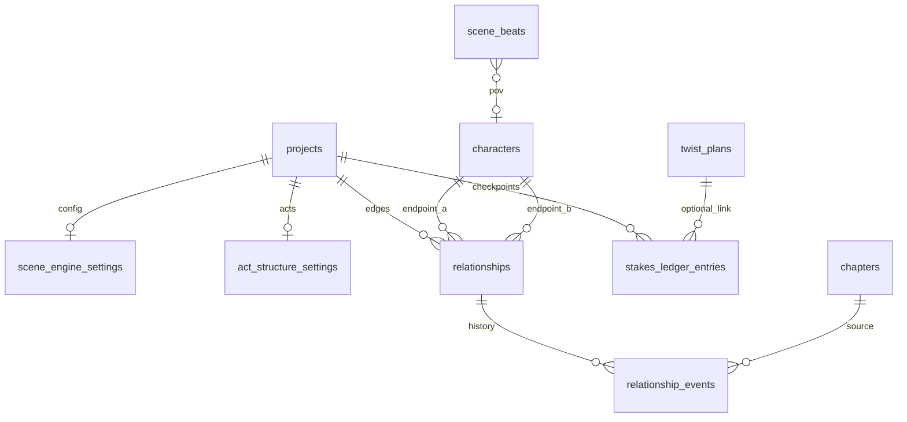

# Phase 8 Database Schema — Slice 1

> **Canonical for Phase 8 Slice 1.** Extends [Phase 6 schema](../phase-6/schema.md).  
> **Migration tool:** Alembic (`apps/api/alembic/` — continue from Phase 6 `019`).

---

## Design principles (unchanged + Phase 8)

1. **Multi-tenant:** Every row carries `project_id` (directly or via FK chain).
2. **Ledger append-only:** `relationship_events` and generic `ledger_events` — no UPDATE of settled rows.
3. **Graph is derived:** `relationships` registry + events; no Neo4j.
4. **Scene structure extends staging:** `scene_beats` columns editable until chapter locked.
5. **Stakes hybrid storage:** `stakes_ledger_entries` staging + bible snapshot `world.stakes` on settle.
6. **Continuity categories extend enum:** `scene_structure`, `relationship_arc`, `stakes` in application layer (stored as text in `issues_json`).

---

## Migration from Phase 6

| Revision | Content |
|----------|---------|
| `020_scene_engine` | Extend `scene_beats`; create `scene_engine_settings` |
| `021_relationships` | `relationships`, `relationship_events` |
| `022_stakes_ledger` | `act_structure_settings`, `stakes_ledger_entries` |
| `023_ledger_phase8_events` | Extend `ledger_entity_type` + `ledger_event_type` enums |

**Current main head:** `019_ledger_power_events` — Phase 8 starts at `020`.

---

## `020_scene_engine`

### Extend `scene_beats`

| Column | Type | Constraints | Notes |
|--------|------|-------------|-------|
| `goal` | `text` | NOT NULL, DEFAULT `''` | |
| `conflict` | `text` | NOT NULL, DEFAULT `''` | |
| `outcome` | `text` | NOT NULL, DEFAULT `''` | |
| `stakes_level` | `smallint` | NULL | CHECK 0–5 when not null |
| `pressure_tags` | `jsonb` | NOT NULL, DEFAULT `'[]'` | |
| `pov_character_id` | `uuid` | NULL, FK → `characters(id)` ON DELETE SET NULL | |
| `scene_type` | `text` | NOT NULL, DEFAULT `'scene'` | |

**Indexes:**

- `INDEX scene_beats_pov_character_idx ON scene_beats (project_id, pov_character_id) WHERE pov_character_id IS NOT NULL`

### `scene_engine_settings`

| Column | Type | Constraints | Notes |
|--------|------|-------------|-------|
| `project_id` | `uuid` | PK, FK → `projects(id)` ON DELETE CASCADE | |
| `enabled` | `boolean` | NOT NULL, DEFAULT `true` | |
| `require_conflict` | `boolean` | NOT NULL, DEFAULT `true` | |
| `require_outcome_on_complete` | `boolean` | NOT NULL, DEFAULT `true` | |
| `min_goal_length` | `smallint` | NOT NULL, DEFAULT `8` | |
| `llm_auditor_enabled` | `boolean` | NOT NULL, DEFAULT `false` | |
| `strictness` | `text` | NOT NULL, DEFAULT `'standard'` | |
| `updated_at` | `timestamptz` | NOT NULL, DEFAULT `now()` | |

---

## `021_relationships`

### `relationships`

| Column | Type | Constraints | Notes |
|--------|------|-------------|-------|
| `id` | `uuid` | PK, DEFAULT `gen_random_uuid()` | |
| `project_id` | `uuid` | NOT NULL, FK → `projects(id)` ON DELETE CASCADE | |
| `character_a_id` | `uuid` | NOT NULL, FK → `characters(id)` ON DELETE CASCADE | Lower UUID |
| `character_b_id` | `uuid` | NOT NULL, FK → `characters(id)` ON DELETE CASCADE | Higher UUID |
| `relation_type` | `text` | NOT NULL | |
| `custom_label` | `text` | NULL | |
| `baseline_intensity` | `smallint` | NOT NULL, DEFAULT `0` | -5..+5 |
| `notes_md` | `text` | NOT NULL, DEFAULT `''` | |
| `created_at` | `timestamptz` | NOT NULL, DEFAULT `now()` | |
| `updated_at` | `timestamptz` | NOT NULL, DEFAULT `now()` | |

**Constraints:**

- `CHECK (character_a_id < character_b_id)`
- `CHECK (baseline_intensity BETWEEN -5 AND 5)`
- `UNIQUE relationships_project_pair_idx ON (project_id, character_a_id, character_b_id)`

**Indexes:**

- `INDEX relationships_project_id_idx ON relationships (project_id)`
- `INDEX relationships_character_a_idx ON relationships (project_id, character_a_id)`
- `INDEX relationships_character_b_idx ON relationships (project_id, character_b_id)`

### `relationship_events`

| Column | Type | Constraints | Notes |
|--------|------|-------------|-------|
| `id` | `uuid` | PK, DEFAULT `gen_random_uuid()` | |
| `project_id` | `uuid` | NOT NULL, FK → `projects(id)` ON DELETE CASCADE | |
| `relationship_id` | `uuid` | NOT NULL, FK → `relationships(id)` ON DELETE CASCADE | |
| `event_type` | `text` | NOT NULL | |
| `intensity_delta` | `smallint` | NOT NULL, DEFAULT `0` | |
| `intensity_after` | `smallint` | NOT NULL | Snapshot |
| `relation_type_after` | `text` | NULL | |
| `payload` | `jsonb` | NOT NULL, DEFAULT `'{}'` | |
| `chapter_id` | `uuid` | NOT NULL, FK → `chapters(id)` ON DELETE RESTRICT | |
| `chapter_number` | `integer` | NOT NULL | |
| `prose_version` | `integer` | NOT NULL | |
| `settled_at` | `timestamptz` | NULL | |
| `created_at` | `timestamptz` | NOT NULL, DEFAULT `now()` | |

**Indexes:**

- `INDEX relationship_events_relationship_idx ON relationship_events (relationship_id, chapter_number ASC, settled_at ASC)`
- `INDEX relationship_events_project_chapter_idx ON relationship_events (project_id, chapter_number DESC)`
- Partial: `WHERE settled_at IS NOT NULL` for graph queries

**Immutability:** Application rejects UPDATE/DELETE when `settled_at IS NOT NULL`.

---

## `022_stakes_ledger`

### `act_structure_settings`

| Column | Type | Constraints | Notes |
|--------|------|-------------|-------|
| `project_id` | `uuid` | PK, FK → `projects(id)` ON DELETE CASCADE | |
| `act_count` | `smallint` | NOT NULL, DEFAULT `3` | CHECK 1–7 |
| `chapters_per_act` | `jsonb` | NOT NULL, DEFAULT `'[]'` | |
| `enabled` | `boolean` | NOT NULL, DEFAULT `true` | |
| `flat_middle_window_chapters` | `smallint` | NOT NULL, DEFAULT `3` | |
| `updated_at` | `timestamptz` | NOT NULL, DEFAULT `now()` | |

### `stakes_ledger_entries`

| Column | Type | Constraints | Notes |
|--------|------|-------------|-------|
| `id` | `uuid` | PK, DEFAULT `gen_random_uuid()` | |
| `project_id` | `uuid` | NOT NULL, FK → `projects(id)` ON DELETE CASCADE | |
| `act_number` | `smallint` | NOT NULL | CHECK >= 1 |
| `checkpoint_key` | `text` | NOT NULL | |
| `title` | `text` | NOT NULL | |
| `description_md` | `text` | NOT NULL, DEFAULT `''` | |
| `target_level` | `smallint` | NOT NULL | CHECK 0–5 |
| `status` | `text` | NOT NULL, DEFAULT `'planned'` | |
| `plant_chapter_id` | `uuid` | NULL, FK → `chapters(id)` ON DELETE SET NULL | |
| `resolve_chapter_id` | `uuid` | NULL, FK → `chapters(id)` ON DELETE SET NULL | |
| `linked_twist_id` | `uuid` | NULL, FK → `twist_plans(id)` ON DELETE SET NULL | |
| `sort_order` | `integer` | NOT NULL, DEFAULT `0` | |
| `created_at` | `timestamptz` | NOT NULL, DEFAULT `now()` | |
| `updated_at` | `timestamptz` | NOT NULL, DEFAULT `now()` | |

**Indexes:**

- `UNIQUE stakes_ledger_project_act_key_idx ON (project_id, act_number, checkpoint_key)`
- `INDEX stakes_ledger_project_act_sort_idx ON (project_id, act_number, sort_order ASC)`
- `INDEX stakes_ledger_status_idx ON (project_id, status)`

---

## `023_ledger_phase8_events`

Extend enums on `ledger_events`:

### `ledger_entity_type` additions

| Value | Meaning |
|-------|---------|
| `relationship` | Relationship edge (entity_id = `relationships.id`) |
| `stakes` | Stakes checkpoint (entity_id = `stakes_ledger_entries.id`) |

### `ledger_event_type` additions

| Value | Entity | Payload keys |
|-------|--------|--------------|
| `relationship_change` | `relationship` | `{ "intensity_delta", "intensity_after", "relation_type_after", "event_type" }` |
| `stakes_escalation` | `stakes` | `{ "act_number", "from_level", "to_level", "checkpoint_key" }` |

**Settle flow:** Same as Phase 2–6 — approved proposals INSERT into `ledger_events` + domain tables.

---

## Bible snapshot shapes (Phase 8)

### `world.stakes` (on settle)

See [stakes.md](./stakes.md).

### `world.scene_structure_summary` (optional patch)

Per-chapter aggregate keyed by chapter number — author opt-in at settle.

---

## Entity relationship (Phase 8 extension)

---

## Continuity engine reads (no writes)

Scene lint reads `scene_beats` + settings for chapter.

Relationship rules read latest settled `relationship_events` + registry.

Stakes rules read `stakes_ledger_entries` + act settings + beat `stakes_level` aggregates.

---

## Multi-tenant isolation (unchanged)

- All queries filter by `project_id`.
- Nested resources validate FK chain to project.
- Cross-tenant → HTTP `404`.

---

## Migration checklist (implementation PR)

- [ ] `020_scene_engine` — alter `scene_beats`; create settings
- [ ] `021_relationships` — registry + events
- [ ] `022_stakes_ledger` — act settings + entries
- [ ] `023_ledger_phase8_events` — enum extension
- [ ] Integration tests: cross-tenant, graph query, flat-middle WARN, settle append
- [ ] Bible snapshot includes `world.stakes` after settle

---

## Deferred (Phase 9+)

Neo4j, research notes tables, series parent projects, export jobs, collaboration sessions.

---

## Links

- [Phase 6 schema](../phase-6/schema.md)
- [scene-engine.md](./scene-engine.md)
- [relationships.md](./relationships.md)
- [stakes.md](./stakes.md)
- [openapi.yaml](./openapi.yaml)
