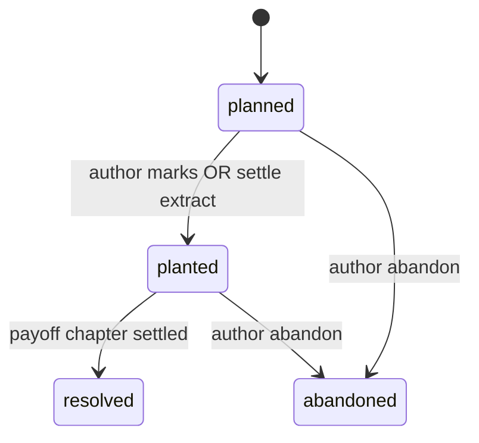

# Phase 8 Stakes Ledger — Act Escalation

> Act-level escalation tracking with continuity integration and settle snapshot.  
> Implements product [03-domain-and-subsystems.md](../../product/03-domain-and-subsystems.md) §7 (stakes half).

---

## Purpose

Authors define **stakes checkpoints** per act (target intensity, description, payoff links). The engine detects **flat middle** (missing escalation) and **stakes drift** (scene beats exceed act ceiling without justification). Checkpoints can **plant** into twist/continuity and commit status changes on settle.

---

## Entities

### `act_structure_settings`

One row per project.

| Column | Type | Default | Notes |
|--------|------|---------|-------|
| `project_id` | `uuid` PK | | |
| `act_count` | `smallint` | `3` | 1–7 |
| `chapters_per_act` | `jsonb` | `'[]'` | Optional explicit boundaries — see shape |
| `enabled` | `boolean` | `true` | Disables `stakes` continuity category when false |
| `flat_middle_window_chapters` | `smallint` | `3` | WARN if no escalation in window |
| `updated_at` | `timestamptz` | | |

**`chapters_per_act[]` item shape:**

```json
{ "act_number": 1, "start_chapter": 1, "end_chapter": 8, "label": "Hồi I — Thiên Nhai" }
```

When empty, acts divide evenly by chapter count (ceil).

---

### `stakes_ledger_entries`

Staging + settled checkpoints (hybrid like twist plants).

| Column | Type | Notes |
|--------|------|-------|
| `id` | `uuid` PK | |
| `project_id` | `uuid` FK | |
| `act_number` | `smallint` | 1-based |
| `checkpoint_key` | `text` | e.g. `act1_midpoint`, `act2_all_is_lost` |
| `title` | `text` | Author-facing label |
| `description_md` | `text` | What escalates |
| `target_level` | `smallint` | 0–5 stakes intensity |
| `status` | `text` | `planned`, `planted`, `resolved`, `abandoned` |
| `plant_chapter_id` | `uuid` | NULL until planted |
| `resolve_chapter_id` | `uuid` | NULL until resolved |
| `linked_twist_id` | `uuid` | Optional FK → `twist_plans(id)` |
| `sort_order` | `integer` | Within act |
| `created_at` | `timestamptz` | |
| `updated_at` | `timestamptz` | |

**Indexes:**

- `UNIQUE (project_id, act_number, checkpoint_key)`
- `INDEX stakes_ledger_project_act_idx ON (project_id, act_number, sort_order)`

---

## Status lifecycle



| Transition | Trigger |
|------------|---------|
| → `planted` | PATCH status; or settle proposes `stakes_status_change` |
| → `resolved` | Resolve chapter settled + optional twist payoff link |
| → `abandoned` | PATCH with reason |

---

## Continuity category: `stakes`

### K1 — Flat middle (no escalation)

**Code:** `stakes_flat_middle`  
**Severity:** WARN (relaxed) / FAIL (strict + mystery genre)

| Check | Logic |
|-------|-------|
| Input | `stakes_ledger_entries` + chapter numbers in current act |
| Violation | No entry moved to `planted` or `resolved` within `flat_middle_window_chapters` sliding window in act middle 50% |

**Fingerprint:** `stakes:{project_id}:flat_middle:act{act_number}:ch{chapter_number}`

---

### K2 — Checkpoint planted without scene stakes

**Code:** `stakes_plant_without_beat_stakes`  
**Severity:** WARN

| Check | Logic |
|-------|-------|
| Violation | Entry `status=planted` for current chapter but no beat with `stakes_level >= target_level - 1` |

Cross-links [scene-engine.md](./scene-engine.md) rule S5.

---

### K3 — Escalation drop

**Code:** `stakes_escalation_regression`  
**Severity:** WARN

| Check | Logic |
|-------|-------|
| Violation | Max beat `stakes_level` in act N < max in act N-1 without `abandoned` checkpoint documenting intentional de-escalation |

---

### K4 — Unresolved checkpoint past act boundary

**Code:** `stakes_unresolved_past_act`  
**Severity:** FAIL when strict

| Check | Logic |
|-------|-------|
| Violation | `status=planted` entry in act M while checking chapter in act M+1 without `resolve_chapter_id` |

---

### K5 — Target level jump without ledger proposal

**Code:** `stakes_level_jump_without_checkpoint`  
**Severity:** WARN

| Check | Logic |
|-------|-------|
| Violation | Beat `stakes_level` exceeds act `target_level` max by > 1 without new checkpoint in state_diff |

---

## Genre pack tuning

Extends Phase 6 `genre_rule_pack_json`:

```json
{
  "strictness": {
    "stakes": "standard"
  },
  "thresholds": {
    "stakes_flat_middle": "warn",
    "stakes_unresolved_past_act": "fail"
  }
}
```

| `genre_profile` | Default `stakes` strictness |
|-----------------|----------------------------|
| `mystery` | strict |
| `xianxia` | standard |
| `literary` | relaxed |

---

## State diff / settle

```json
{
  "stakes_ledger_proposals": [
    {
      "entry_id": "stakes-uuid",
      "status": "planted",
      "plant_chapter_id": "chapter-uuid",
      "target_level": 4
    }
  ],
  "ledger_proposals": [
    {
      "entity_type": "stakes",
      "entity_id": "stakes-uuid",
      "event_type": "stakes_escalation",
      "payload": {
        "act_number": 2,
        "from_level": 2,
        "to_level": 4,
        "checkpoint_key": "act2_midpoint"
      }
    }
  ],
  "bible_patch_candidates": [
    {
      "path": "world.stakes",
      "op": "replace",
      "value": {
        "act_count": 3,
        "checkpoints": [
          {
            "checkpoint_key": "act1_midpoint",
            "status": "resolved",
            "target_level": 3
          }
        ],
        "current_act_peak_level": 4
      }
    }
  ]
}
```

**Settle snapshot** — `bible_versions.snapshot_json.world.stakes`:

```json
{
  "act_count": 3,
  "current_act_peak_level": 4,
  "checkpoints": [
    {
      "id": "...",
      "act_number": 1,
      "checkpoint_key": "act1_midpoint",
      "title": "Mất sư môn",
      "target_level": 3,
      "status": "resolved"
    }
  ]
}
```

Continuity at `bible_version_at_draft` reads snapshot + staging entries not yet settled.

---

## API summary

| Method | Path | Purpose |
|--------|------|---------|
| GET/PATCH | `/projects/{id}/stakes/settings` | Act structure settings |
| GET/POST | `/projects/{id}/stakes/entries` | List / create checkpoints |
| GET/PATCH/DELETE | `/projects/{id}/stakes/entries/{eid}` | CRUD entry |
| GET | `/projects/{id}/stakes/board` | Act-grouped board columns |
| POST | `/projects/{id}/context-packs/stakes` | Progressive LLM slice |

Full contract: [openapi.yaml](./openapi.yaml).

---

## Web UI

| Screen | Route | Spec |
|--------|-------|------|
| Stakes board | `/projects/[id]/stakes` | [web-screens.md](./web-screens.md) |
| Project Hub indicator | Open stakes WARN badge | Hub widget |
| Chapter Editor panel | Collapsible stakes context for current act | Same |

**i18n namespace:** `stakes.*`

---

## Project Hub indicator

When latest continuity report contains open `stakes_*` WARN/FAIL:

| UI | Behavior |
|----|----------|
| Badge | "Stakes — cần leo thang" on hub header |
| Link | → Stakes board filtered to current act |

---

## Links

- [scene-engine.md](./scene-engine.md) — beat `stakes_level`, rule S5
- [schema.md](./schema.md) — migration `022`
- Skill: `storyforge-domain-canon`, `storyforge-twists` (linked_twist_id)
