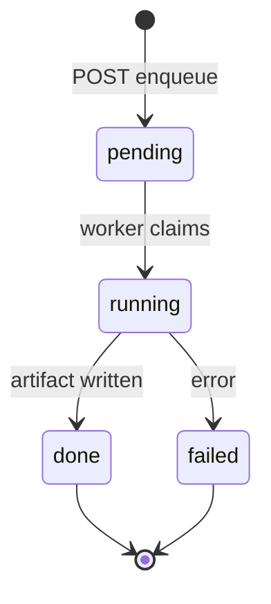

# Phase 9 — Export (EPUB, DOCX, Git Markdown Mirror)

> **Skill:** `storyforge-architecture`, `storyforge-domain-canon`  
> **User stories:** US-E01, US-E02

---

## Purpose

Authors export chapters and canon to portable formats **asynchronously**. Export reads project state and produces artifacts — it never mutates bible versions, ledgers, or chapter status.

---

## Job types

| `job_type` | Output | Notes |
|------------|--------|-------|
| `epub` | `.epub` file | Chapter order by `chapters.number`; NCX spine |
| `docx` | `.docx` file | One section per chapter; optional beat headings |
| `git_md_mirror` | `.zip` tree | Markdown/YAML bible + `chapters/NN-title.md`; optional `manifest.json` |

---

## Content scope options

Request body `options` (common):

| Field | Type | Default | Description |
|-------|------|---------|-------------|
| `chapter_scope` | enum | `settled_only` | `settled_only` \| `include_drafts` \| `selected` |
| `chapter_ids` | uuid[] | null | Required when `selected` |
| `include_author_notes` | boolean | false | Beat summaries / staging notes in export |
| `include_bible` | boolean | true | For epub/docx: appendix from settled bible |
| `bible_version` | integer | null | Pin snapshot; default = current settled |
| `strip_secrets` | boolean | true | Omit `secret_truth`, unrevealed twists |
| `git_md_push_stub` | boolean | false | When true, job records stub `push_target` in result — **no real git push** Phase 9 |

**Settled vs draft:** Default exports **settled chapters only** (`status = settled`). `include_drafts` adds drafting chapters with watermark metadata in EPUB/DOCX (`draft: true` in git-md frontmatter).

---

## Job lifecycle



| Status | Meaning |
|--------|---------|
| `pending` | Row inserted; message in Redis queue |
| `running` | Worker processing |
| `done` | `artifact_path` + `download_url` populated |
| `failed` | `error_message` set; no artifact |

---

## Redis queue pattern

Stack already includes Redis (Docker Compose). Phase 9 formalizes export queue:

| Item | Value |
|------|-------|
| Queue name | `storyforge:export_jobs` |
| Payload | `{ "job_id": "uuid", "project_id": "uuid", "job_type": "epub" }` |
| Worker | API subprocess or dedicated worker container; BRPOP with timeout |
| Idempotency | Same `job_id` not re-enqueued if status ≠ `failed` |

**Testcontainers:** Use Redis service in integration tests; or in-process fake queue when `STORYFORGE_EXPORT_SYNC=1` for deterministic tests.

---

## Artifact storage (Phase 9)

| Concern | Approach |
|---------|----------|
| Path | `{EXPORT_ARTIFACT_DIR}/{project_id}/{job_id}/{filename}` |
| Default dir | `/tmp/storyforge-exports` (env `STORYFORGE_EXPORT_ARTIFACT_DIR`) |
| Download | `GET .../export/jobs/{job_id}/download` streams file |
| TTL | Optional cleanup cron deletes rows + files older than 7 days |
| S3 | **Out of scope** — local path only |

---

## Git markdown mirror layout

```text
{project_slug}/
  README.md                 # project meta + bible version
  bible/
    world.md
    characters/
      {slug}.md
    glossary.md
  chapters/
    01-opening.md
    02-the-sect.md
  manifest.json             # export job id, bible_version, chapter list
```

- Derived from settled snapshots; frontmatter YAML on each file
- `git_md_push_stub: true` → result includes `{ "push_stub": { "remote": "origin", "branch": "canon-mirror", "status": "skipped_phase9" } }`

---

## API surface (summary)

| Method | Path | Purpose |
|--------|------|---------|
| POST | `/projects/{id}/export/jobs` | Enqueue job → `202` + job |
| GET | `/projects/{id}/export/jobs` | List recent jobs |
| GET | `/projects/{id}/export/jobs/{job_id}` | Poll status |
| GET | `/projects/{id}/export/jobs/{job_id}/download` | Download artifact (`done` only) |
| DELETE | `/projects/{id}/export/jobs/{job_id}` | Cancel pending / delete artifact |

See [openapi.yaml](./openapi.yaml) and [api-contracts.md](./api-contracts.md).

---

## Continuity / Gate

Export does **not** run continuity checks and does **not** affect settle. No new continuity categories required.

---

## Security

- Strip `secret_truth` and unrevealed twist content when `strip_secrets=true` (default)
- Download requires project ACL (same as chapter read)
- Artifacts not public URLs — authenticated download endpoint only

---

## Web touchpoints

Export panel on Project Hub: format picker, scope toggles, job history table, download button when done.

See [web-screens.md](./web-screens.md).

---

## Deferred (Phase 10+)

- Real git push (deploy keys, GitHub App)
- S3 presigned URLs
- Custom templates / CSS for EPUB
- Batch series export (all books in one zip)
