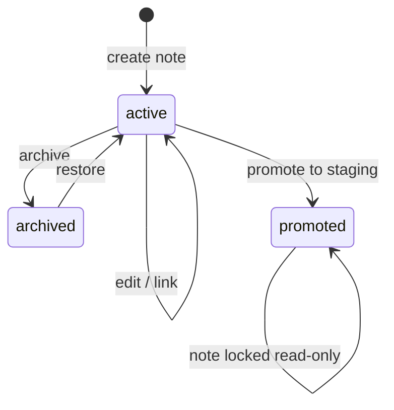

# Phase 9 — Research Module

> **Skill:** `storyforge-domain-canon`, `storyforge-architecture`, `storyforge-continuity`  
> **Product:** [03-domain-and-subsystems.md](../../product/03-domain-and-subsystems.md) §13

---

## Purpose

Authors attach **external research** (historical notes, world-building scraps, citation URLs) to a project without polluting settled canon. Research promotes to **bible staging** through an explicit human action — never auto-settle.

---

## Key concepts

| Concept | Description |
|---------|-------------|
| **Research note** | Markdown body + metadata; non-settled; project-scoped |
| **Link** | Typed pointer to character, place (bible key), fact (bible key), or chapter |
| **Promote** | Copy note content into `bible_entry_staging`; record `promoted_to_staging_id` on note |
| **Search** | Postgres full-text (`tsvector`) on title + body; optional tag filter |

---

## Entity lifecycle

| Status | Editable | Promote allowed |
|--------|----------|-----------------|
| `active` | Yes | Yes |
| `archived` | No (restore first) | No |
| `promoted` | No | No (idempotent GET promote returns existing staging id) |

---

## Promote workflow

1. Author selects target bible **section** (`world`, `characters`, `timeline`, `glossary`, `objects`, `style`) and optional **staging entry id** (update vs create).
2. API validates section + title uniqueness rules (same as Phase 1 staging CRUD).
3. API inserts or updates `bible_entry_staging` with:
   - `content_md` from note body (author may edit in modal before submit)
   - `source_research_note_id` in metadata JSON (audit trail)
   - `base_bible_version` = current `projects.bible_version_current`
4. API sets note `status = promoted`, `promoted_to_staging_id`, `promoted_at`.
5. **No** `bible_version++` — author continues normal settle flow when ready.

**Invariant:** Promote never writes to `bible_versions.snapshot_json`.

---

## Links

| `link_type` | Target | Validation |
|-------------|--------|------------|
| `character` | `characters.id` | Must belong to same `project_id` |
| `place` | `bible_key` string (e.g. `world.locations.inner_hall`) | Key format validated |
| `fact` | `bible_key` string | Same |
| `chapter` | `chapters.id` | Same project |

Links are many-to-many; deleting a note cascades links.

---

## Search

`GET .../research/notes/search?q=...&tags=...&status=active`

- Uses `research_notes.search_vector` (generated `tsvector` from title + body_md)
- Rank by `ts_rank`; paginate default 20
- Tag filter: JSON array overlap on `tags`

**Out of scope Phase 9:** pgvector semantic search, LLM summarization.

---

## API surface (summary)

| Method | Path | Purpose |
|--------|------|---------|
| GET | `/projects/{id}/research/notes` | List (filter status, tags) |
| POST | `/projects/{id}/research/notes` | Create |
| GET | `/projects/{id}/research/notes/{note_id}` | Detail + links |
| PATCH | `/projects/{id}/research/notes/{note_id}` | Update (active only) |
| DELETE | `/projects/{id}/research/notes/{note_id}` | Soft-delete → archived |
| POST | `/projects/{id}/research/notes/{note_id}/links` | Add link |
| DELETE | `/projects/{id}/research/notes/{note_id}/links/{link_id}` | Remove link |
| GET | `/projects/{id}/research/notes/search` | Full-text search |
| POST | `/projects/{id}/research/notes/{note_id}/promote` | Promote to staging |

See [openapi.yaml](./openapi.yaml) and [api-contracts.md](./api-contracts.md).

---

## Continuity (WARN-only)

Research module does **not** block settle. Optional deterministic checks during full continuity check:

| Code | Severity | When |
|------|----------|------|
| `research_link_orphan_character` | WARN | Note links character deleted/archived |
| `research_link_orphan_bible_key` | WARN | Linked bible key absent from current bible snapshot |
| `research_unpromoted_high_link_count` | WARN | Note with ≥5 entity links still `active` after 30 days (configurable stub) |

Authors may mark intentional via existing override flow (category `world_rule` or new `research` category — **WARN only**, never FAIL).

**Gate rule:** No FAIL severities from research category in Phase 9.

---

## Context packs

Research notes are **excluded** from Writer/Editor agent context packs by default. Optional author-only pack slice (Phase 10+).

---

## Web touchpoints

- Research inbox (list + filters)
- Note detail drawer with links panel + Promote CTA
- Promote modal: section picker, title, preview diff vs existing staging

See [web-screens.md](./web-screens.md).

---

## Multi-tenant isolation

All queries filter `project_id`. Cross-tenant note id → `404`.

---

## Deferred (Phase 10+)

- LLM autofill from URL
- Citation bibliography export
- Shared research across series (read-only mirror from parent series)
