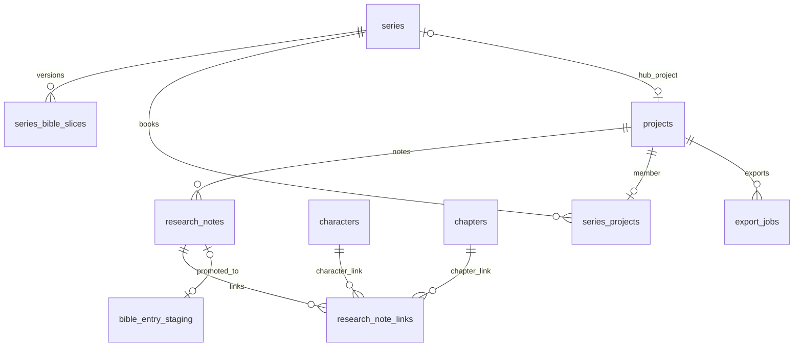

# Phase 9 Database Schema — Slice 1

> **Canonical for Phase 9 Slice 1.** Extends [Phase 8 schema](../phase-8/schema.md).  
> **Migration tool:** Alembic (`apps/api/alembic/` — continue from Phase 8 `023`).

---

## Design principles (unchanged + Phase 9)

1. **Multi-tenant:** Every row carries `project_id` (directly or via FK chain); series rows scoped by owner.
2. **Research is non-canon:** Notes never write to `bible_versions`; promote targets `bible_entry_staging` only.
3. **Series inherit read-only:** Parent slice versioned separately; child overrides flagged in staging metadata.
4. **Export jobs ephemeral:** Artifacts on local disk; job row tracks status + path.
5. **Continuity:** New WARN-only codes; no FAIL from research/series/export categories.
6. **Redis queue:** Export worker reads job id from queue; Postgres is SoT for job status.

---

## Migration from Phase 8

| Revision | Content |
|----------|---------|
| `024_research_notes` | `research_notes`, `research_note_links`, FTS index |
| `025_series` | `series`, `series_projects`, `series_bible_slices`; extend `projects.series_id` |
| `026_export_jobs` | `export_jobs` |
| `027_bible_staging_series_meta` | Extend `bible_entry_staging.metadata_json` defaults; optional `projects.last_seen_series_slice_version` |

**Current main head:** `023_ledger_phase8_events` — Phase 9 starts at `024`.

---

## `024_research_notes`

### `research_notes`

| Column | Type | Constraints | Notes |
|--------|------|-------------|-------|
| `id` | `uuid` | PK, DEFAULT `gen_random_uuid()` | |
| `project_id` | `uuid` | NOT NULL, FK → `projects(id)` ON DELETE CASCADE | |
| `title` | `text` | NOT NULL | |
| `body_md` | `text` | NOT NULL, DEFAULT `''` | |
| `source_url` | `text` | NULL | Optional citation |
| `tags` | `jsonb` | NOT NULL, DEFAULT `'[]'` | String array |
| `status` | `text` | NOT NULL, DEFAULT `'active'` | `active` \| `archived` \| `promoted` |
| `promoted_to_staging_id` | `uuid` | NULL, FK → `bible_entry_staging(id)` ON DELETE SET NULL | |
| `promoted_at` | `timestamptz` | NULL | |
| `search_vector` | `tsvector` | GENERATED ALWAYS AS (`to_tsvector('simple', coalesce(title,'') || ' ' || coalesce(body_md,''))`) STORED | |
| `created_at` | `timestamptz` | NOT NULL, DEFAULT `now()` | |
| `updated_at` | `timestamptz` | NOT NULL, DEFAULT `now()` | |

**Indexes:**

- `INDEX research_notes_project_status_idx ON research_notes (project_id, status, updated_at DESC)`
- `GIN research_notes_search_idx ON research_notes USING gin (search_vector)`
- `GIN research_notes_tags_idx ON research_notes USING gin (tags jsonb_path_ops)`

### `research_note_links`

| Column | Type | Constraints | Notes |
|--------|------|-------------|-------|
| `id` | `uuid` | PK, DEFAULT `gen_random_uuid()` | |
| `project_id` | `uuid` | NOT NULL, FK → `projects(id)` ON DELETE CASCADE | Denormalized for ACL |
| `note_id` | `uuid` | NOT NULL, FK → `research_notes(id)` ON DELETE CASCADE | |
| `link_type` | `text` | NOT NULL | `character` \| `place` \| `fact` \| `chapter` |
| `character_id` | `uuid` | NULL, FK → `characters(id)` ON DELETE CASCADE | When type=character |
| `bible_key` | `text` | NULL | When type=place/fact |
| `chapter_id` | `uuid` | NULL, FK → `chapters(id)` ON DELETE CASCADE | When type=chapter |
| `created_at` | `timestamptz` | NOT NULL, DEFAULT `now()` | |

**Constraints:**

- `CHECK` exactly one target column populated per `link_type`
- `UNIQUE research_note_links_dedupe_idx ON (note_id, link_type, coalesce(character_id::text, bible_key, chapter_id::text))`

**Indexes:**

- `INDEX research_note_links_note_idx ON research_note_links (note_id)`
- `INDEX research_note_links_character_idx ON research_note_links (project_id, character_id) WHERE character_id IS NOT NULL`

---

## `025_series`

### `series`

| Column | Type | Constraints | Notes |
|--------|------|-------------|-------|
| `id` | `uuid` | PK, DEFAULT `gen_random_uuid()` | |
| `owner_user_id` | `uuid` | NOT NULL | MVP stub owner |
| `title` | `text` | NOT NULL | |
| `slug` | `text` | NOT NULL | UNIQUE per owner |
| `hub_project_id` | `uuid` | NULL, FK → `projects(id)` ON DELETE SET NULL | Authoring surface for shared slice |
| `created_at` | `timestamptz` | NOT NULL, DEFAULT `now()` | |
| `updated_at` | `timestamptz` | NOT NULL, DEFAULT `now()` | |

**Indexes:**

- `UNIQUE series_owner_slug_idx ON (owner_user_id, slug)`

### `series_bible_slices`

Append-only settled slices for series shared canon (mirrors bible_versions pattern at series level).

| Column | Type | Constraints | Notes |
|--------|------|-------------|-------|
| `id` | `uuid` | PK, DEFAULT `gen_random_uuid()` | |
| `series_id` | `uuid` | NOT NULL, FK → `series(id)` ON DELETE CASCADE | |
| `version` | `integer` | NOT NULL | Monotonic per series |
| `slice_json` | `jsonb` | NOT NULL | Subset of bible shape |
| `inherited_sections` | `jsonb` | NOT NULL, DEFAULT `'["world","glossary","style","power_system"]'` | |
| `settled_at` | `timestamptz` | NOT NULL, DEFAULT `now()` | |
| `settled_from_hub_bible_version` | `integer` | NULL | Audit |

**Constraints:**

- `UNIQUE series_bible_slices_version_idx ON (series_id, version)`

**Indexes:**

- `INDEX series_bible_slices_series_version_desc ON series_bible_slices (series_id, version DESC)`

### `series_projects`

| Column | Type | Constraints | Notes |
|--------|------|-------------|-------|
| `series_id` | `uuid` | NOT NULL, FK → `series(id)` ON DELETE CASCADE | |
| `project_id` | `uuid` | NOT NULL, FK → `projects(id)` ON DELETE CASCADE | |
| `book_order` | `smallint` | NOT NULL, DEFAULT `1` | |
| `inheritance_config_json` | `jsonb` | NOT NULL, DEFAULT `'{}'` | Per-book section toggles |
| `attached_at` | `timestamptz` | NOT NULL, DEFAULT `now()` | |

**Constraints:**

- `PRIMARY KEY (series_id, project_id)`
- `UNIQUE series_projects_one_series_per_project ON (project_id)` — a project belongs to at most one series

### Extend `projects`

| Column | Type | Constraints | Notes |
|--------|------|-------------|-------|
| `series_id` | `uuid` | NULL, FK → `series(id)` ON DELETE SET NULL | Denormalized from join for fast reads |
| `last_seen_series_slice_version` | `integer` | NULL | For WARN drift detection |

---

## `026_export_jobs`

### `export_jobs`

| Column | Type | Constraints | Notes |
|--------|------|-------------|-------|
| `id` | `uuid` | PK, DEFAULT `gen_random_uuid()` | |
| `project_id` | `uuid` | NOT NULL, FK → `projects(id)` ON DELETE CASCADE | |
| `requested_by_user_id` | `uuid` | NOT NULL | |
| `job_type` | `text` | NOT NULL | `epub` \| `docx` \| `git_md_mirror` |
| `status` | `text` | NOT NULL, DEFAULT `'pending'` | `pending` \| `running` \| `done` \| `failed` |
| `options_json` | `jsonb` | NOT NULL, DEFAULT `'{}'` | Scope, chapter_ids, strip_secrets, etc. |
| `artifact_path` | `text` | NULL | Local filesystem path |
| `artifact_filename` | `text` | NULL | e.g. `novel.epub` |
| `artifact_size_bytes` | `bigint` | NULL | |
| `error_message` | `text` | NULL | When failed |
| `result_json` | `jsonb` | NULL | git push stub, chapter counts |
| `started_at` | `timestamptz` | NULL | |
| `finished_at` | `timestamptz` | NULL | |
| `created_at` | `timestamptz` | NOT NULL, DEFAULT `now()` | |

**Indexes:**

- `INDEX export_jobs_project_created_idx ON export_jobs (project_id, created_at DESC)`
- `INDEX export_jobs_status_pending_idx ON export_jobs (status, created_at) WHERE status = 'pending'`

**Immutability:** `job_type`, `options_json`, `project_id` immutable after insert. Status transitions only via worker.

---

## `027_bible_staging_series_meta`

### Extend `bible_entry_staging`

Add optional columns (or use existing `metadata_json` keys):

| Key / column | Purpose |
|--------------|---------|
| `metadata_json.source_research_note_id` | Audit from research promote |
| `metadata_json.series_override` | boolean |
| `metadata_json.overrides_series_key` | string bible key |
| `metadata_json.override_reason` | string optional |

No migration required if `metadata_json` already exists — document keys in API. If column missing, add:

| Column | Type | Default |
|--------|------|---------|
| `metadata_json` | `jsonb` | `'{}'` | if not present from Phase 1 |

---

## Entity relationship (Phase 9 extension)

---

## Redis (not Postgres)

| Key pattern | Purpose |
|-------------|---------|
| `storyforge:export_jobs` | List queue — LPUSH enqueue, BRPOP worker |
| `storyforge:export_job:{id}:lock` | Optional short TTL lock while running |

---

## Continuity engine reads (no writes)

- Research WARN rules read `research_note_links` + current bible snapshot
- Series WARN rules compare `series_bible_slices.version` vs `projects.last_seen_series_slice_version`
- Export does not touch continuity tables

---

## Multi-tenant isolation (unchanged)

- All queries filter by `project_id` or series ownership.
- Cross-tenant → HTTP `404`.

---

## Migration checklist (implementation PR)

- [ ] `024_research_notes` — notes + links + FTS
- [ ] `025_series` — series tables + `projects.series_id`
- [ ] `026_export_jobs` — job table
- [ ] `027_bible_staging_series_meta` — metadata keys documented
- [ ] Integration tests: promote → staging, series inherit read, export job lifecycle
- [ ] Redis Testcontainers or sync mode for export worker tests

---

## Deferred (Phase 10+)

Neo4j, collaboration sessions, S3 artifact URLs, LLM research tables, motif/ending promises.

---

## Links

- [Phase 8 schema](../phase-8/schema.md)
- [research.md](./research.md)
- [series.md](./series.md)
- [export.md](./export.md)
- [openapi.yaml](./openapi.yaml)
